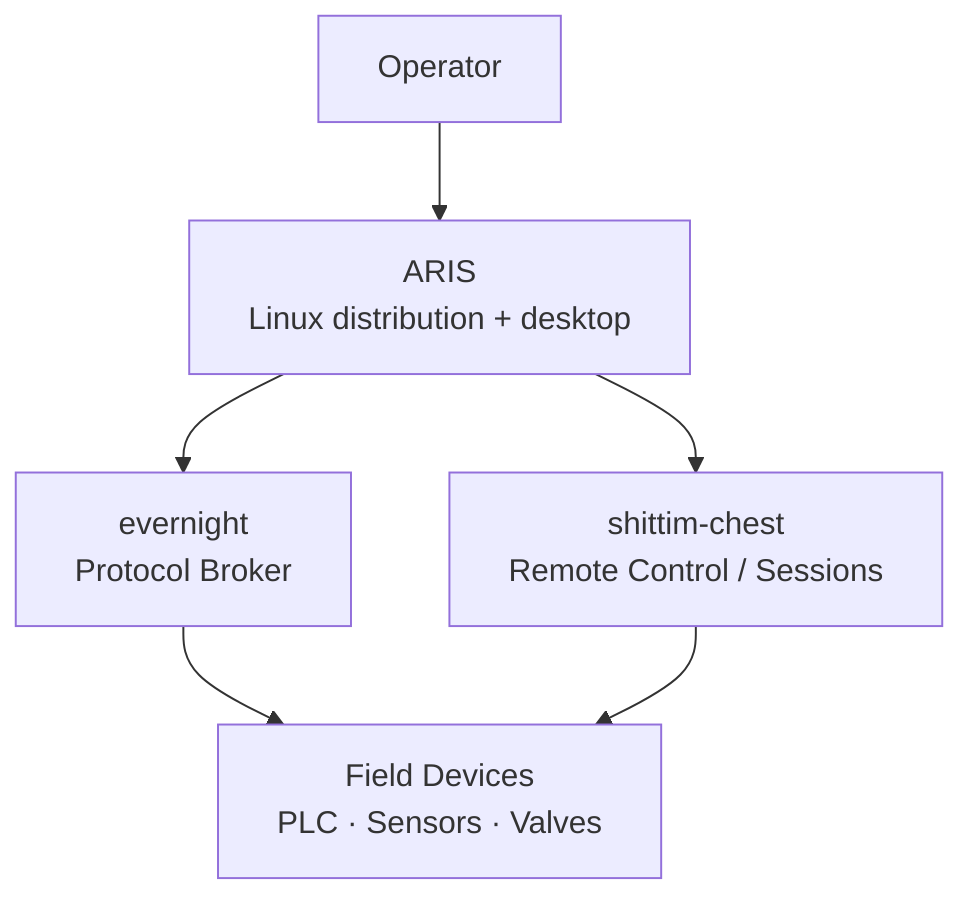

<p align="center"></p>

<h1 align="center">ARIS</h1>

<p align="center"><strong>A Linux-standard distribution with a desktop tuned for evernight &amp; shittim-chest — built for industrial HMI and host stations</strong></p>

<div align="center">

[](./LICENSE)
[](https://github.com/celestia-island/aris/actions/workflows/ci.yml)

</div>

<div align="center">

**English** ·
[简体中文](./docs/zhs/README.md) ·
[繁體中文](./docs/zht/README.md) ·
[日本語](./docs/ja/README.md) ·
[한국어](./docs/ko/README.md) ·
[Français](./docs/fr/README.md) ·
[Español](./docs/es/README.md) ·
[Русский](./docs/ru/README.md) ·
[العربية](./docs/ar/README.md)

</div>

## What is ARIS?

ARIS is a Linux distribution for the operator-facing machine — the industrial
HMI panel and supervisory host station. It ships a desktop environment
purpose-built for [evernight](https://github.com/celestia-island/evernight)
(industrial protocol broker) and
[shittim-chest](https://github.com/celestia-island/shittim-chest) (remote
control / sessions).

ARIS is **not** the edge gateway firmware (that's
[kei](https://github.com/celestia-island/kei)). It's the standard Linux OS
that the operator sits in front of: LSB-compatible, familiar, with a desktop
wired specifically for monitoring and controlling industrial brokers.



## USB-C Zero-Config

Plug ARIS into any host via USB-C — it appears as a USB drive with
auto-installers, plus a virtual Ethernet link to the gateway dashboard.
No manual configuration needed. See the
[USB-C provisioning guide](./docs/en/guides/usb-c-provisioning.md).

## Supported Hardware

| Architecture | Status | Typical devices |
|-------------|--------|-----------------|
| x86_64 | Active | Industrial PCs, HMI panels, supervisory hosts |
| ARMv8+ (aarch64) | Planned | ARM SBCs with display output |
| ARMv7+ (armv7) | Planned | Legacy ARM industrial panels |
| RISC-V 64 | Planned | Future RISC-V industrial boards |

## Quick Start

```bash
just setup-cross   # Install cross-compilation toolchains
just build         # Build firmware image for default board
just flash-sd      # Write image to SD card
```

See the [build guide](./docs/en/build/quickstart.md) for detailed instructions.

## Architecture

ARIS layers a custom desktop and evernight/shittim-chest integration on top
of an LSB-compatible Linux base. See the
[architecture overview](./docs/en/architecture/overview.md) for details.

## License

Business Source License 1.1 (BUSL-1.1). Converts to SySL-1.0 or Apache-2.0
on 2030-01-01. See [LICENSE](./LICENSE).
