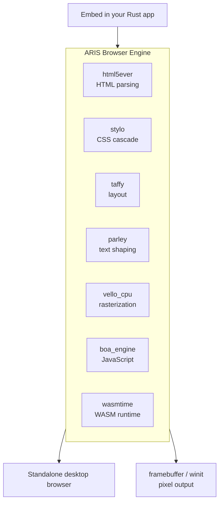

<p align="center"></p>

<h1 align="center">ARIS</h1>

<p align="center"><strong>A browser engine built on servo — embed it, run it standalone. Under the hood, servo's infrastructure is selectively replaced with pure-Rust alternatives.</strong></p>

<div align="center">

[](./LICENSE)
[](https://github.com/celestia-island/aris/actions/workflows/ci.yml)

</div>

<div align="center">

**English** ·
[简体中文](./docs/zhs/README.md) ·
[繁體中文](./docs/zht/README.md) ·
[日本語](./docs/ja/README.md) ·
[한국어](./docs/ko/README.md) ·
[Français](./docs/fr/README.md) ·
[Español](./docs/es/README.md) ·
[Русский](./docs/ru/README.md) ·
[العربية](./docs/ar/README.md)

</div>

## What is ARIS?

ARIS is a **browser engine** derived from servo. It can be embedded as a library
in any Rust application, or run as a standalone desktop browser. The rendering
pipeline is assembled from pure-Rust crates — html5ever, stylo, taffy, parley,
vello — and servo's original SpiderMonkey / WebRender / SWGL dependencies are
replaced with Boa (JS), Vello CPU (rasterization), and Wasmtime (WASM).



## Why not fork Servo?

Servo ties SpiderMonkey (C++), WebRender (C++/SWGL), and a sprawling component
graph together. ARIS takes servo's strongest pieces — the pure-Rust HTML/CSS
front-end (html5ever, stylo, cssparser, selectors) — and rebuilds the
JavaScript, rasterization, and WASM layers with pure-Rust alternatives. The
result is a smaller, simpler, and fully self-contained Rust codebase.

| Servo component | ARIS replacement | Why |
|----------------|-----------------|-----|
| SpiderMonkey (C++) | boa_engine | Pure Rust, no C++ build |
| WebRender + SWGL (C++) | vello_cpu | Pure Rust CPU rasterization |
| components/script | Boa bridge | No SpiderMonkey coupling |
| — | wasmtime | WASM Component Model, WASI |

## Quick Start

```bash
# Build the standalone browser
cargo build -p aris-render --release

# Render a web page to framebuffer
cargo run -p aris-render --bin render_lagrange -- example.html

# Run in desktop window (winit backend)
cargo run -p aris-render --bin render_window --features winit-backend
```

See the [build guide](./docs/en/build/quickstart.md) for detailed instructions.

## Architecture

```
┌──────────────────────────────────────────────────────┐
│  tairitsu (VDOM) / hikari (UI components)            │
│  WASM Component Model → WIT interface                │
├──────────────────────────────────────────────────────┤
│  ARIS render pipeline                                 │
│  html5ever → stylo → taffy → parley → vello_cpu → RGBA│
│  Boa JS engine (page scripts)                        │
│  Wasmtime (WASM components, WASI)                    │
├──────────────────────────────────────────────────────┤
│  Display backends: /dev/fb0 · winit+softbuffer       │
├──────────────────────────────────────────────────────┤
│  kei kernel (syscall ABI) or Linux                   │
└──────────────────────────────────────────────────────┘
```

See the [architecture overview](./docs/en/architecture/overview.md) for details.

## Ecosystem

- **[kei](https://github.com/celestia-island/kei)** — Rust OS kernel (syscall ABI, drivers)
- **[tairitsu](https://github.com/celestia-island/tairitsu)** — WASM UI framework
- **[hikari](https://github.com/celestia-island/hikari)** — UI component library
- **[shirabe](https://github.com/celestia-island/shirabe)** — browser automation, defines render FFI contract
- **[evernight](https://github.com/celestia-island/evernight)** — industrial protocol broker
- **[entelecheia](https://github.com/celestia-island/entelecheia)** — AI agent platform

## License

Business Source License 1.1 (BUSL-1.1). Converts to SySL-1.0 or Apache-2.0
on 2030-01-01. See [LICENSE](./LICENSE).
