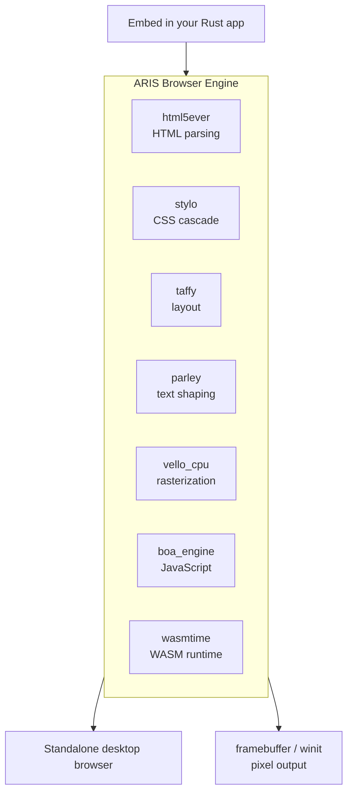

<p align="center"></p>

<h1 align="center">ARIS</h1>

<p align="center"><strong>A pure-Rust browser engine derived from servo.</strong></p>

<div align="center">

[](./LICENSE)
[](https://github.com/celestia-island/aris/actions/workflows/ci.yml)

</div>

<div align="center">

**English** ·
[简体中文](./docs/zhs/README.md) ·
[繁體中文](./docs/zht/README.md) ·
[日本語](./docs/ja/README.md) ·
[한국어](./docs/ko/README.md) ·
[Français](./docs/fr/README.md) ·
[Español](./docs/es/README.md) ·
[Русский](./docs/ru/README.md) ·
[العربية](./docs/ar/README.md)

</div>

## What is ARIS?

ARIS is a **browser engine** derived from servo. It can be embedded as a library
in any Rust application, or run as a standalone desktop browser. The rendering
pipeline is assembled from pure-Rust crates — html5ever, stylo, taffy, parley,
vello — and servo's original SpiderMonkey / WebRender / SWGL dependencies are
replaced with Boa (JS), Vello CPU (rasterization), and Wasmtime (WASM).



## Why not fork Servo?

Servo ties SpiderMonkey (C++), WebRender (C++/SWGL), and a sprawling component
graph together. ARIS takes servo's strongest pieces — the pure-Rust HTML/CSS
front-end (html5ever, stylo, cssparser, selectors) — and rebuilds the
JavaScript, rasterization, and WASM layers with pure-Rust alternatives. The
result is a smaller, simpler, and fully self-contained Rust codebase.

| Servo component | ARIS replacement | Why |
|----------------|-----------------|-----|
| SpiderMonkey (C++) | boa_engine | Pure Rust, no C++ build |
| WebRender + SWGL (C++) | vello_cpu | Pure Rust CPU rasterization |
| components/script | Boa bridge | No SpiderMonkey coupling |
| — | wasmtime | WASM Component Model, WASI |

## Quick Start

```bash
# Build and run the interactive desktop browser (with JS + networking)
cargo run -p aris-render --features "desktop winit js" --bin aris_browser

# Navigate to a URL, file, or search query
cargo run -p aris-render --features "desktop winit js" --bin aris_browser -- https://example.com
cargo run -p aris-render --features "desktop winit js" --bin aris_browser -- ./local-page.html
cargo run -p aris-render --features "desktop winit js" --bin aris_browser -- "search query"

# Or use the just recipe
just dev              # start page
just dev-html FILE    # load a local HTML file

# Render a web page to a PPM file (headless, no window)
cargo run -p aris-render --bin render_lagrange -- example.html
```

## Browser features

The `aris_browser` binary (`cargo run --bin aris_browser`) is a working desktop
browser with:

| Feature | Status |
|---------|--------|
| HTML/CSS rendering (html5ever + stylo + taffy + parley + Vello CPU) | ✅ |
| Navigation: URL bar, link clicks, form submission, back/forward/reload | ✅ |
| HTTP(S) + `file://` networking with subresource fetching (img, CSS, fonts) | ✅ |
| Response caching + cookie storage | ✅ |
| Browser chrome: back/forward/reload/close buttons, favicon, address bar | ✅ |
| Mouse hover/click/scroll, keyboard text input into `<input>`/`<textarea>` | ✅ |
| Scrollbar (draggable) + keyboard scrolling (Space/PgUp/PgDn/Home/End) | ✅ |
| Right-click context menu (with text labels) | ✅ |
| Find-in-page (Ctrl+F) with match highlights | ✅ |
| Page zoom (Ctrl+= / Ctrl+- / Ctrl+0) | ✅ |
| OS clipboard copy/paste (Ctrl+C / Ctrl+V) | ✅ |
| Keyboard shortcuts (Ctrl+L, Ctrl+R/F5, Alt+Left/Right, Esc) | ✅ |
| Bottom status bar (hovered link URL + loading indicator) | ✅ |
| Page title → window title; window title reflects `<title>` | ✅ |
| JavaScript: `<script>` execution (Boa), `document.write` SSR | ✅ |
| JavaScript: interactive `onclick`, `addEventListener('click')` | ✅ |
| JavaScript: DOM manipulation (`getElementById`, `createElement`, `appendChild`, `setAttribute`, `textContent`, `style`) | ✅ |
| HiDPI super-sampled rendering | ✅ |

See the [build guide](./docs/en/build/quickstart.md) for detailed instructions.

## Architecture

```
┌──────────────────────────────────────────────────────┐
│  tairitsu (VDOM) / hikari (UI components)            │
│  WASM Component Model → WIT interface                │
├──────────────────────────────────────────────────────┤
│  ARIS render pipeline                                 │
│  html5ever → stylo → taffy → parley → vello_cpu → RGBA│
│  Boa JS engine (page scripts)                        │
│  Wasmtime (WASM components, WASI)                    │
├──────────────────────────────────────────────────────┤
│  Display backends: /dev/fb0 · winit+softbuffer       │
├──────────────────────────────────────────────────────┤
│  kei kernel (syscall ABI) or Linux                   │
└──────────────────────────────────────────────────────┘
```

See the [architecture overview](./docs/en/architecture/overview.md) for details.

## License

Business Source License 1.1 (BUSL-1.1). Converts to SySL-1.0 or Apache-2.0
on 2030-01-01. See [LICENSE](./LICENSE).
