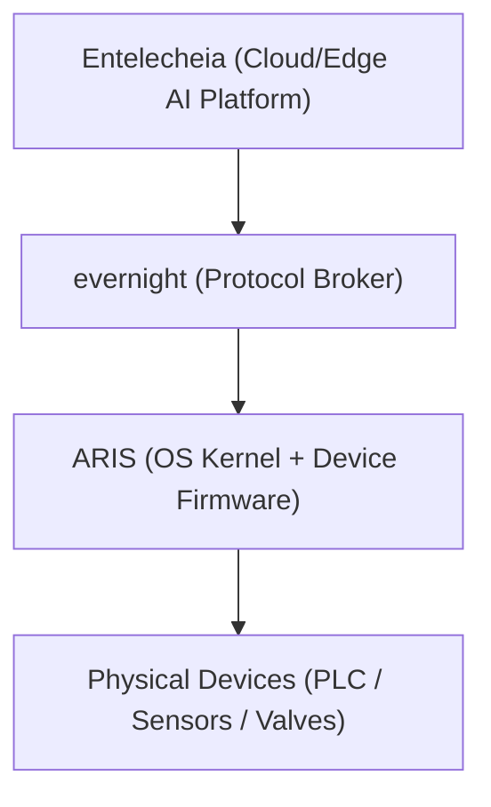

<p align="center"></p>

<h1 align="center">ARIS</h1>

<p align="center"><strong>Embedded OS for industrial IoT gateways — runs evernight on ARM/RISC-V edge devices</strong></p>

<div align="center">

[](./LICENSE)
[](https://github.com/celestia-island/aris/actions/workflows/ci.yml)

</div>

<div align="center">

**English** ·
[简体中文](./docs/zhs/README.md) ·
[繁體中文](./docs/zht/README.md) ·
[日本語](./docs/ja/README.md) ·
[한국어](./docs/ko/README.md) ·
[Français](./docs/fr/README.md) ·
[Español](./docs/es/README.md) ·
[Русский](./docs/ru/README.md) ·
[العربية](./docs/ar/README.md)

</div>

## Introduction

ARIS is the embedded OS/firmware for the Entelecheia industrial IoT gateway.
It runs [evernight](https://github.com/celestia-island/evernight) on ARM/RISC-V
edge devices, bridging the protocol broker to physical hardware through a
minimal, secure kernel layer.



## USB-C Zero-Config Provisioning

When connected to any host via USB-C, the gateway presents itself as a composite
USB device:

- **Mass Storage** — a virtual USB drive containing per-OS auto-installers for
  the evernight client (Windows `.bat` + AutoRun, Linux `.sh`, macOS `.command`,
  Android instructions)
- **CDC-NCM** — a virtual Ethernet adapter giving the host a direct IP link to
  the gateway dashboard at `http://10.0.99.1:8080`

**Plug in USB-C → host sees a USB drive → open the installer → done.** No
network configuration, no driver downloads, no manual pairing.

## Supported Architectures

| Architecture | Status | Target Boards |
|-------------|--------|---------------|
| ARMv8+ (aarch64) | Active | NanoPi R3S (RK3566) |
| ARMv7+ (armv7) | Planned | Raspberry Pi 3/4 |
| RISC-V 64 (riscv64) | Planned | VisionFive 2 |
| x86_64 | Planned | Industrial PC |

## Quick Start

```bash
just setup-cross   # Install cross-compilation toolchains
just build         # Build firmware image for default board
just build-board nanopi-r3s
just flash-sd      # Write image to SD card
```

## Architecture

ARIS follows a two-phase strategy:

- **Phase 1** (current): Linux kernel + Buildroot-style slim rootfs, runs
  evernight as daemon. Pragmatic, ships now.
- **Phase 2** (future): [Asterinas](https://github.com/asterinas/asterinas)
  framekernel (Rust OS) replaces Linux kernel. Full safe-stack from silicon up.

See [docs](./docs/en/) for architecture details, hardware references, and build
guides.

## License

Business Source License 1.1 (BUSL-1.1). Commercial use requires an
authorization license. Non-commercial use follows the SySL-1.0 protocol.
Converts to SySL-1.0 or Apache-2.0 on 2030-01-01. See [LICENSE](./LICENSE).
