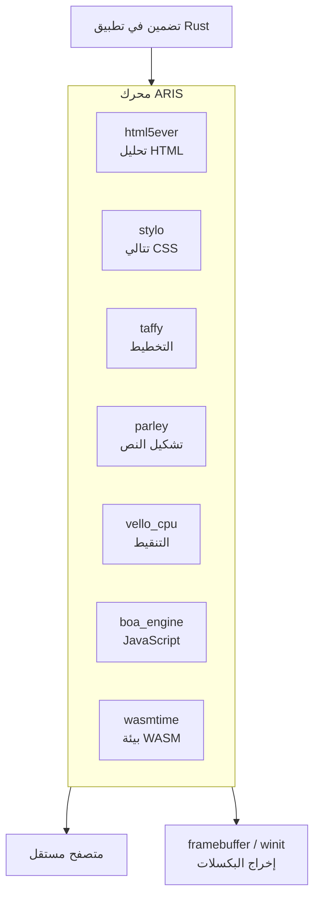

<p align="center"></p>

<h1 align="center">ARIS</h1>

<p align="center"><strong>محرك متصفح مبني على servo — قابل للتضمين أو التشغيل المستقل. تم استبدال البنية التحتية الرسمية لـ servo جزئيًا ببدائل Rust خالصة.</strong></p>

<div align="center">

[](../../LICENSE)
[](https://github.com/celestia-island/aris/actions/workflows/ci.yml)

</div>

<div align="center">

[English](../en/README.md) ·
[简体中文](../zhs/README.md) ·
[繁體中文](../zht/README.md) ·
[日本語](../ja/README.md) ·
[한국어](../ko/README.md) ·
[Français](../fr/README.md) ·
[Español](../es/README.md) ·
[Русский](../ru/README.md) ·
**العربية**

</div>

## مقدمة

ARIS هو **محرك متصفح مشتق من servo**. يمكن تضمينه كمكتبة في أي تطبيق Rust، أو تشغيله كمتصفح مكتبي مستقل. يتم تجميع خط أنابيب التصيير من صناديق Rust خالصة — html5ever و stylo و taffy و parley و vello — وتم استبدال اعتماديات servo على SpiderMonkey / WebRender / SWGL بـ Boa (JS) و Vello CPU (التنقيط) و Wasmtime (WASM).



## لماذا لا نشعب Servo مباشرة؟

يجمع Servo بين SpiderMonkey (C++) و WebRender (C++/SWGL) ورسم بياني ضخم من الاعتماديات. يأخذ ARIS أفضل قطع servo — واجهة HTML/CSS الأمامية بـ Rust الخالص (html5ever و stylo و cssparser و selectors) — ويعيد بناء طبقات JavaScript والتنقيط و WASM ببدائل Rust خالصة.

| مكون Servo | بديل ARIS | السبب |
|-----------|----------|------|
| SpiderMonkey (C++) | boa_engine | Rust خالص، بدون بناء C++ |
| WebRender + SWGL (C++) | vello_cpu | تنقيط CPU بـ Rust خالص |
| components/script | جسر Boa | بدون اقتران بـ SpiderMonkey |
| — | wasmtime | WASM Component Model, WASI |

## البدء السريع

```bash
# بناء المتصفح المستقل
cargo build -p aris-render --release

# تصيير صفحة ويب إلى framebuffer
cargo run -p aris-render --bin render_lagrange -- example.html

# التشغيل في نافذة (خلفية winit)
cargo run -p aris-render --bin render_window --features winit-backend
```

انظر [دليل البناء](./build/quickstart.md) للتفاصيل.

## البنية

```
┌──────────────────────────────────────────────────────┐
│  tairitsu (VDOM) / hikari (مكونات UI)               │
│  WASM Component Model → واجهة WIT                    │
├──────────────────────────────────────────────────────┤
│  خط أنابيب التصيير ARIS                                │
│  html5ever → stylo → taffy → parley → vello_cpu → RGBA│
│  محرك Boa JS (نصوص الصفحات)                           │
│  Wasmtime (مكونات WASM, WASI)                        │
├──────────────────────────────────────────────────────┤
│  خلفيات العرض: /dev/fb0 · winit+softbuffer           │
├──────────────────────────────────────────────────────┤
│  نواة kei (syscall ABI) أو Linux                     │
└──────────────────────────────────────────────────────┘
```

انظر [نظرة عامة على البنية](./architecture/overview.md).

## النظام البيئي

- **[kei](https://github.com/celestia-island/kei)** — نواة نظام تشغيل بـ Rust
- **[tairitsu](https://github.com/celestia-island/tairitsu)** — إطار عمل UI بتقنية WASM
- **[hikari](https://github.com/celestia-island/hikari)** — مكتبة مكونات UI
- **[shirabe](https://github.com/celestia-island/shirabe)** — أتمتة المتصفح، عقد FFI للتصيير
- **[evernight](https://github.com/celestia-island/evernight)** — وسيط بروتوكولات صناعية
- **[entelecheia](https://github.com/celestia-island/entelecheia)** — منصة وكلاء الذكاء الاصطناعي

## الترخيص

Business Source License 1.1 (BUSL-1.1). يتحول إلى SySL-1.0 أو Apache-2.0 في 2030-01-01. انظر [LICENSE](../../LICENSE).
