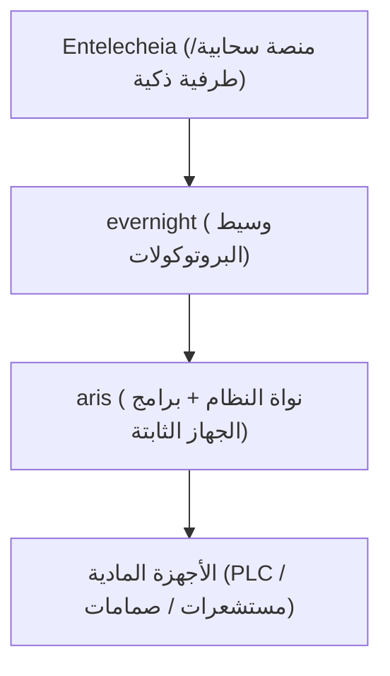

<p align="center"></p>

<h1 align="center">ARIS</h1>

<p align="center"><strong>توزيعة لينكس قياسية بسطح مكتب مُهيَّأ لِـ evernight و shittim-chest — مبنية لألواح HMI الصناعية والمحطات المُشرفة</strong></p>

<div align="center">

[](../../LICENSE)
[](https://github.com/celestia-island/aris/actions/workflows/ci.yml)

</div>

<div align="center">

[English](../en/README.md) ·
[简体中文](../zhs/README.md) ·
[繁體中文](../zht/README.md) ·
[日本語](../ja/README.md) ·
[한국어](../ko/README.md) ·
[Français](../fr/README.md) ·
[Español](../es/README.md) ·
[Русский](../ru/README.md) ·
**[العربية](../ar/README.md)**

</div>

## مقدمة

ARIS توزيعة لينكس تلتزم بقاعدة لينكس القياسية (LSB) وتأتي بسطح مكتب مبني خصيصاً
لِـ evernight و shittim-chest. مقياسها هو لوحة HMI الصناعية والمحطة المُشرفة
(supervisory host) — الآلة التي يواجهها المُشغّل، لا بوابة الحافة. وحيثما تمتدّ
رصة Celestia الأوسع نحو الأسفل إلى الأجهزة المادية، يبقى ARIS نظام التشغيل الذي
يجلس المُشغّل أمامه فعلياً: لينكس مألوف متوافق مع LSB يُقلع إلى سطح مكتب مُهيَّأ
خصيصاً لمراقبة وسطاء evernight وجلسات shittim-chest والتحكّم بها.



## التزويد بدون تكوين عبر USB-C

عند الاتصال بأي مضيف عبر USB-C، تظهر البوابة كجهاز USB مركّب:

- **التخزين الكتلي** — محرك أقراص USB افتراضي يحتوي على برامج تثبيت تلقائية
  لكل نظام تشغيل لعميل evernight (Windows ‎`.bat`‎ + تشغيل تلقائي، Linux ‎`.sh`‎،
  macOS ‎`.command`‎، تعليمات أندرويد)
- **CDC-NCM** — محول إيثرنت افتراضي يمنح المضيف رابط IP مباشر إلى لوحة تحكم
    البوابة على `http://10.0.99.1:8080`

**وصّل USB-C ← يرى المضيف محرك أقراص USB ← افتح المثبّت ← تم.** بدون أي تكوين
للشبكة، أو تنزيل تعريفات، أو إقران يدوي.

## البنى المدعومة

| البنية | الحالة | اللوحات المستهدفة |
|-------------|--------|---------------|
| ARMv8+ (aarch64) | نشط | NanoPi R3S (RK3566) |
| ARMv7+ (armv7) | مخطط | Raspberry Pi 3/4 |
| RISC-V 64 (riscv64) | مخطط | VisionFive 2 |
| x86_64 | مخطط | حاسوب صناعي |

## البدء السريع

```bash
just setup-cross   # Install cross-compilation toolchains
just build         # Build firmware image for default board
just build-board nanopi-r3s
just flash-sd      # Write image to SD card
```

## البنية

يتبع aris استراتيجية من مرحلتين:

- **المرحلة 1** (الحالية): نواة Linux + نظام جذر مختصر بأسلوب Buildroot،
  يشغّل evernight كعملية خلفية. عملي ومتاح الآن.
- **المرحلة 2** (المستقبلية): [Asterinas](https://github.com/asterinas/asterinas)
  كنواة إطار (نظام تشغيل بلغة Rust) يحل محل نواة Linux. حزمة آمنة كاملة من
  السيليكون حتى التطبيق.

راجع [الوثائق](../en/) لتفاصيل البنية، ومراجع العتاد، وأدلة البناء.

## الترخيص

Business Source License 1.1 (BUSL-1.1). Commercial use requires an
authorization license. Non-commercial use follows the SySL-1.0 protocol.
Converts to SySL-1.0 or Apache-2.0 on 2030-01-01. See [LICENSE](../../LICENSE).
