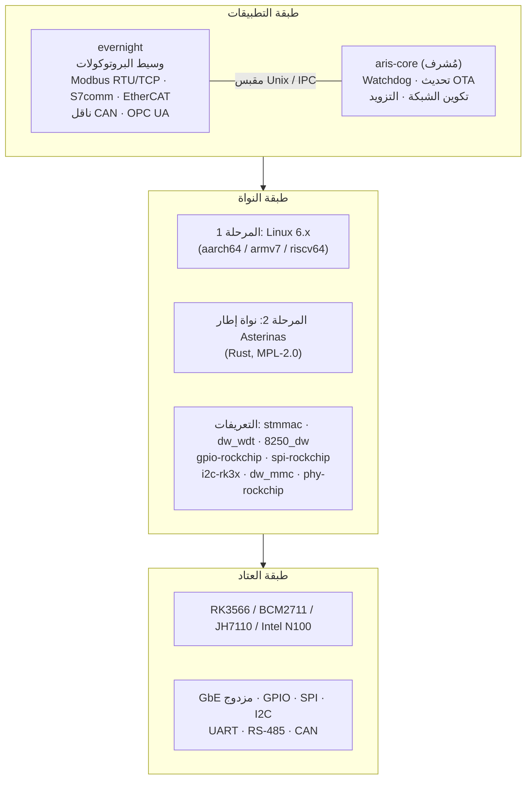
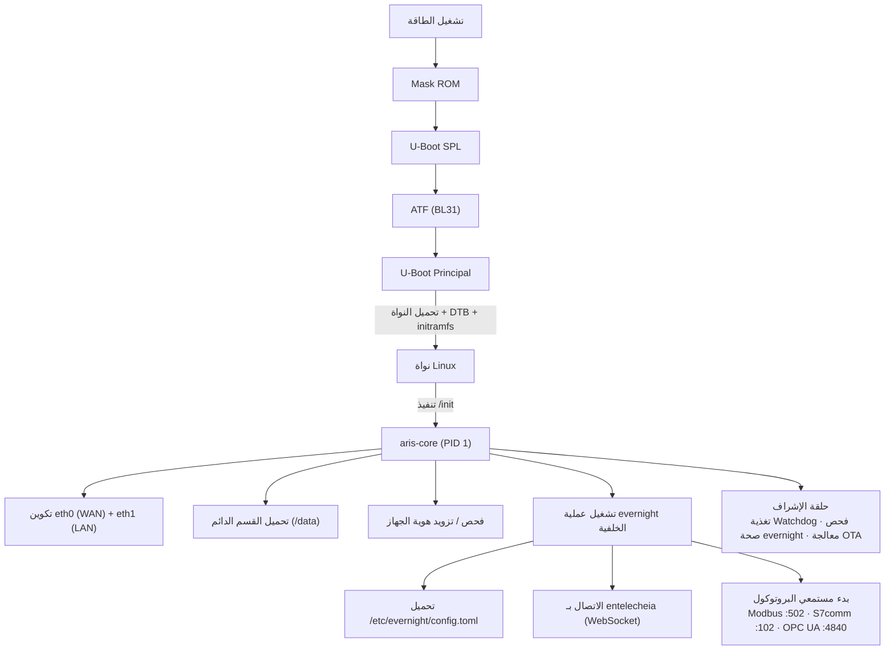

# بنية نظام aris

## نظرة عامة

aris هو نظام تشغيل مدمج معياري لبوابات إنترنت الأشياء الصناعية يشغّل منظومة
Entelecheia. يربط وسيط البروتوكولات evernight بالعتاد المادي عبر طبقة نواة
أمنية ومختصرة.

## طبقات البنية



## تسلسل الإقلاع



## تخطيط الأقسام (تحديث A/B)

| الإزاحة | الحجم | القسم | المحتوى |
|---------|--------|-----------|----------|
| 0 | 32 ك.بايت | (فجوة) | idbloader.img |
| 32 ك.بايت | 8 م.بايت | (فجوة) | u-boot.itb |
| 8 م.بايت | 128 م.بايت | boot-A | Image + DTB + boot.scr |
| 136 م.بايت | 128 م.بايت | boot-B | Image + DTB + boot.scr (احتياطي) |
| 264 م.بايت | 512 م.بايت | rootfs-A | squashfs (ro) |
| 776 م.بايت | 512 م.بايت | rootfs-B | squashfs (ro، احتياطي) |
| 1288 م.بايت | - | دائم | ext4 (rw، /data) |

## طوبولوجيا الشبكة

```mermaid
flowchart TB
    NET["الإنترنت / شبكة LAN للمؤسسة"] --> ETH0
    subbox GW["بوابة aris"]
        ETH0["eth0 — WAN (DHCP)"]
        ETH1["eth1 — LAN (192.168.42.1/24)"]
    end
    ETH1 --> PLC["PLC\n192.168.42.5"]
    ETH1 --> SEN["مستشعر\n192.168.42.10"]
    ETH1 --> HMI["HMI\n192.168.42.20"]
```

## استراتيجية Asterinas ARM64 (المرحلة 2)

المصدر الرئيسي لـ Asterinas ARM64:

- **التفرّع**: https://github.com/wanywhn/asterinas (الفرع: `arm64-support`)
- **طلب الدمج**: asterinas/asterinas#3270
- **الحالة**: شبه جاهز للدمج؛ يشمل GICv3 وARM GIC وشجرة أجهزة أساسية
  وإعداد MMU ووحدة تحكم UART لـ aarch64

بمجرد دمجه في الفرع الرئيسي لـ Asterinas، سيتتبع aris المستودع الرسمي. حتى
ذلك الحين، يعمل فرع `arm64-support` كأساس للتطوير.
