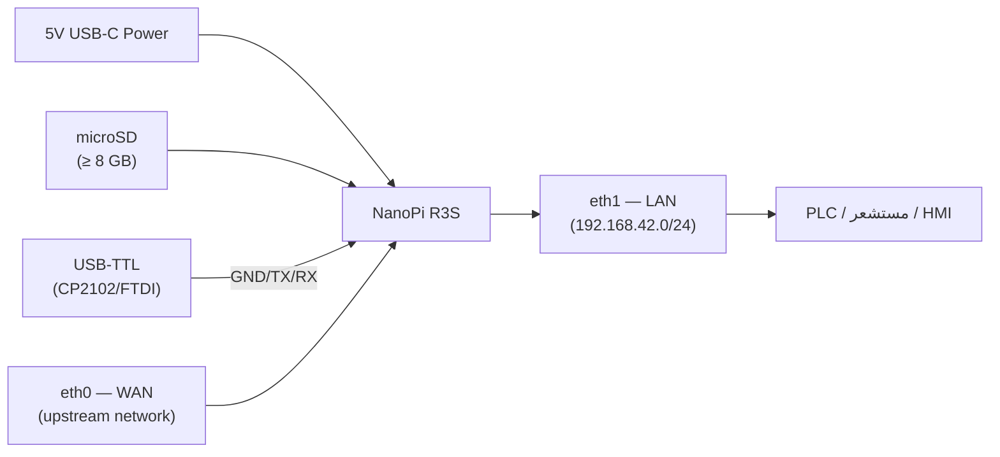
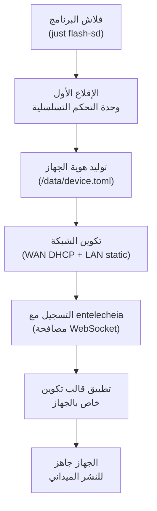
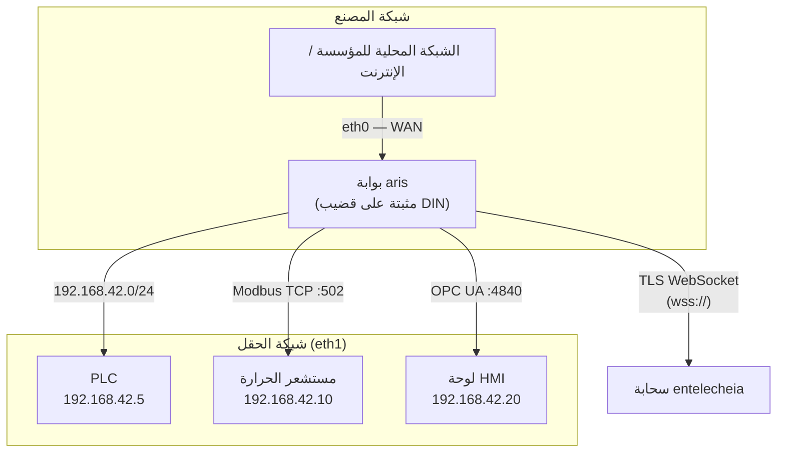
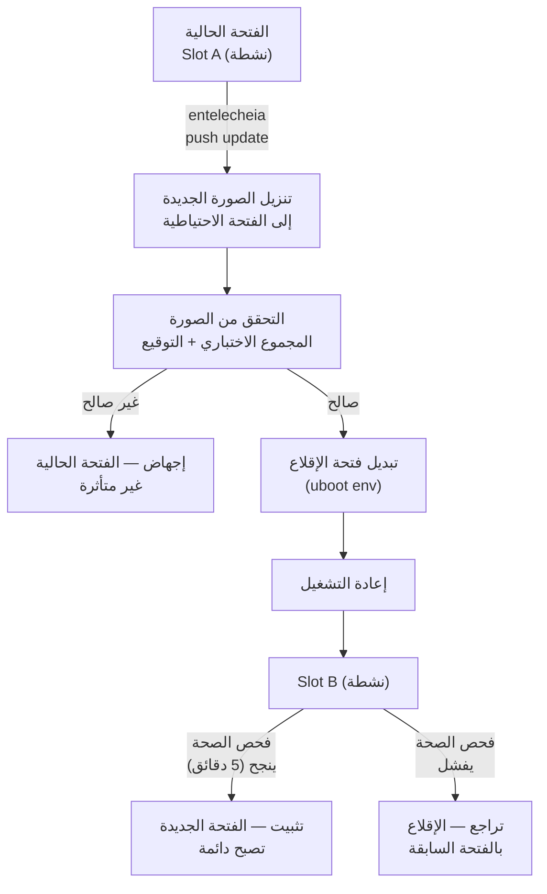

# دليل نشر aris

## نظرة عامة

يغطي هذا الدليل نشر برنامج aris الثابت على الأجهزة الفعلية — بدءًا من تزويد
المصنع وحتى التركيب الميداني والصيانة المستمرة.

## تجميع العتاد

### NanoPi R3S

بالنسبة للوحة المرجعية (NanoPi R3S)، ستحتاج إلى:

1. **لوحة NanoPi R3S** (RK3566، 2GB RAM)
2. **بطاقة microSD** (≥ 8 GB، يُوصى بـ UHS-I)
3. **مزود طاقة USB-C** (5V / 3A)
4. **محول تسلسلي USB-TTL** (منطق 3.3V، CP2102 أو FTDI)
5. **كابلات إيثرنت** (2 لكابل WAN + LAN)
6. **مرفق** (اختياري، يُوصى بتركيب قضيب DIN)



### مرجع الأسلاك

| دبوس اللوحة | محول USB-TTL | ملاحظات |
|-------------|-----------------|-------|
| Pin 1 (GND) | GND | أرضي مشترك |
| Pin 2 (TX) | RX | اللوحة ترسل → المحول يستقبل |
| Pin 3 (RX) | TX | اللوحة تستقبل ← المحول يرسل |

يعمل UART التصحيح بسرعة **1500000 باود، 8N1**. تدعم معظم محاكيات الطرفية
(`picocom`، `minicom`، `screen`) معدل الباود هذا.

## تزويد المصنع

يتبع تزويد جهاز جديد الخطوات التالية:



### هوية الجهاز

يمتلك كل جهاز aris هوية فريدة مخزنة في `/data/device.toml`:

```toml
[device]
node_id = "aris-nanopi-r3s-001"
hardware = "nanopi-r3s"
serial = "RK3566-SN-XXXXXXXX"

[entitlecheia]
endpoint = "wss://entelecheia.example.com/ws"
psk = "/data/keys/device.psk"
```

تُولَّد الهوية عند الإقلاع الأول وتُحفظ في قسم التخزين الدائم القابل للكتابة.
يُستخدم مفتاح المشاركة المسبقة (`device.psk`) للمصادقة مع دورة حياة جلسة
entelecheia.

## طوبولوجيا الشبكة

يبدو النشر الميداني النموذجي كالتالي:



- **eth0 (WAN)**: يتصل بالشبكة المحلية للمؤسسة أو مباشرة بالإنترنت. DHCP
  افتراضيًا؛ يمكن تكوين IP ثابت عبر `/data/network.toml`.
- **eth1 (LAN)**: يخدم شبكة الناقل الميداني المحلية على `192.168.42.0/24`.
  هنا تتصل PLCs والمستشعرات وواجهات HMI.

## تحديثات OTA

يدعم aris تحديثات الفتحة المزدوجة A/B للتحديثات الآمنة القابلة للتراجع:



يدعم تخطيط الأقسام A/B لكل من `boot` و `rootfs`:

| الفتحة | قسم boot | قسم rootfs | الحالة |
|------|---------------|-----------------|--------|
| A | `boot-A` (128 MiB) | `rootfs-A` (512 MiB) | أساسية |
| B | `boot-B` (128 MiB) | `rootfs-B` (512 MiB) | احتياطية |

## قائمة فحص النشر الميداني

قبل نشر جهاز في موقع فعلي، تحقق مما يلي:

1. **العتاد**: جميع الكابلات مثبتة، مصدر الطاقة كافٍ، المرفق محكم الإغلاق
2. **التخزين**: بطاقة SD مُدخلة بشكل صحيح، عدم تفعيل مفتاح الحماية من الكتابة
3. **الشبكة**: كلا منفذي eth0 و eth1 موصولان بالشبكات الصحيحة
4. **التسلسلي**: USB-TTL قابل للوصول للوصول الطارئ لوحدة التحكم
5. **الإقلاع**: تشغيل الطاقة، مراقبة وحدة التحكم التسلسلية لرسائل الإقلاع
6. **الخدمات**: `aris-core` (PID 1) ومراقب `evernight` يعملان
7. **التسجيل**: ظهور الجهاز في لوحة معلومات entelecheia
8. **البروتوكول**: مستمعو Modbus/S7comm/OPC UA قابلون للوصول من الأجهزة الميدانية
9. **OTA**: اختبار تحديث OTA وهمي للتحقق من تخطيط الأقسام
10. **المراقب**: اختبار المراقب بقتل `aris-core` — يجب أن يعيد الجهاز التشغيل

```bash
# Verify services on the device (via SSH or serial)
ps aux | grep aris-core
ps aux | grep evernight

# Check network interfaces
ip addr show eth0
ip addr show eth1

# Check partition layout
cat /proc/partitions

# Check boot slot
fw_printenv boot_slot

# Trigger manual health check
aris-core --health-check
```

## المراقبة

بعد النشر، راقب هذه المقاييس:

| المقياس | المصدر | عتبة التنبيه |
|--------|--------|----------------|
| درجة حرارة CPU | `/sys/class/thermal/thermal_zone0/temp` | > 80°C |
| استخدام الذاكرة | `/proc/meminfo` | > 90% |
| تآكل التخزين | `/data/wear_level.txt` | > 80% rated cycles |
| رابط الشبكة | `ethtool eth0` / `ethtool eth1` | Link down |
| حالة evernight | `systemctl status evernight` | Not running |
| اتصال entelecheia | `/var/log/evernight.log` | Disconnected > 60s |

تُبلغ جميع المقاييس إلى entelecheia عبر وسيط بروتوكول evernight. تظهر التنبيهات
في لوحة معلومات entelecheia ويمكنها تفعيل استجابات تلقائية (إعادة تشغيل،
تجاوز الفشل، إرسال فني).
