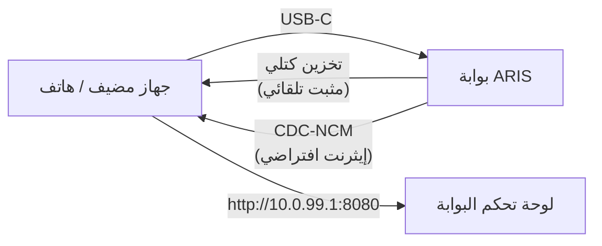

# التزويد الصفري عبر USB-C

عند توصيل ARIS بأي مضيف عبر USB-C، تُعرف البوابة نفسها كجهاز USB مركب
بوظيفتين:

## التخزين الكتلي

محرك أقراص USB افتراضي يحتوي على مثبتات تلقائية حسب نظام التشغيل لعميل
[evernight](https://github.com/celestia-island/evernight):

- **Windows** — مثبت `.bat` مع تشغيل تلقائي
- **Linux** — سكريبت `.sh` شل
- **macOS** — ملف `.command`
- **Android** — تعليمات على الشاشة

يرى المضيف محرك أقراص USB، ويفتح المثبت المناسب لنظام تشغيله، ويتم تثبيت
عميل evernight بدون أي تهيئة يدوية.

## CDC-NCM (إيثرنت افتراضي)

محول إيثرنت افتراضي يمنح المضيف رابط IP مباشر إلى لوحة تحكم البوابة على
`http://10.0.99.1:8080`.

## التدفق

**قم بتوصيل USB-C → يرى المضيف محرك أقراص USB → افتح المثبت → انتهى.**
لا حاجة لتكوين الشبكة، ولا تنزيل برامج تشغيل، ولا إقران يدوي.
