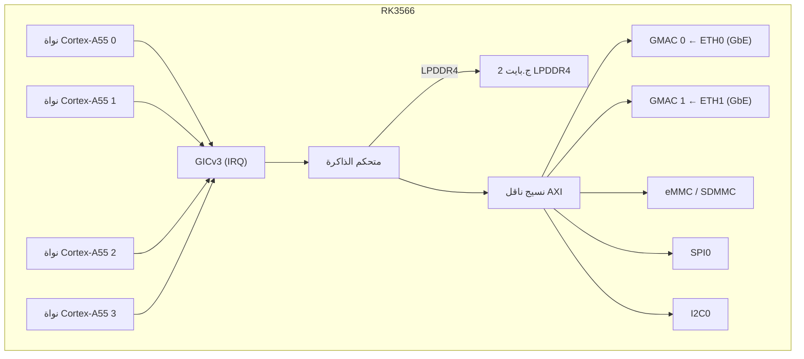

# NanoPi R3S — مرجع العتاد

## المواصفات

| المكوّن | التفصيل |
|-----------|--------|
| SoC | Rockchip RK3566 |
| CPU | رباعي النواة Cortex-A55 @ 1.8 جيجاهرتز |
| NPU | 1 TOPS (INT8) |
| RAM | 2 ج.بايت LPDDR4/LPDDR4X |
| التخزين | MicroSD (حتى 128 ج.بايت) + وحدة eMMC |
| إيثرنت | 2x 10/100/1000 ميجابت/ث (PHY RTL8211F) |
| USB | 1x USB 3.0 Type-A |
| UART للتصحيح | موصّل 3 أسنان 2.54 ملم (TTL 3.3 فولت) |
| GPIO | موصّل 40 سنًا متوافق مع Raspberry Pi |
| الطاقة | 5V/3A عبر USB-C |
| الأبعاد | 65 × 52 ملم |

## توزيع الأطراف

### موصّل GPIO ذو 40 سنًا

| السن | الإشارة | السن | الإشارة |
|-----|--------|-----|--------|
| 1 | 3.3V | 2 | 5V |
| 3 | GPIO2 | 4 | 5V |
| 5 | GPIO3 | 6 | GND |
| 7 | GPIO4 | 8 | GPIO14 (UART2 TX) |
| 9 | GND | 10 | GPIO15 (UART2 RX) |
| ... | ... | ... | ... |

### UART للتصحيح

| السن | التصنيف | الوظيفة |
|-----|-------|----------|
| 1 | GND | الأرضي |
| 2 | TX  | UART2 TX (3.3 فولت) |
| 3 | RX  | UART2 RX (3.3 فولت) |

معدل الباود: 1500000، 8 بتات بيانات، بلا تماثل، 1 بت إيقاف.

## المخطط الصندوقي (برامج aris الثابتة)

