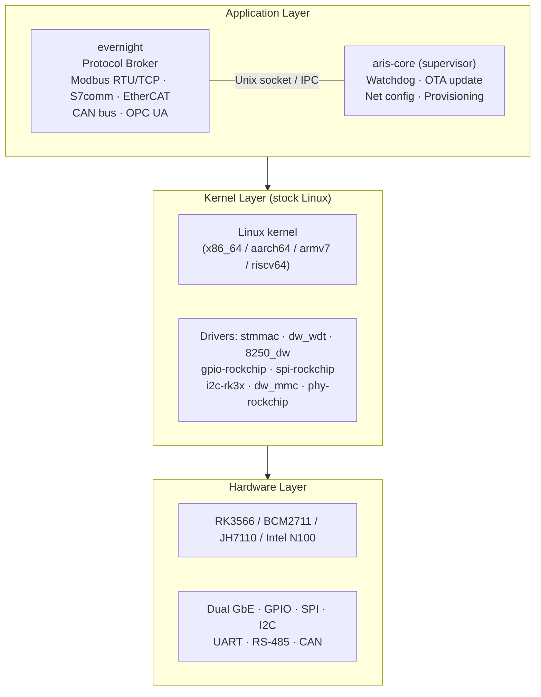
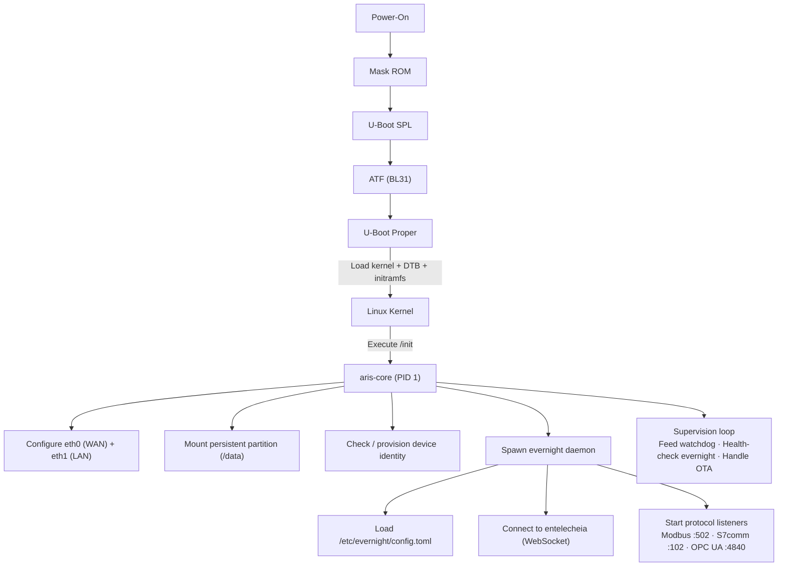

# aris System Architecture

## Overview

aris is a Linux-standard distribution with a desktop environment purpose-built
for evernight and shittim-chest. It targets industrial HMI panels and
supervisory host (上位机) stations — the operator-facing machine. It runs a
stock Linux kernel and bridges the evernight broker and shittim-chest sessions
to field devices.

## Architecture Layers



## Boot Flow



## Partition Layout (A/B Update)

| Offset | Size | Partition | Contents |
|--------|------|-----------|----------|
| 0 | 32 KiB | (gap) | idbloader.img |
| 32 KiB | 8 MiB | (gap) | u-boot.itb |
| 8 MiB | 128 MiB | boot-A | Image + DTB + boot.scr |
| 136 MiB | 128 MiB | boot-B | Image + DTB + boot.scr (standby) |
| 264 MiB | 512 MiB | rootfs-A | squashfs (ro) |
| 776 MiB | 512 MiB | rootfs-B | squashfs (ro, standby) |
| 1288 MiB | - | persistent | ext4 (rw, /data) |

## Network Topology

```mermaid
flowchart TB
    NET["Internet / Enterprise LAN"] --> ETH0
    subbox GW["aris Gateway"]
        ETH0["eth0 — WAN (DHCP)"]
        ETH1["eth1 — LAN (192.168.42.1/24)"]
    end
    ETH1 --> PLC["PLC\n192.168.42.5"]
    ETH1 --> SEN["Sensor\n192.168.42.10"]
    ETH1 --> HMI["HMI\n192.168.42.20"]
```

## Asterinas ARM64 Strategy (Phase 2)

Primary upstream source for ARM64 Asterinas:

- **Fork**: https://github.com/wanywhn/asterinas (branch: `arm64-support`)
- **PR**: asterinas/asterinas#3270
- **Status**: Nearly ready for merge; includes GICv3, ARM GIC, basic device
  tree, MMU setup, and UART console for aarch64

Once merged into mainline Asterinas, aris will track the official repo. Until
then, the `arm64-support` branch serves as the development baseline.
