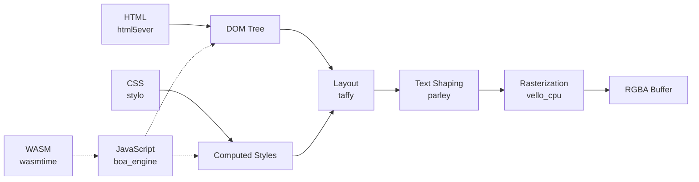

# ARIS Architecture

## Overview

ARIS is a browser engine derived from servo. It can be embedded as a library
in any Rust application, or run as a standalone desktop browser. The rendering
pipeline uses pure-Rust crates (html5ever, stylo, taffy, parley, vello),
replacing servo's SpiderMonkey (C++), WebRender (C++/SWGL), and
components/script with Boa, Vello CPU, and Wasmtime respectively.

## Rendering Pipeline



### Component Details

| Layer | Crate | Role | Origin |
|-------|-------|------|--------|
| HTML parsing | html5ever | Parse HTML into DOM tree | Servo (pure Rust) |
| CSS parsing & cascade | stylo + cssparser + selectors | Parse CSS, compute cascaded styles | Servo (pure Rust) |
| Layout | taffy | Flexbox, Grid, Block layout | Independent (pure Rust) |
| Text shaping | parley | Text layout and shaping | Independent (pure Rust) |
| Rasterization | vello_cpu | CPU-based vector graphics → RGBA pixels | Independent (pure Rust) |
| JavaScript | boa_engine | ECMAScript execution | Independent (pure Rust) |
| WASM runtime | wasmtime | WASM Component Model, WASI | Independent |

### What We Replaced from Servo

| Servo Component | ARIS Replacement | Reason |
|----------------|-----------------|--------|
| SpiderMonkey (C++) | boa_engine | Pure Rust, no C++ build dependency |
| WebRender + SWGL (C++) | vello_cpu | Pure Rust CPU rasterization |
| components/script | Boa bridge (aris-js) | No SpiderMonkey coupling |
| components/layout (partial) | taffy + parley | Pure Rust, independently maintained |
| — | wasmtime | WASM Component Model with WASI |

## Display Backends

ARIS renders to a pixel buffer which can be displayed through multiple backends:

| Backend | Crate | Use Case |
|---------|-------|----------|
| /dev/fb0 mmap | aris-render (fbdev) | Embedded devices, kei kernel |
| winit + softbuffer | aris-render (winit_backend) | Desktop (Linux, macOS, Windows) |
| WASM canvas | aris-wasm | Browser embedding via WASM |

## System Integration

```
┌──────────────────────────────────────────────────────────┐
│  Application Layer                                       │
│  tairitsu (VDOM) · hikari (UI components)                │
│  evernight (protocol broker) · entelecheia (AI agents)   │
├──────────────────────────────────────────────────────────┤
│  ARIS Browser Engine                                     │
│  ┌─────────┐ ┌─────────┐ ┌──────────┐ ┌──────────┐     │
│  │ render  │ │   js    │ │  wasm    │ │   abi    │     │
│  │ HTML→   │ │ boa_    │ │ wasmtime │ │ Linux    │     │
│  │ pixels  │ │ engine  │ │ + WIT   │ │ compat   │     │
│  └─────────┘ └─────────┘ └──────────┘ └──────────┘     │
├──────────────────────────────────────────────────────────┤
│  Kernel Layer                                            │
│  kei (syscall ABI, /dev/fb0, virtio-gpu) or Linux       │
└──────────────────────────────────────────────────────────┘
```

## Package Structure

```
aris/
├── packages/
│   ├── render/        # Rendering pipeline (Blitz + Vello CPU)
│   │   ├── src/lib.rs          # Public API
│   │   ├── src/fbdev.rs        # /dev/fb0 mmap backend
│   │   ├── src/winit_backend.rs # Desktop window backend
│   │   └── src/bin/            # render_lagrange, render_window, etc.
│   ├── js/             # Boa JS engine bridge (aris-js)
│   ├── wasm/           # Wasmtime WASM host + WIT adapter
│   ├── abi/            # Linux ABI compatibility layer
│   ├── core/           # PID 1 system supervisor
│   └── common/         # Shared types
├── configs/            # Board configurations
├── board/              # Device trees, boot scripts
├── kernel/             # Kernel patches (when on Linux)
└── scripts/            # Build and test automation
```

## Two Operating Modes

### 1. Embedded (Library)
Link `aris-render` as a dependency, call `render_html()` or `render_dom_ops()`:
```rust
use aris_render::render_html;
let pixels: Vec<u8> = render_html("<h1>Hello</h1>", 800, 600)?;
```

### 2. Standalone (Desktop Browser)
Run the `render_window` binary for a full desktop browser window:
```bash
cargo run -p aris-render --bin render_window --features winit-backend
```

## Related Projects

- **[kei](https://github.com/celestia-island/kei)** — Rust OS kernel providing syscall ABI and framebuffer
- **[tairitsu](https://github.com/celestia-island/tairitsu)** — WASM UI framework with VDOM
- **[hikari](https://github.com/celestia-island/hikari)** — UI component library built on tairitsu
- **[shirabe](https://github.com/celestia-island/shirabe)** — Browser automation, defines render FFI contract
