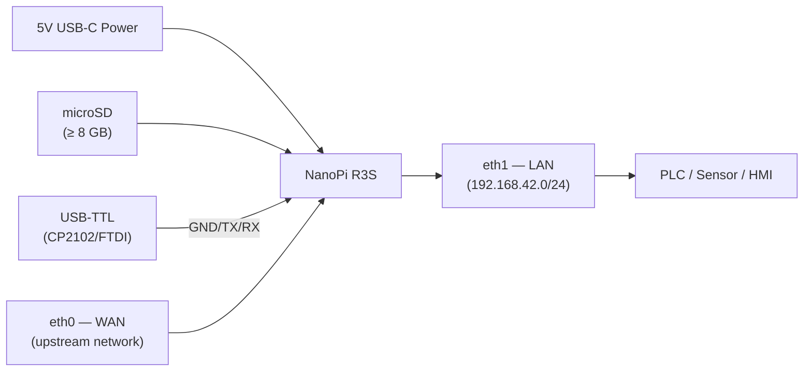
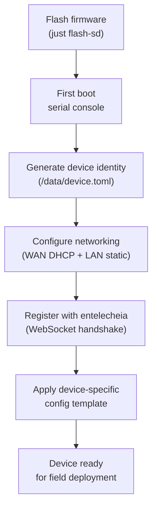
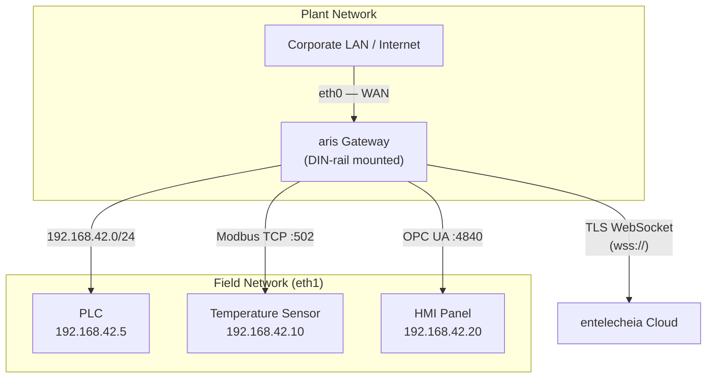
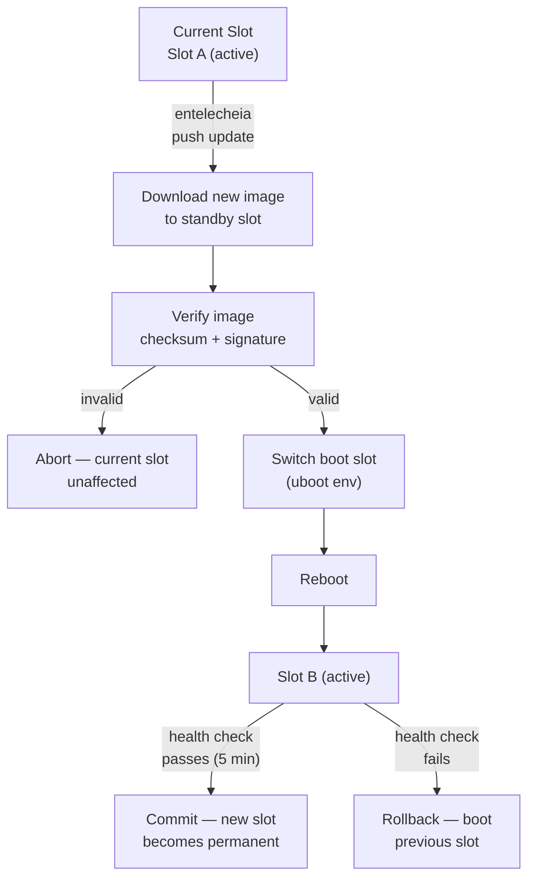

# aris Deployment Guide

## Overview

This guide covers deploying aris firmware to physical hardware — from factory
provisioning to field installation and ongoing maintenance.

## Hardware Assembly

### NanoPi R3S

For the reference board (NanoPi R3S), you will need:

1. **NanoPi R3S board** (RK3566, 2GB RAM)
2. **microSD card** (≥ 8 GB, UHS-I recommended)
3. **USB-C power supply** (5V / 3A)
4. **USB-TTL serial adapter** (3.3V logic, CP2102 or FTDI)
5. **Ethernet cables** (2x for WAN + LAN)
6. **Enclosure** (optional, DIN-rail mountable recommended)



### Wiring Reference

| Board Header | USB-TTL Adapter | Notes |
|-------------|-----------------|-------|
| Pin 1 (GND) | GND | Common ground |
| Pin 2 (TX) | RX | Board transmits → adapter receives |
| Pin 3 (RX) | TX | Board receives ← adapter transmits |

The debug UART runs at **1500000 baud, 8N1**. Most terminal emulators
(`picocom`, `minicom`, `screen`) support this baud rate.

## Factory Provisioning

Provisioning a new device follows these steps:



### Device Identity

Each aris device has a unique identity stored in `/data/device.toml`:

```toml
[device]
node_id = "aris-nanopi-r3s-001"
hardware = "nanopi-r3s"
serial = "RK3566-SN-XXXXXXXX"

[entitlecheia]
endpoint = "wss://entelecheia.example.com/ws"
psk = "/data/keys/device.psk"
```

The identity is generated on first boot and persisted to the writable persistent
partition. The pre-shared key (`device.psk`) is used to authenticate with
entelecheia's session lifecycle.

## Network Topology

A typical field deployment looks like:



- **eth0 (WAN)**: Connects to the upstream corporate network or directly to the
  internet. DHCP by default; static IP configurable via `/data/network.toml`.
- **eth1 (LAN)**: Serves the local fieldbus network at `192.168.42.0/24`. This
  is where PLCs, sensors, and HMIs connect.

## OTA Updates

aris supports A/B dual-slot updates for safe, rollback-capable firmware
upgrades:



The partition layout supports A/B for both `boot` and `rootfs`:

| Slot | boot partition | rootfs partition | Status |
|------|---------------|-----------------|--------|
| A | `boot-A` (128 MiB) | `rootfs-A` (512 MiB) | Primary |
| B | `boot-B` (128 MiB) | `rootfs-B` (512 MiB) | Standby |

## Field Deployment Checklist

Before deploying a device to a physical site, verify:

1. **Hardware**: All cables seated, power supply adequate, enclosure sealed
2. **Storage**: SD card properly inserted, no write-protect switch enabled
3. **Network**: Both eth0 and eth1 cabled to correct networks
4. **Serial**: USB-TTL accessible for emergency console access
5. **Boot**: Power on, monitor serial console for boot messages
6. **Services**: `aris-core` (PID 1) and `evernight` daemon running
7. **Registration**: Device appears in entelecheia dashboard
8. **Protocol**: Modbus/S7comm/OPC UA listeners reachable from field devices
9. **OTA**: Test a dummy OTA update to verify partition layout
10. **Watchdog**: Test watchdog by killing `aris-core` — device should reboot

```bash
# Verify services on the device (via SSH or serial)
ps aux | grep aris-core
ps aux | grep evernight

# Check network interfaces
ip addr show eth0
ip addr show eth1

# Check partition layout
cat /proc/partitions

# Check boot slot
fw_printenv boot_slot

# Trigger manual health check
aris-core --health-check
```

## Monitoring

After deployment, monitor these metrics:

| Metric | Source | Alert Threshold |
|--------|--------|----------------|
| CPU temperature | `/sys/class/thermal/thermal_zone0/temp` | > 80°C |
| Memory usage | `/proc/meminfo` | > 90% |
| Storage wear | `/data/wear_level.txt` | > 80% rated cycles |
| Network link | `ethtool eth0` / `ethtool eth1` | Link down |
| evernight status | `systemctl status evernight` | Not running |
| entelecheia connection | `/var/log/evernight.log` | Disconnected > 60s |

All metrics are reported to entelecheia via the evernight protocol broker.
Alerts are surfaced in the entelecheia dashboard and can trigger automated
responses (restart, failover, dispatch technician).
