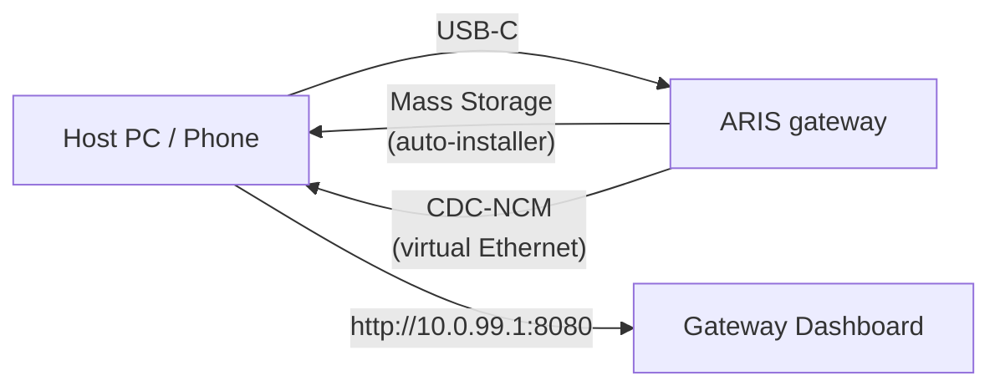

# USB-C Zero-Config Provisioning

When ARIS is connected to any host via USB-C, the gateway presents itself as a
composite USB device with two functions:

## Mass Storage

A virtual USB drive containing per-OS auto-installers for the
[evernight](https://github.com/celestia-island/evernight) client:

- **Windows** — `.bat` installer with AutoRun
- **Linux** — `.sh` shell script
- **macOS** — `.command` file
- **Android** — on-screen instructions

The host sees a USB drive, opens the installer for their OS, and the
evernight client is installed with zero manual configuration.

## CDC-NCM (Virtual Ethernet)

A virtual Ethernet adapter giving the host a direct IP link to the gateway
dashboard at `http://10.0.99.1:8080`.

## Flow

**Plug in USB-C → host sees a USB drive → open the installer → done.**
No network configuration, no driver downloads, no manual pairing.
