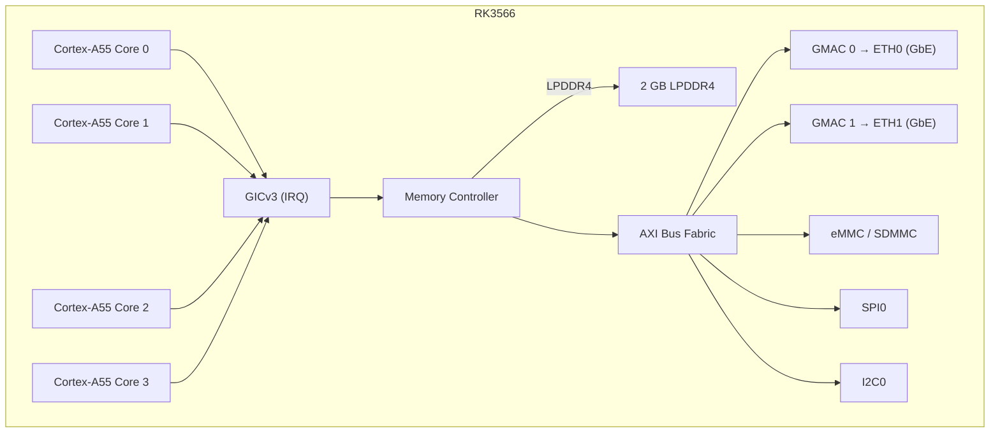

# NanoPi R3S — Hardware Reference

## Specifications

| Component | Detail |
|-----------|--------|
| SoC | Rockchip RK3566 |
| CPU | Quad-core Cortex-A55 @ 1.8 GHz |
| NPU | 1 TOPS (INT8) |
| RAM | 2 GB LPDDR4/LPDDR4X |
| Storage | MicroSD (up to 128 GB) + eMMC module |
| Ethernet | 2x 10/100/1000 Mbps (RTL8211F PHY) |
| USB | 1x USB 3.0 Type-A |
| Debug UART | 3-pin 2.54mm header (3.3V TTL) |
| GPIO | 40-pin Raspberry Pi compatible header |
| Power | 5V/3A via USB-C |
| Dimensions | 65 × 52 mm |

## Pinout

### 40-pin GPIO Header

| Pin | Signal | Pin | Signal |
|-----|--------|-----|--------|
| 1 | 3.3V | 2 | 5V |
| 3 | GPIO2 | 4 | 5V |
| 5 | GPIO3 | 6 | GND |
| 7 | GPIO4 | 8 | GPIO14 (UART2 TX) |
| 9 | GND | 10 | GPIO15 (UART2 RX) |
| ... | ... | ... | ... |

### Debug UART

| Pin | Label | Function |
|-----|-------|----------|
| 1 | GND | Ground |
| 2 | TX  | UART2 TX (3.3V) |
| 3 | RX  | UART2 RX (3.3V) |

Baud rate: 1500000, 8 data bits, no parity, 1 stop bit.

## Block Diagram (aris firmware)

