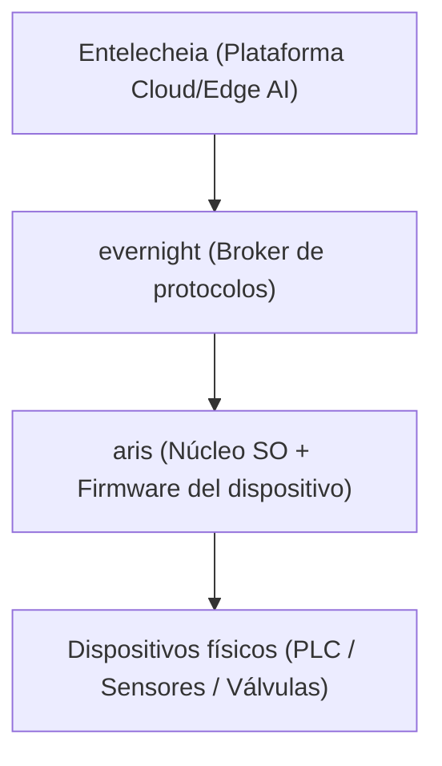

<p align="center"></p>

<h1 align="center">ARIS</h1>

<p align="center"><strong>Una distribución estándar Linux con un escritorio afinado para evernight y shittim-chest — construida para HMI industrial y estaciones host</strong></p>

<div align="center">

[](../../LICENSE)
[](https://github.com/celestia-island/aris/actions/workflows/ci.yml)

</div>

<div align="center">

[English](../en/README.md) ·
[简体中文](../zhs/README.md) ·
[繁體中文](../zht/README.md) ·
[日本語](../ja/README.md) ·
[한국어](../ko/README.md) ·
[Français](../fr/README.md) ·
**[Español](../es/README.md)** ·
[Русский](../ru/README.md) ·
[العربية](../ar/README.md)

</div>

## Introducción

ARIS es una distribución Linux fiel a la base estándar de Linux (Linux Standard
Base) que incluye un entorno de escritorio diseñado específicamente para
evernight y shittim-chest. Su referencia es el panel HMI industrial y la
estación host (上位机) — la máquina orientada al operador, no la pasarela edge.
Allí donde la pila Celestia más amplia desciende hacia los dispositivos
físicos, ARIS es el SO frente al que el operador realmente se sienta: un Linux
familiar y compatible con LSB que arranca en un escritorio cableado
específicamente para monitorizar y controlar brokers de evernight y sesiones de
shittim-chest.



## Aprovisionamiento Zero-Config USB-C

Cuando se conecta a un host mediante USB-C, la pasarela se presenta como un
dispositivo USB compuesto:

- **Almacenamiento masivo** — una unidad USB virtual que contiene
  autoinstaladores por SO para el cliente evernight (Windows `.bat` + AutoRun,
  Linux `.sh`, macOS `.command`, instrucciones para Android)
- **CDC-NCM** — un adaptador Ethernet virtual que proporciona al host un enlace
  IP directo al panel de la pasarela en `http://10.0.99.1:8080`

**Conecte USB-C → el host ve una unidad USB → abra el instalador → listo.** Sin
configuración de red, sin descargas de controladores, sin emparejamiento manual.

## Arquitecturas compatibles

| Arquitectura | Estado | Placas objetivo |
|-------------|--------|-----------------|
| ARMv8+ (aarch64) | Activo | NanoPi R3S (RK3566) |
| ARMv7+ (armv7) | Planificado | Raspberry Pi 3/4 |
| RISC-V 64 (riscv64) | Planificado | VisionFive 2 |
| x86_64 | Planificado | PC industrial |

## Inicio rápido

```bash
just setup-cross   # Install cross-compilation toolchains
just build         # Build firmware image for default board
just build-board nanopi-r3s
just flash-sd      # Write image to SD card
```

## Arquitectura

ARIS sigue una estrategia de dos fases:

- **Fase 1** (actual): núcleo Linux + rootfs ligero estilo Buildroot, ejecuta
  evernight como demonio. Pragmático, se entrega ahora.
- **Fase 2** (futura): [Asterinas](https://github.com/asterinas/asterinas)
  framekernel (SO en Rust) reemplaza al núcleo Linux. Pila segura completa, del
  silicio hasta la aplicación.

Consulte la [documentación](../en/) para detalles de arquitectura, referencias
de hardware y guías de construcción.

## Licencia

Business Source License 1.1 (BUSL-1.1). Commercial use requires an
authorization license. Non-commercial use follows the SySL-1.0 protocol.
Converts to SySL-1.0 or Apache-2.0 on 2030-01-01. See [LICENSE](../../LICENSE).
