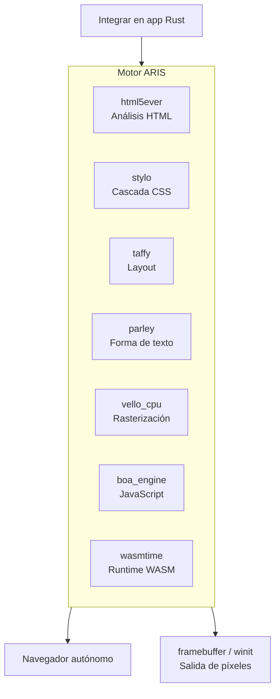

<p align="center"></p>

<h1 align="center">ARIS</h1>

<p align="center"><strong>Un motor de navegador construido sobre servo — integrable o autónomo. La infraestructura oficial de servo se reemplaza parcialmente con alternativas 100% Rust.</strong></p>

<div align="center">

[](../../LICENSE)
[](https://github.com/celestia-island/aris/actions/workflows/ci.yml)

</div>

<div align="center">

[English](../en/README.md) ·
[简体中文](../zhs/README.md) ·
[繁體中文](../zht/README.md) ·
[日本語](../ja/README.md) ·
[한국어](../ko/README.md) ·
[Français](../fr/README.md) ·
**Español** ·
[Русский](../ru/README.md) ·
[العربية](../ar/README.md)

</div>

## Introducción

ARIS es un **motor de navegador derivado de servo**. Puede integrarse como biblioteca en cualquier aplicación Rust, o ejecutarse como navegador de escritorio autónomo. El pipeline de renderizado se ensambla a partir de crates 100% Rust — html5ever, stylo, taffy, parley, vello — y las dependencias SpiderMonkey / WebRender / SWGL de servo se reemplazan por Boa (JS), Vello CPU (rasterización) y Wasmtime (WASM).



## ¿Por qué no forkear Servo directamente?

Servo agrupa SpiderMonkey (C++), WebRender (C++/SWGL) y un amplio grafo de dependencias. ARIS toma las mejores piezas de servo — el frontal HTML/CSS en Rust puro (html5ever, stylo, cssparser, selectors) — y reconstruye las capas de JavaScript, rasterización y WASM con alternativas 100% Rust.

| Componente Servo | Alternativa ARIS | Razón |
|-----------------|-----------------|-------|
| SpiderMonkey (C++) | boa_engine | 100% Rust, sin build C++ |
| WebRender + SWGL (C++) | vello_cpu | Rasterización CPU 100% Rust |
| components/script | Puente Boa | Sin acoplamiento a SpiderMonkey |
| — | wasmtime | WASM Component Model, WASI |

## Inicio rápido

```bash
# Compilar el navegador autónomo
cargo build -p aris-render --release

# Renderizar página web al framebuffer
cargo run -p aris-render --bin render_lagrange -- example.html

# Ejecutar en ventana (backend winit)
cargo run -p aris-render --bin render_window --features winit-backend
```

Consulte la [guía de compilación](./build/quickstart.md) para más detalles.

## Arquitectura

```
┌──────────────────────────────────────────────────────┐
│  tairitsu (VDOM) / hikari (componentes UI)           │
│  WASM Component Model → interfaz WIT                 │
├──────────────────────────────────────────────────────┤
│  Pipeline de renderizado ARIS                         │
│  html5ever → stylo → taffy → parley → vello_cpu → RGBA│
│  Motor Boa JS (scripts de página)                    │
│  Wasmtime (componentes WASM, WASI)                   │
├──────────────────────────────────────────────────────┤
│  Backends de pantalla: /dev/fb0 · winit+softbuffer   │
├──────────────────────────────────────────────────────┤
│  Núcleo kei (ABI syscall) o Linux                    │
└──────────────────────────────────────────────────────┘
```

Consulte la [visión general de arquitectura](./architecture/overview.md).

## Ecosistema

- **[kei](https://github.com/celestia-island/kei)** — Núcleo de SO en Rust
- **[tairitsu](https://github.com/celestia-island/tairitsu)** — Framework UI WASM
- **[hikari](https://github.com/celestia-island/hikari)** — Biblioteca de componentes UI
- **[shirabe](https://github.com/celestia-island/shirabe)** — Automatización de navegador, contrato FFI de renderizado
- **[evernight](https://github.com/celestia-island/evernight)** — Bróker de protocolos industriales
- **[entelecheia](https://github.com/celestia-island/entelecheia)** — Plataforma de agentes IA

## Licencia

Business Source License 1.1 (BUSL-1.1). Se convierte a SySL-1.0 o Apache-2.0 el 2030-01-01. Ver [LICENSE](../../LICENSE).
