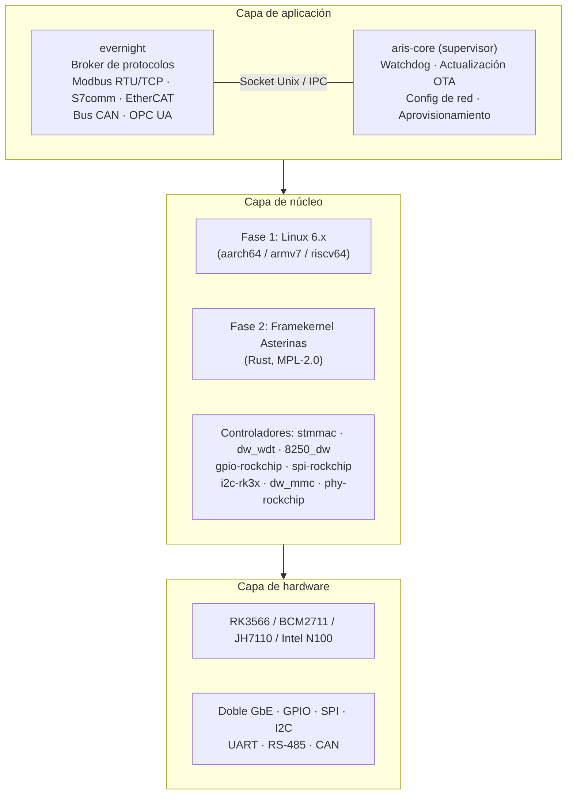
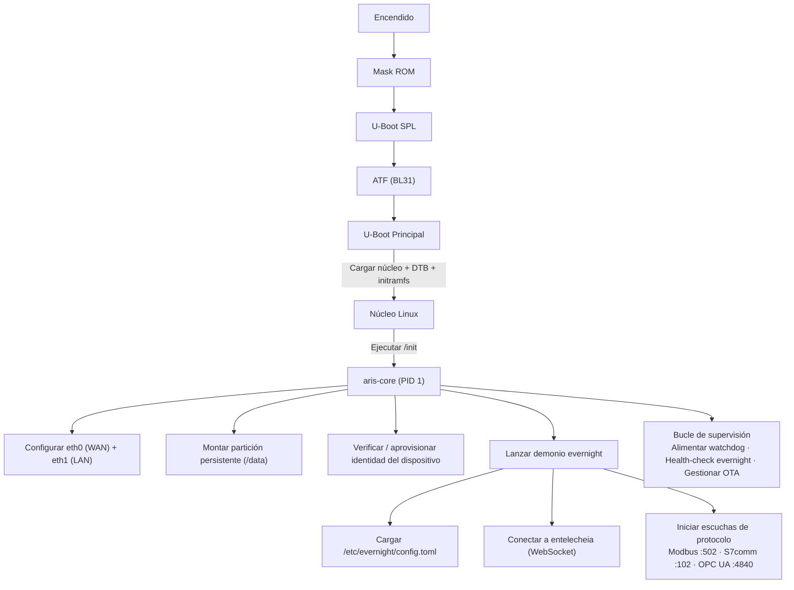

# Arquitectura del sistema aris

## Visión general

aris es un SO embebido modular para pasarelas IoT industriales que ejecutan el
ecosistema Entelecheia. Conecta el broker de protocolos evernight al hardware
físico a través de una capa de núcleo mínima y segura.

## Capas de arquitectura



## Flujo de arranque



## Disposición de particiones (Actualización A/B)

| Desplazamiento | Tamaño | Partición | Contenido |
|----------------|--------|-----------|-----------|
| 0 | 32 KiB | (hueco) | idbloader.img |
| 32 KiB | 8 MiB | (hueco) | u-boot.itb |
| 8 MiB | 128 MiB | boot-A | Image + DTB + boot.scr |
| 136 MiB | 128 MiB | boot-B | Image + DTB + boot.scr (en espera) |
| 264 MiB | 512 MiB | rootfs-A | squashfs (ro) |
| 776 MiB | 512 MiB | rootfs-B | squashfs (ro, en espera) |
| 1288 MiB | - | persistente | ext4 (rw, /data) |

## Topología de red

```mermaid
flowchart TB
    NET["Internet / LAN empresarial"] --> ETH0
    subbox GW["Pasarela aris"]
        ETH0["eth0 — WAN (DHCP)"]
        ETH1["eth1 — LAN (192.168.42.1/24)"]
    end
    ETH1 --> PLC["PLC\n192.168.42.5"]
    ETH1 --> SEN["Sensor\n192.168.42.10"]
    ETH1 --> HMI["HMI\n192.168.42.20"]
```

## Estrategia Asterinas ARM64 (Fase 2)

Fuente principal upstream para Asterinas ARM64:

- **Fork**: https://github.com/wanywhn/asterinas (rama: `arm64-support`)
- **PR**: asterinas/asterinas#3270
- **Estado**: Casi listo para fusionar; incluye GICv3, ARM GIC, árbol de
  dispositivos básico, configuración MMU y consola UART para aarch64

Una vez fusionado en el mainline de Asterinas, aris seguirá el repositorio
oficial. Hasta entonces, la rama `arm64-support` sirve como base de desarrollo.
