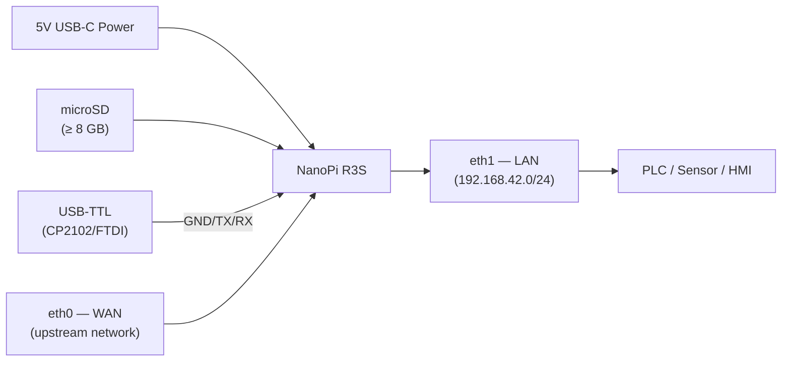
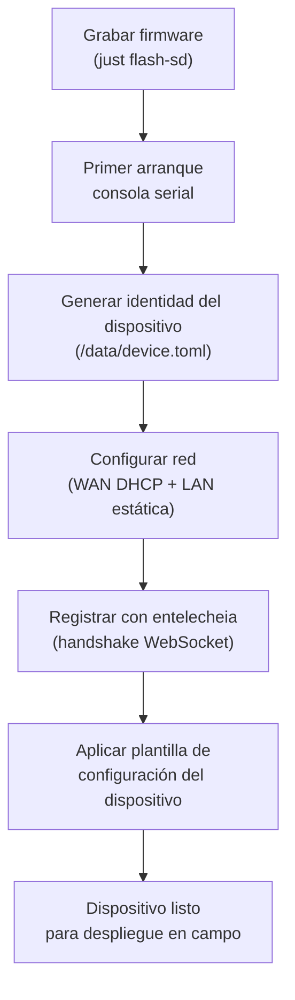
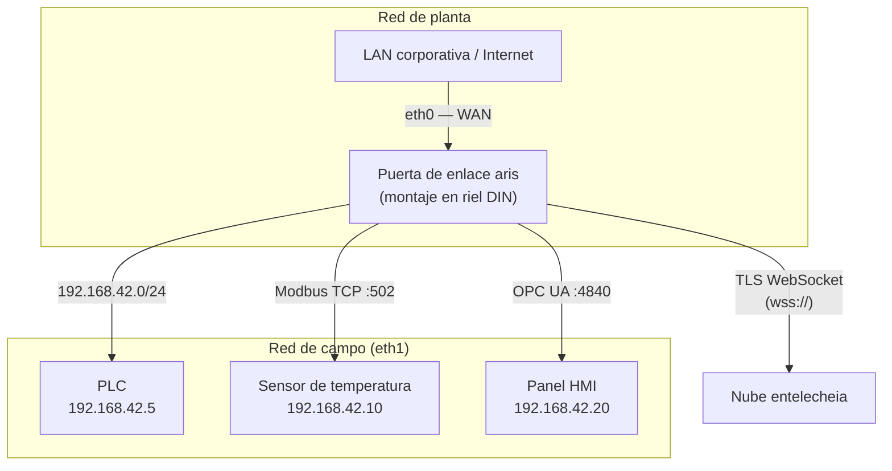
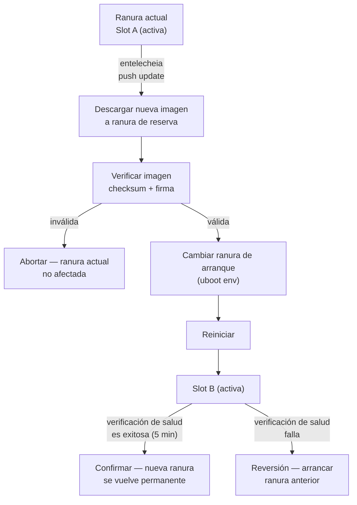

# Guía de despliegue de aris

## Visión general

Esta guía cubre el despliegue del firmware aris en hardware físico — desde
el aprovisionamiento de fábrica hasta la instalación en campo y el mantenimiento
continuo.

## Ensamblaje del hardware

### NanoPi R3S

Para la placa de referencia (NanoPi R3S), necesitará:

1. **Placa NanoPi R3S** (RK3566, 2GB RAM)
2. **Tarjeta microSD** (≥ 8 GB, se recomienda UHS-I)
3. **Fuente de alimentación USB-C** (5V / 3A)
4. **Adaptador serial USB-TTL** (lógica 3.3V, CP2102 o FTDI)
5. **Cables Ethernet** (2x para WAN + LAN)
6. **Carcasa** (opcional, se recomienda montaje en riel DIN)



### Referencia de cableado

| Pin de placa | Adaptador USB-TTL | Notas |
|-------------|-----------------|-------|
| Pin 1 (GND) | GND | Tierra común |
| Pin 2 (TX) | RX | La placa transmite → el adaptador recibe |
| Pin 3 (RX) | TX | La placa recibe ← el adaptador transmite |

El UART de depuración funciona a **1500000 baudios, 8N1**. La mayoría de los
emuladores de terminal (`picocom`, `minicom`, `screen`) soportan esta velocidad.

## Aprovisionamiento de fábrica

El aprovisionamiento de un nuevo dispositivo sigue estos pasos:



### Identidad del dispositivo

Cada dispositivo aris tiene una identidad única almacenada en `/data/device.toml`:

```toml
[device]
node_id = "aris-nanopi-r3s-001"
hardware = "nanopi-r3s"
serial = "RK3566-SN-XXXXXXXX"

[entitlecheia]
endpoint = "wss://entelecheia.example.com/ws"
psk = "/data/keys/device.psk"
```

La identidad se genera en el primer arranque y se persiste en la partición
persistente escribible. La clave precompartida (`device.psk`) se usa para
autenticarse con el ciclo de vida de sesión de entelecheia.

## Topología de red

Un despliegue típico en campo se ve así:



- **eth0 (WAN)**: Se conecta a la red corporativa ascendente o directamente a
  internet. DHCP por defecto; IP estática configurable mediante
  `/data/network.toml`.
- **eth1 (LAN)**: Sirve la red de bus de campo local en `192.168.42.0/24`. Aquí
  se conectan los PLCs, sensores y HMIs.

## Actualizaciones OTA

aris soporta actualizaciones de doble ranura A/B para actualizaciones de
firmware seguras con capacidad de reversión:



El diseño de particiones soporta A/B tanto para `boot` como para `rootfs`:

| Ranura | Partición boot | Partición rootfs | Estado |
|------|---------------|-----------------|--------|
| A | `boot-A` (128 MiB) | `rootfs-A` (512 MiB) | Primaria |
| B | `boot-B` (128 MiB) | `rootfs-B` (512 MiB) | Reserva |

## Lista de verificación para despliegue en campo

Antes de desplegar un dispositivo en un sitio físico, verifique:

1. **Hardware**: Todos los cables asentados, fuente de alimentación adecuada,
   carcasa sellada
2. **Almacenamiento**: Tarjeta SD correctamente insertada, sin protección contra
   escritura activada
3. **Red**: Ambos eth0 y eth1 conectados a las redes correctas
4. **Serial**: USB-TTL accesible para acceso de emergencia a la consola
5. **Arranque**: Encender, monitorear consola serial para mensajes de arranque
6. **Servicios**: `aris-core` (PID 1) y demonio `evernight` en ejecución
7. **Registro**: El dispositivo aparece en el panel de entelecheia
8. **Protocolo**: Listeners Modbus/S7comm/OPC UA accesibles desde dispositivos
   de campo
9. **OTA**: Probar una actualización OTA ficticia para verificar el diseño de
   particiones
10. **Watchdog**: Probar el watchdog matando `aris-core` — el dispositivo debe
    reiniciarse

```bash
# Verify services on the device (via SSH or serial)
ps aux | grep aris-core
ps aux | grep evernight

# Check network interfaces
ip addr show eth0
ip addr show eth1

# Check partition layout
cat /proc/partitions

# Check boot slot
fw_printenv boot_slot

# Trigger manual health check
aris-core --health-check
```

## Monitoreo

Después del despliegue, monitoree estas métricas:

| Métrica | Fuente | Umbral de alerta |
|--------|--------|----------------|
| Temperatura CPU | `/sys/class/thermal/thermal_zone0/temp` | > 80°C |
| Uso de memoria | `/proc/meminfo` | > 90% |
| Desgaste de almacenamiento | `/data/wear_level.txt` | > 80% rated cycles |
| Enlace de red | `ethtool eth0` / `ethtool eth1` | Link down |
| Estado de evernight | `systemctl status evernight` | Not running |
| Conexión entelecheia | `/var/log/evernight.log` | Disconnected > 60s |

Todas las métricas se reportan a entelecheia a través del broker de protocolo
evernight. Las alertas se muestran en el panel de entelecheia y pueden
desencadenar respuestas automáticas (reinicio, conmutación por error, envío de
técnico).
