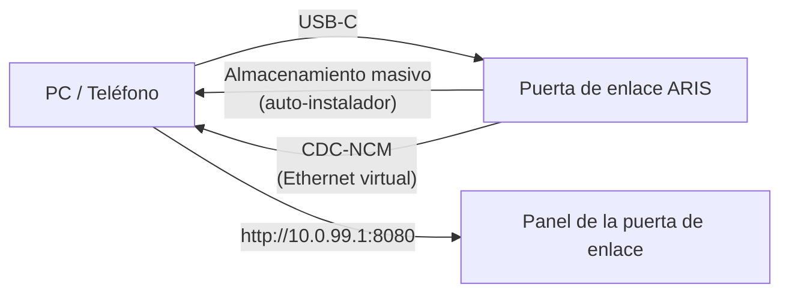

# Aprovisionamiento cero-configuración por USB-C

Cuando ARIS se conecta a cualquier host mediante USB-C, la puerta de enlace se
presenta como un dispositivo USB compuesto con dos funciones:

## Almacenamiento masivo

Una unidad USB virtual que contiene instaladores automáticos por sistema
operativo para el cliente [evernight](https://github.com/celestia-island/evernight):

- **Windows** — instalador `.bat` con AutoRun
- **Linux** — script de shell `.sh`
- **macOS** — archivo `.command`
- **Android** — instrucciones en pantalla

El host ve una unidad USB, abre el instalador para su sistema operativo y el
cliente evernight se instala sin configuración manual.

## CDC-NCM (Ethernet virtual)

Un adaptador Ethernet virtual que brinda al host un enlace IP directo al panel
de la puerta de enlace en `http://10.0.99.1:8080`.

## Flujo

**Conecte USB-C → el host ve una unidad USB → abra el instalador → listo.**
Sin configuración de red, sin descargas de controladores, sin emparejamiento manual.
