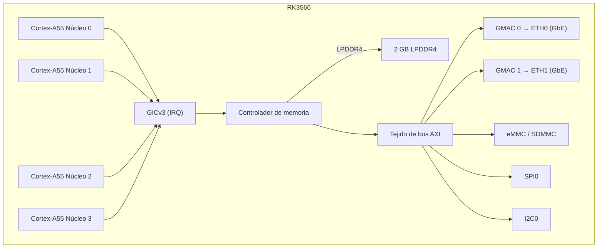

# NanoPi R3S — Referencia de hardware

## Especificaciones

| Componente | Detalle |
|-----------|---------|
| SoC | Rockchip RK3566 |
| CPU | Cortex-A55 de cuatro núcleos @ 1,8 GHz |
| NPU | 1 TOPS (INT8) |
| RAM | 2 GB LPDDR4/LPDDR4X |
| Almacenamiento | MicroSD (hasta 128 GB) + módulo eMMC |
| Ethernet | 2x 10/100/1000 Mbps (PHY RTL8211F) |
| USB | 1x USB 3.0 Type-A |
| UART de depuración | Header de 3 pines 2,54 mm (TTL 3,3 V) |
| GPIO | Header de 40 pines compatible con Raspberry Pi |
| Alimentación | 5V/3A mediante USB-C |
| Dimensiones | 65 × 52 mm |

## Pinout

### Header GPIO de 40 pines

| Pin | Señal | Pin | Señal |
|-----|-------|-----|-------|
| 1 | 3,3V | 2 | 5V |
| 3 | GPIO2 | 4 | 5V |
| 5 | GPIO3 | 6 | GND |
| 7 | GPIO4 | 8 | GPIO14 (UART2 TX) |
| 9 | GND | 10 | GPIO15 (UART2 RX) |
| ... | ... | ... | ... |

### UART de depuración

| Pin | Etiqueta | Función |
|-----|----------|---------|
| 1 | GND | Tierra |
| 2 | TX  | UART2 TX (3,3 V) |
| 3 | RX  | UART2 RX (3,3 V) |

Velocidad en baudios: 1500000, 8 bits de datos, sin paridad, 1 bit de parada.

## Diagrama de bloques (firmware aris)

