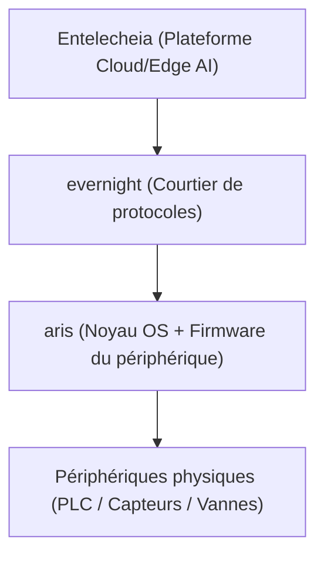

<p align="center"></p>

<h1 align="center">ARIS</h1>

<p align="center"><strong>OS embarqué pour passerelles IoT industrielles — exécute evernight sur périphériques edge ARM/RISC-V</strong></p>

<div align="center">

[](../../LICENSE)
[](https://github.com/celestia-island/aris/actions/workflows/ci.yml)

</div>

<div align="center">

[English](../en/README.md) ·
[简体中文](../zhs/README.md) ·
[繁體中文](../zht/README.md) ·
[日本語](../ja/README.md) ·
[한국어](../ko/README.md) ·
**[Français](../fr/README.md)** ·
[Español](../es/README.md) ·
[Русский](../ru/README.md) ·
[العربية](../ar/README.md)

</div>

## Introduction

ARIS est l'OS/firmware embarqué pour la passerelle IoT industrielle Entelecheia.
Il exécute [evernight](https://github.com/celestia-island/evernight) sur des
périphériques edge ARM/RISC-V, reliant le courtier de protocoles au matériel
physique via une couche noyau minimale et sécurisée.



## Provisionnement Zero-Config USB-C

Lorsqu'il est connecté à un hôte via USB-C, la passerelle se présente comme un
périphérique USB composite :

- **Stockage de masse** — un lecteur USB virtuel contenant des auto-installeurs
  par OS pour le client evernight (Windows `.bat` + AutoRun, Linux `.sh`,
  macOS `.command`, instructions Android)
- **CDC-NCM** — une carte Ethernet virtuelle donnant à l'hôte un lien IP direct
  vers le tableau de bord de la passerelle à `http://10.0.99.1:8080`

**Branchez USB-C → l'hôte voit un lecteur USB → ouvrez l'installeur → terminé.**
Aucune configuration réseau, aucun téléchargement de pilote, aucun appairage
manuel.

## Architectures prises en charge

| Architecture | Statut | Cartes cibles |
|-------------|--------|---------------|
| ARMv8+ (aarch64) | Actif | NanoPi R3S (RK3566) |
| ARMv7+ (armv7) | Planifié | Raspberry Pi 3/4 |
| RISC-V 64 (riscv64) | Planifié | VisionFive 2 |
| x86_64 | Planifié | PC industriel |

## Démarrage rapide

```bash
just setup-cross   # Install cross-compilation toolchains
just build         # Build firmware image for default board
just build-board nanopi-r3s
just flash-sd      # Write image to SD card
```

## Architecture

ARIS suit une stratégie en deux phases :

- **Phase 1** (actuelle) : noyau Linux + rootfs léger de type Buildroot, exécute
  evernight comme daemon. Pragmatique, livrable maintenant.
- **Phase 2** (future) : [Asterinas](https://github.com/asterinas/asterinas)
  framekernel (OS Rust) remplace le noyau Linux. Pile sécurisée complète, du
  silicium jusqu'à l'application.

Voir la [documentation](../en/) pour les détails d'architecture, les références
matérielles et les guides de construction.

## Licence

Business Source License 1.1 (BUSL-1.1). Commercial use requires an
authorization license. Non-commercial use follows the SySL-1.0 protocol.
Converts to SySL-1.0 or Apache-2.0 on 2030-01-01. See [LICENSE](../../LICENSE).
