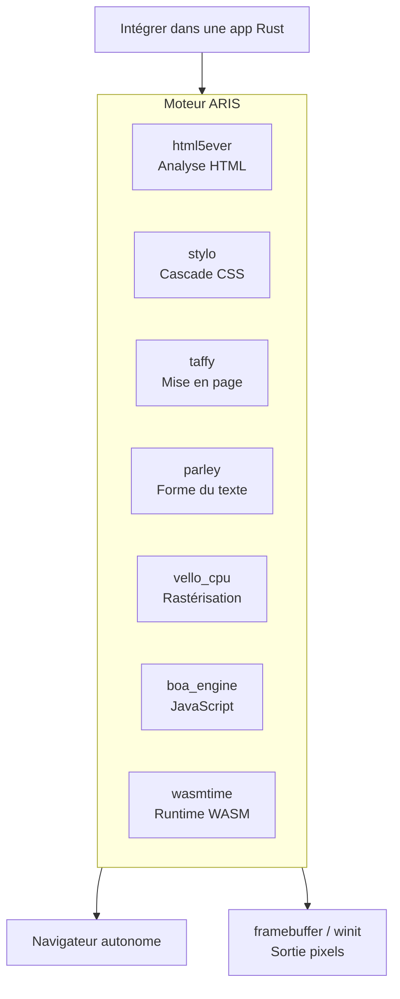

<p align="center"></p>

<h1 align="center">ARIS</h1>

<p align="center"><strong>Un moteur de navigateur en Rust pur dérivé de servo.</strong></p>

<div align="center">

[](https://sysl.celestia.world)
[](https://github.com/celestia-island/aris/actions/workflows/ci.yml)

</div>

<div align="center">

[English](../en/README.md) ·
[简体中文](../zhs/README.md) ·
[繁體中文](../zht/README.md) ·
[日本語](../ja/README.md) ·
[한국어](../ko/README.md) ·
**Français** ·
[Español](../es/README.md) ·
[Русский](../ru/README.md) ·
[العربية](../ar/README.md)

</div>

## Introduction

ARIS est un **moteur de navigateur dérivé de servo**. Il peut être intégré comme bibliothèque dans n'importe quelle application Rust, ou exécuté comme navigateur de bureau autonome. Le pipeline de rendu est assemblé à partir de crates 100% Rust — html5ever, stylo, taffy, parley, vello — et les dépendances SpiderMonkey / WebRender / SWGL de servo sont remplacées par Boa (JS), Vello CPU (rastérisation) et Wasmtime (WASM).



## Pourquoi ne pas forker Servo directement ?

Servo embarque SpiderMonkey (C++), WebRender (C++/SWGL) et un graphe de dépendances volumineux. ARIS reprend les meilleurs éléments de servo — le frontal HTML/CSS en Rust pur (html5ever, stylo, cssparser, selectors) — et reconstruit les couches JavaScript, rastérisation et WASM avec des alternatives 100% Rust.

| Composant Servo | Alternative ARIS | Raison |
|-----------------|-----------------|--------|
| SpiderMonkey (C++) | boa_engine | 100% Rust, pas de build C++ |
| WebRender + SWGL (C++) | vello_cpu | Rastérisation CPU 100% Rust |
| components/script | Pont Boa | Sans couplage SpiderMonkey |
| — | wasmtime | WASM Component Model, WASI |

## Démarrage rapide

```bash
# Compiler le navigateur autonome
cargo build -p aris-render --release

# Rendre une page web vers le framebuffer
cargo run -p aris-render --bin render_lagrange -- example.html

# Exécuter dans une fenêtre (backend winit)
cargo run -p aris-render --bin render_window --features winit-backend
```

Voir le [guide de compilation](./build/quickstart.md) pour plus de détails.

## Architecture

```
┌──────────────────────────────────────────────────────┐
│  tairitsu (VDOM) / hikari (composants UI)            │
│  WASM Component Model → interface WIT                │
├──────────────────────────────────────────────────────┤
│  Pipeline de rendu ARIS                               │
│  html5ever → stylo → taffy → parley → vello_cpu → RGBA│
│  Moteur Boa JS (scripts de page)                     │
│  Wasmtime (composants WASM, WASI)                    │
├──────────────────────────────────────────────────────┤
│  Backends d'affichage : /dev/fb0 · winit+softbuffer  │
├──────────────────────────────────────────────────────┤
│  Noyau kei (ABI syscall) ou Linux                    │
└──────────────────────────────────────────────────────┘
```

Voir la [vue d'ensemble architecturale](./architecture/overview.md).

## Licence

SySL-1.0 (Synthetic Source License). Voir [LICENSE](../../LICENSE) ou le [site SySL](https://sysl.celestia.world).
