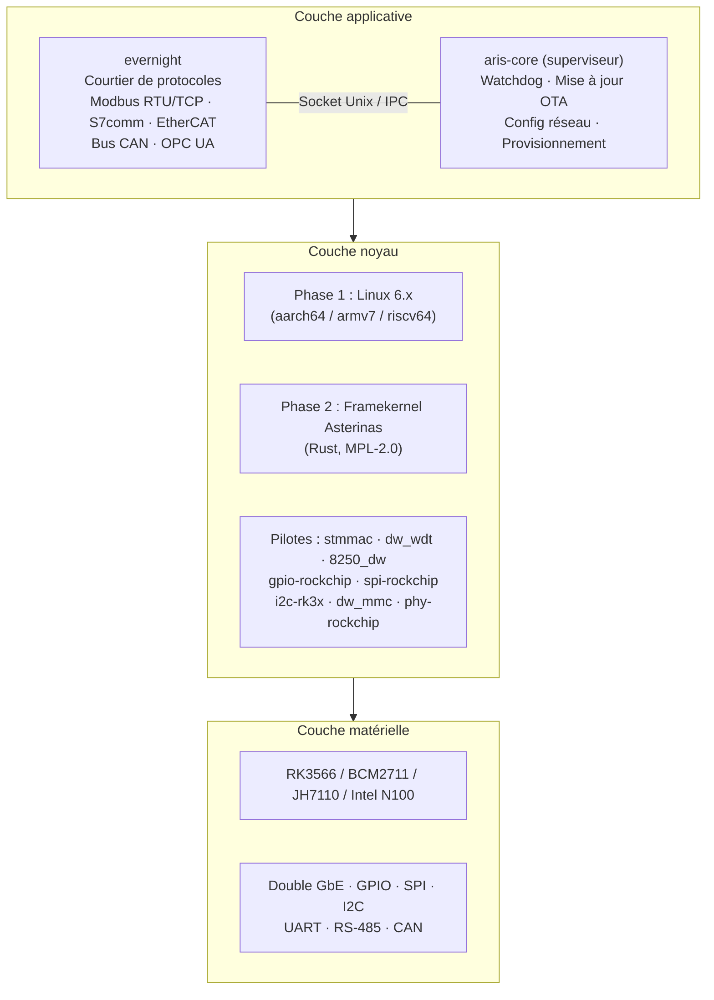
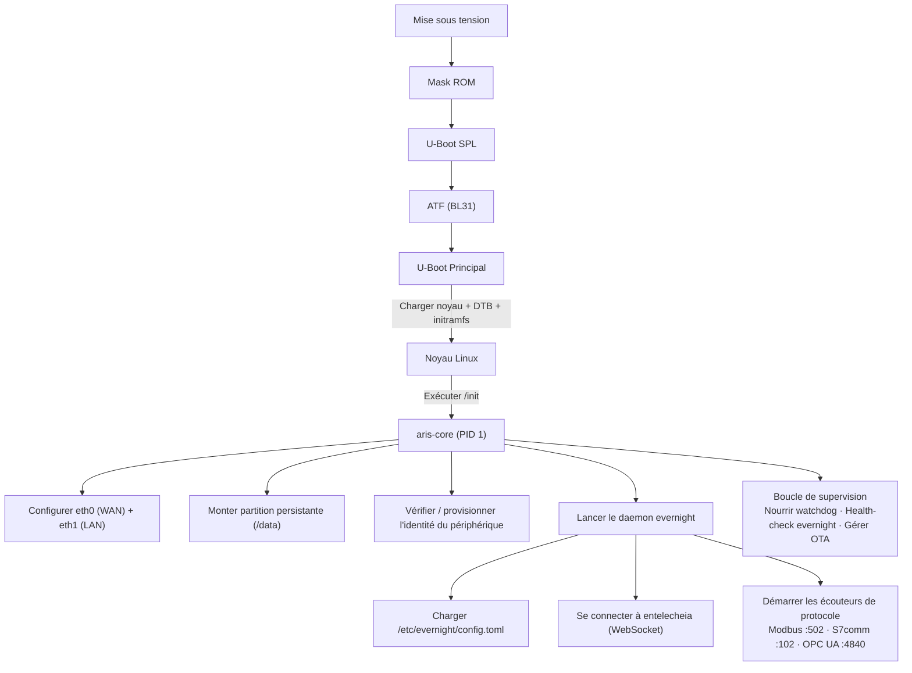

# Architecture du système aris

## Aperçu

aris est un OS embarqué modulaire pour les passerelles IoT industrielles exécutant
l'écosystème Entelecheia. Il relie le courtier de protocoles evernight au
matériel physique via une couche noyau minimale et sécurisée.

## Couches d'architecture



## Flux de démarrage



## Disposition des partitions (Mise à jour A/B)

| Décalage | Taille | Partition | Contenu |
|----------|--------|-----------|---------|
| 0 | 32 Kio | (écart) | idbloader.img |
| 32 Kio | 8 Mio | (écart) | u-boot.itb |
| 8 Mio | 128 Mio | boot-A | Image + DTB + boot.scr |
| 136 Mio | 128 Mio | boot-B | Image + DTB + boot.scr (secours) |
| 264 Mio | 512 Mio | rootfs-A | squashfs (ro) |
| 776 Mio | 512 Mio | rootfs-B | squashfs (ro, secours) |
| 1288 Mio | - | persistante | ext4 (rw, /data) |

## Topologie réseau

```mermaid
flowchart TB
    NET["Internet / LAN d'entreprise"] --> ETH0
    subbox GW["Passerelle aris"]
        ETH0["eth0 — WAN (DHCP)"]
        ETH1["eth1 — LAN (192.168.42.1/24)"]
    end
    ETH1 --> PLC["PLC\n192.168.42.5"]
    ETH1 --> SEN["Capteur\n192.168.42.10"]
    ETH1 --> HMI["HMI\n192.168.42.20"]
```

## Stratégie Asterinas ARM64 (Phase 2)

Source amont principale pour Asterinas ARM64 :

- **Fork** : https://github.com/wanywhn/asterinas (branche : `arm64-support`)
- **PR** : asterinas/asterinas#3270
- **Statut** : Prêt à être fusionné ; inclut GICv3, ARM GIC, arbre de
  périphériques de base, configuration MMU et console UART pour aarch64

Une fois fusionné dans le mainline Asterinas, aris suivra le dépôt officiel.
D'ici là, la branche `arm64-support` sert de base de développement.
