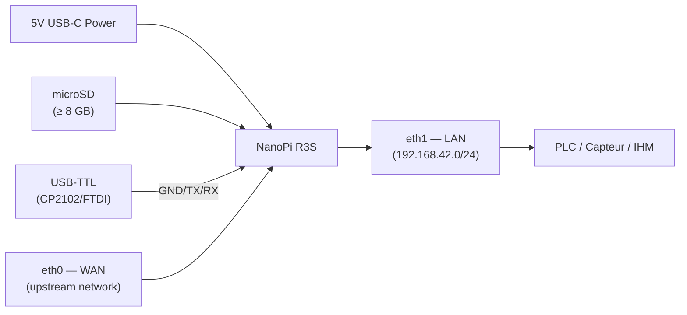
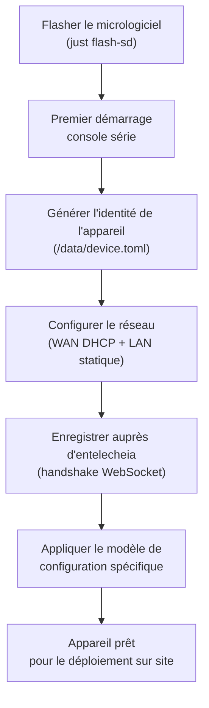
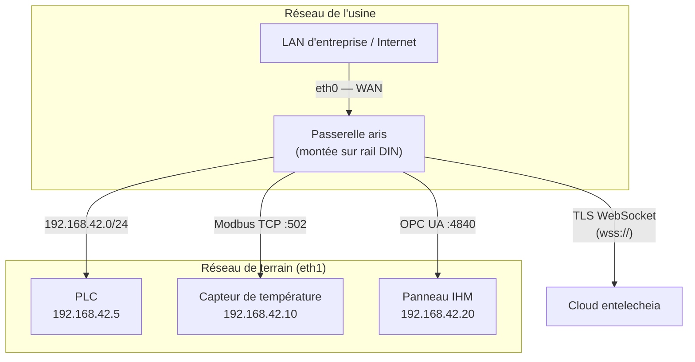
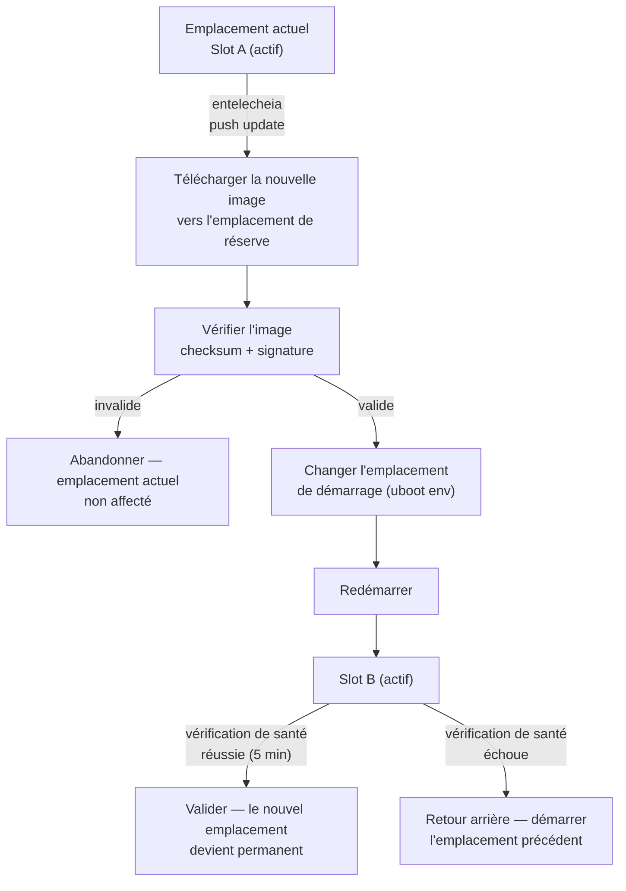

# Guide de déploiement d'aris

## Aperçu

Ce guide couvre le déploiement du micrologiciel aris sur du matériel physique
— de l'approvisionnement en usine à l'installation sur site et à la maintenance
continue.

## Assemblage matériel

### NanoPi R3S

Pour la carte de référence (NanoPi R3S), vous aurez besoin de :

1. **Carte NanoPi R3S** (RK3566, 2 Go de RAM)
2. **Carte microSD** (≥ 8 Go, UHS-I recommandé)
3. **Alimentation USB-C** (5V / 3A)
4. **Adaptateur série USB-TTL** (logique 3,3V, CP2102 ou FTDI)
5. **Câbles Ethernet** (2x pour WAN + LAN)
6. **Boîtier** (optionnel, montage sur rail DIN recommandé)



### Référence de câblage

| Broche carte | Adaptateur USB-TTL | Notes |
|-------------|-----------------|-------|
| Pin 1 (GND) | GND | Masse commune |
| Pin 2 (TX) | RX | La carte transmet → l'adaptateur reçoit |
| Pin 3 (RX) | TX | La carte reçoit ← l'adaptateur transmet |

L'UART de débogage fonctionne à **1500000 bauds, 8N1**. La plupart des
émulateurs de terminal (`picocom`, `minicom`, `screen`) prennent en charge
ce débit en bauds.

## Approvisionnement en usine

L'approvisionnement d'un nouvel appareil suit ces étapes :



### Identité de l'appareil

Chaque appareil aris possède une identité unique stockée dans `/data/device.toml` :

```toml
[device]
node_id = "aris-nanopi-r3s-001"
hardware = "nanopi-r3s"
serial = "RK3566-SN-XXXXXXXX"

[entitlecheia]
endpoint = "wss://entelecheia.example.com/ws"
psk = "/data/keys/device.psk"
```

L'identité est générée au premier démarrage et persistée sur la partition
persistante inscriptible. La clé pré-partagée (`device.psk`) est utilisée pour
s'authentifier auprès du cycle de vie de session d'entelecheia.

## Topologie réseau

Un déploiement typique sur site ressemble à ceci :



- **eth0 (WAN)** : Se connecte au réseau d'entreprise en amont ou directement
  à Internet. DHCP par défaut ; IP statique configurable via
  `/data/network.toml`.
- **eth1 (LAN)** : Sert le réseau de bus de terrain local sur
  `192.168.42.0/24`. C'est ici que les PLCs, capteurs et IHMs se connectent.

## Mises à jour OTA

aris prend en charge les mises à jour à double emplacement A/B pour des mises
à niveau de micrologiciel sécurisées avec capacité de retour arrière :



La disposition des partitions prend en charge A/B pour `boot` et `rootfs` :

| Emplacement | Partition boot | Partition rootfs | État |
|------|---------------|-----------------|--------|
| A | `boot-A` (128 MiB) | `rootfs-A` (512 MiB) | Primaire |
| B | `boot-B` (128 MiB) | `rootfs-B` (512 MiB) | Réserve |

## Liste de contrôle pour le déploiement sur site

Avant de déployer un appareil sur un site physique, vérifiez :

1. **Matériel** : Tous les câbles bien branchés, alimentation adéquate, boîtier
   scellé
2. **Stockage** : Carte SD correctement insérée, pas de protection en écriture
   activée
3. **Réseau** : Les deux eth0 et eth1 câblés aux bons réseaux
4. **Série** : USB-TTL accessible pour l'accès console d'urgence
5. **Démarrage** : Mettre sous tension, surveiller la console série pour les
   messages de démarrage
6. **Services** : `aris-core` (PID 1) et le démon `evernight` en cours
   d'exécution
7. **Enregistrement** : L'appareil apparaît dans le tableau de bord entelecheia
8. **Protocole** : Les écouteurs Modbus/S7comm/OPC UA accessibles depuis les
   appareils de terrain
9. **OTA** : Tester une mise à jour OTA factice pour vérifier la disposition
   des partitions
10. **Watchdog** : Tester le watchdog en tuant `aris-core` — l'appareil doit
    redémarrer

```bash
# Verify services on the device (via SSH or serial)
ps aux | grep aris-core
ps aux | grep evernight

# Check network interfaces
ip addr show eth0
ip addr show eth1

# Check partition layout
cat /proc/partitions

# Check boot slot
fw_printenv boot_slot

# Trigger manual health check
aris-core --health-check
```

## Surveillance

Après le déploiement, surveillez ces métriques :

| Métrique | Source | Seuil d'alerte |
|--------|--------|----------------|
| Température CPU | `/sys/class/thermal/thermal_zone0/temp` | > 80°C |
| Utilisation mémoire | `/proc/meminfo` | > 90% |
| Usure du stockage | `/data/wear_level.txt` | > 80% rated cycles |
| Liaison réseau | `ethtool eth0` / `ethtool eth1` | Link down |
| État evernight | `systemctl status evernight` | Not running |
| Connexion entelecheia | `/var/log/evernight.log` | Disconnected > 60s |

Toutes les métriques sont transmises à entelecheia via le courtier de protocole
evernight. Les alertes sont affichées dans le tableau de bord entelecheia et
peuvent déclencher des réponses automatisées (redémarrage, basculement, envoi
d'un technicien).
