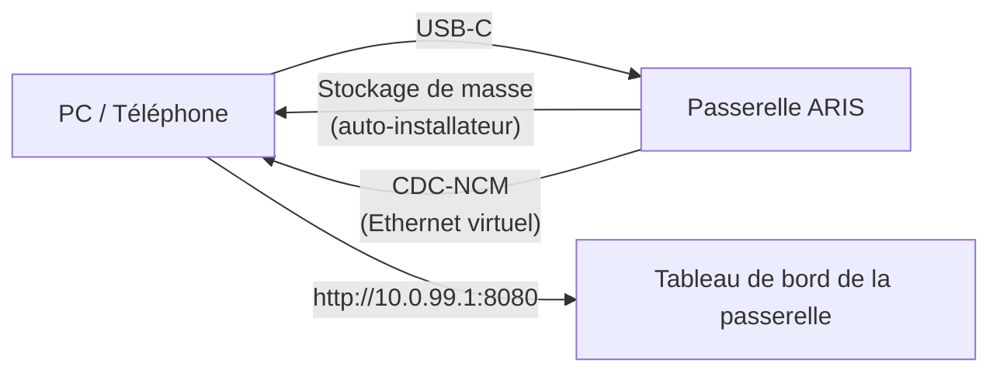

# Provisionnement zéro-configuration par USB-C

Lorsqu'ARIS est connecté à un hôte via USB-C, la passerelle se présente comme
un périphérique USB composite avec deux fonctions :

## Stockage de masse

Un lecteur USB virtuel contenant des auto-installateurs par système
d'exploitation pour le client [evernight](https://github.com/celestia-island/evernight) :

- **Windows** — installateur `.bat` avec AutoRun
- **Linux** — script shell `.sh`
- **macOS** — fichier `.command`
- **Android** — instructions à l'écran

L'hôte voit un lecteur USB, ouvre l'installateur pour son système
d'exploitation et le client evernight est installé sans aucune configuration
manuelle.

## CDC-NCM (Ethernet virtuel)

Un adaptateur Ethernet virtuel offrant à l'hôte une liaison IP directe vers le
tableau de bord de la passerelle à l'adresse `http://10.0.99.1:8080`.

## Flux

**Branchez USB-C → l'hôte voit un lecteur USB → ouvrez l'installateur → fini.**
Aucune configuration réseau, aucun téléchargement de pilote, aucun appairage manuel.
