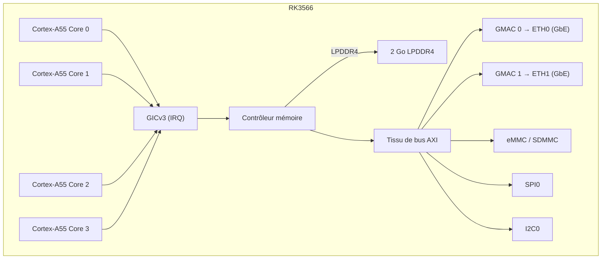

# NanoPi R3S — Référence matérielle

## Spécifications

| Composant | Détail |
|-----------|--------|
| SoC | Rockchip RK3566 |
| CPU | Cortex-A55 quadruple cœur @ 1,8 GHz |
| NPU | 1 TOPS (INT8) |
| RAM | 2 Go LPDDR4/LPDDR4X |
| Stockage | MicroSD (jusqu'à 128 Go) + module eMMC |
| Ethernet | 2x 10/100/1000 Mbps (PHY RTL8211F) |
| USB | 1x USB 3.0 Type-A |
| UART de débogage | Header 3 broches 2,54 mm (TTL 3,3 V) |
| GPIO | Header 40 broches compatible Raspberry Pi |
| Alimentation | 5V/3A via USB-C |
| Dimensions | 65 × 52 mm |

## Brochage

### Header GPIO 40 broches

| Broche | Signal | Broche | Signal |
|--------|--------|--------|--------|
| 1 | 3,3V | 2 | 5V |
| 3 | GPIO2 | 4 | 5V |
| 5 | GPIO3 | 6 | GND |
| 7 | GPIO4 | 8 | GPIO14 (UART2 TX) |
| 9 | GND | 10 | GPIO15 (UART2 RX) |
| ... | ... | ... | ... |

### UART de débogage

| Broche | Étiquette | Fonction |
|--------|-----------|----------|
| 1 | GND | Masse |
| 2 | TX  | UART2 TX (3,3 V) |
| 3 | RX  | UART2 RX (3,3 V) |

Débit : 1500000, 8 bits de données, sans parité, 1 bit d'arrêt.

## Diagramme de blocs (firmware aris)

