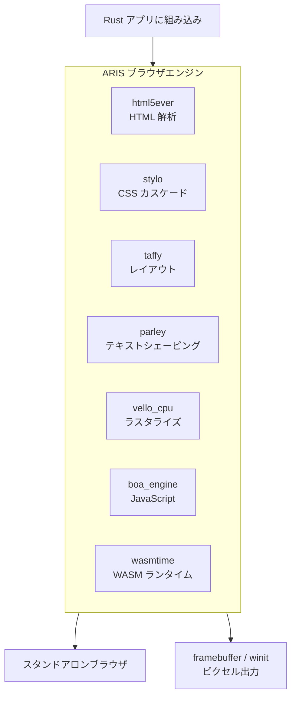

<p align="center"></p>

<h1 align="center">ARIS</h1>

<p align="center"><strong>servo ベースのブラウザエンジン — 組み込みにもスタンドアロンにも。サーボの公式インフラを部分的に純 Rust 代替で置き換え。</strong></p>

<div align="center">

[](../../LICENSE)
[](https://github.com/celestia-island/aris/actions/workflows/ci.yml)

</div>

<div align="center">

[English](../en/README.md) ·
[简体中文](../zhs/README.md) ·
[繁體中文](../zht/README.md) ·
**日本語** ·
[한국어](../ko/README.md) ·
[Français](../fr/README.md) ·
[Español](../es/README.md) ·
[Русский](../ru/README.md) ·
[العربية](../ar/README.md)

</div>

## 概要

ARIS は **servo から派生したブラウザエンジン**です。ライブラリとして Rust アプリに組み込むことも、スタンドアロンのデスクトップブラウザとして実行することも可能です。レンダリングパイプラインは純 Rust クレート（html5ever、stylo、taffy、parley、vello）で構成され、servo の SpiderMonkey / WebRender / SWGL 依存は Boa（JS）、Vello CPU（ラスタライズ）、Wasmtime（WASM）に置き換えられています。



## Servo をフォークしない理由

Servo は SpiderMonkey（C++）、WebRender（C++/SWGL）、そして巨大なコンポーネント依存グラフを抱えています。ARIS は servo の最も優れた部分——純 Rust の HTML/CSS フロントエンド（html5ever、stylo、cssparser、selectors）——を採用し、JavaScript、ラスタライズ、WASM の各層を純 Rust の代替で再構築しています。

| Servo コンポーネント | ARIS の代替 | 理由 |
|---------------------|------------|------|
| SpiderMonkey (C++) | boa_engine | 純 Rust、C++ ビルド不要 |
| WebRender + SWGL (C++) | vello_cpu | 純 Rust CPU ラスタライズ |
| components/script | Boa ブリッジ | SpiderMonkey 結合なし |
| — | wasmtime | WASM Component Model, WASI |

## クイックスタート

```bash
# スタンドアロンブラウザをビルド
cargo build -p aris-render --release

# Web ページをフレームバッファにレンダリング
cargo run -p aris-render --bin render_lagrange -- example.html

# デスクトップウィンドウで実行（winit バックエンド）
cargo run -p aris-render --bin render_window --features winit-backend
```

詳細は[ビルドガイド](./build/quickstart.md)を参照。

## アーキテクチャ

```
┌──────────────────────────────────────────────────────┐
│  tairitsu (VDOM) / hikari (UI コンポーネント)         │
│  WASM Component Model → WIT インターフェース           │
├──────────────────────────────────────────────────────┤
│  ARIS レンダリングパイプライン                          │
│  html5ever → stylo → taffy → parley → vello_cpu → RGBA│
│  Boa JS エンジン（ページスクリプト）                     │
│  Wasmtime（WASM コンポーネント, WASI）                  │
├──────────────────────────────────────────────────────┤
│  ディスプレイバックエンド: /dev/fb0 · winit+softbuffer  │
├──────────────────────────────────────────────────────┤
│  kei カーネル（syscall ABI）または Linux               │
└──────────────────────────────────────────────────────┘
```

詳細は[アーキテクチャ概要](./architecture/overview.md)を参照。

## エコシステム

- **[kei](https://github.com/celestia-island/kei)** — Rust OS カーネル
- **[tairitsu](https://github.com/celestia-island/tairitsu)** — WASM UI フレームワーク
- **[hikari](https://github.com/celestia-island/hikari)** — UI コンポーネントライブラリ
- **[shirabe](https://github.com/celestia-island/shirabe)** — ブラウザ自動化、レンダリング FFI 契約

## ライセンス

Business Source License 1.1 (BUSL-1.1)。2030-01-01 に SySL-1.0 または Apache-2.0 へ変換。[LICENSE](../../LICENSE) 参照。
