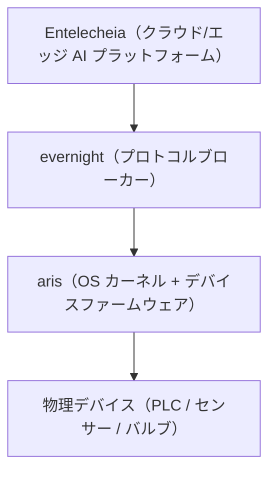

<p align="center"></p>

<h1 align="center">ARIS</h1>

<p align="center"><strong>Linux 標準ディストリビューション、evernight と shittim-chest 向けにチューニングされたデスクトップ — 産業用 HMI とホストステーション（上位機）向けに構築</strong></p>

<div align="center">

[](../../LICENSE)
[](https://github.com/celestia-island/aris/actions/workflows/ci.yml)

</div>

<div align="center">

[English](../en/README.md) ·
[简体中文](../zhs/README.md) ·
[繁體中文](../zht/README.md) ·
**日本語** ·
[한국어](../ko/README.md) ·
[Français](../fr/README.md) ·
[Español](../es/README.md) ·
[Русский](../ru/README.md) ·
[العربية](../ar/README.md)

</div>

## はじめに

ARIS は Linux 標準ベース（LSB）に忠実であり続ける Linux ディストリビューションで、evernight と shittim-chest のために専用構築されたデスクトップ環境を同梱します。そのベンチマークは産業用 HMI パネルと上位機（スーパバイザホスト）——すなわちエッジゲートウェイではなく、オペレータが向き合う機械です。より広い Celestia スタックが物理デバイスまで到達する一方で、ARIS はオペレータが実際にその前に座る OS です。[evernight](https://github.com/celestia-island/evernight) ブローカーと shittim-chest セッションの監視および制御のために特別に配線されたデスクトップへと起動する、馴染みのある LSB 互換の Linux です。



## USB-C ゼロ設定プロビジョニング

USB-C 経由で任意のホストに接続すると、ゲートウェイはコンポジット USB デバイスとして
自身を提示します：

- **マスストレージ** — OS ごとの evernight クライアント自動インストーラーを格納した
  仮想 USB ドライブ（Windows `.bat` + AutoRun、Linux `.sh`、macOS `.command`、
  Android 手順）
- **CDC-NCM** — ホストにゲートウェイダッシュボードへの直接 IP リンクを提供する
  仮想イーサネットアダプター `http://10.0.99.1:8080`

**USB-C を挿す → ホストが USB ドライブとして認識 → インストーラーを開く → 完了。**
ネットワーク設定、ドライバーのダウンロード、手動ペアリングは一切不要です。

## サポートアーキテクチャ

| アーキテクチャ | 状態 | ターゲットボード |
|-------------|--------|---------------|
| ARMv8+ (aarch64) | 活発 | NanoPi R3S (RK3566) |
| ARMv7+ (armv7) | 計画中 | Raspberry Pi 3/4 |
| RISC-V 64 (riscv64) | 計画中 | VisionFive 2 |
| x86_64 | 計画中 | 産業用 PC |

## クイックスタート

```bash
just setup-cross   # Install cross-compilation toolchains
just build         # Build firmware image for default board
just build-board nanopi-r3s
just flash-sd      # Write image to SD card
```

## アーキテクチャ

ARIS は二段階戦略に従います：

- **第 1 段階**（現在）：Linux カーネル + Buildroot スタイルのスリムなルートファイルシステム、
  evernight をデーモンとして実行。実用的で今すぐ提供可能。
- **第 2 段階**（将来）：[Asterinas](https://github.com/asterinas/asterinas)
  フレームカーネル（Rust OS）が Linux カーネルを置き換え。シリコンから最上位までの
  完全なセーフスタックを実現。

アーキテクチャの詳細、ハードウェアリファレンス、ビルドガイドは
[ドキュメント](./) を参照してください。

## ライセンス

Business Source License 1.1 (BUSL-1.1). Commercial use requires an
authorization license. Non-commercial use follows the SySL-1.0 protocol.
Converts to SySL-1.0 or Apache-2.0 on 2030-01-01. See [LICENSE](../../LICENSE).
