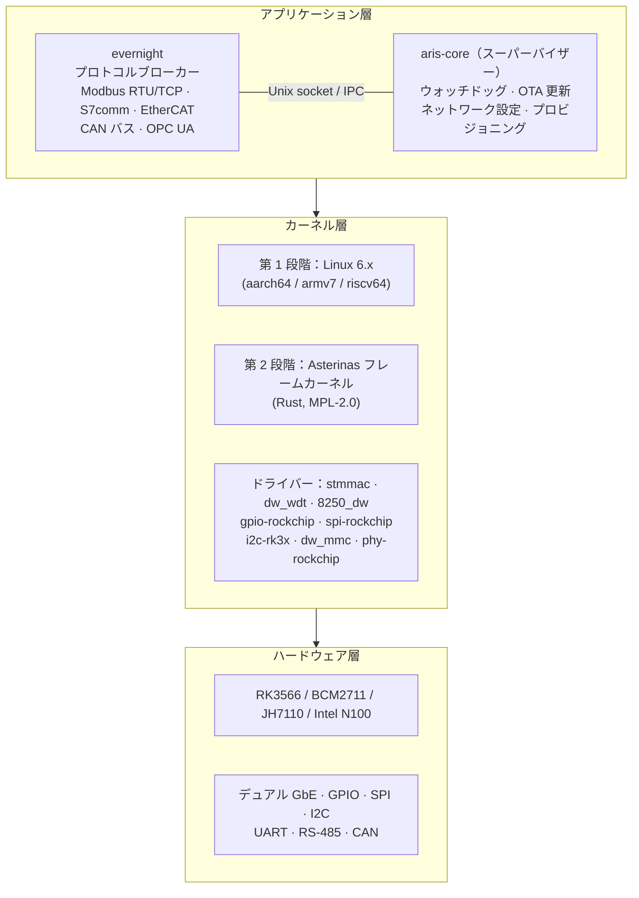
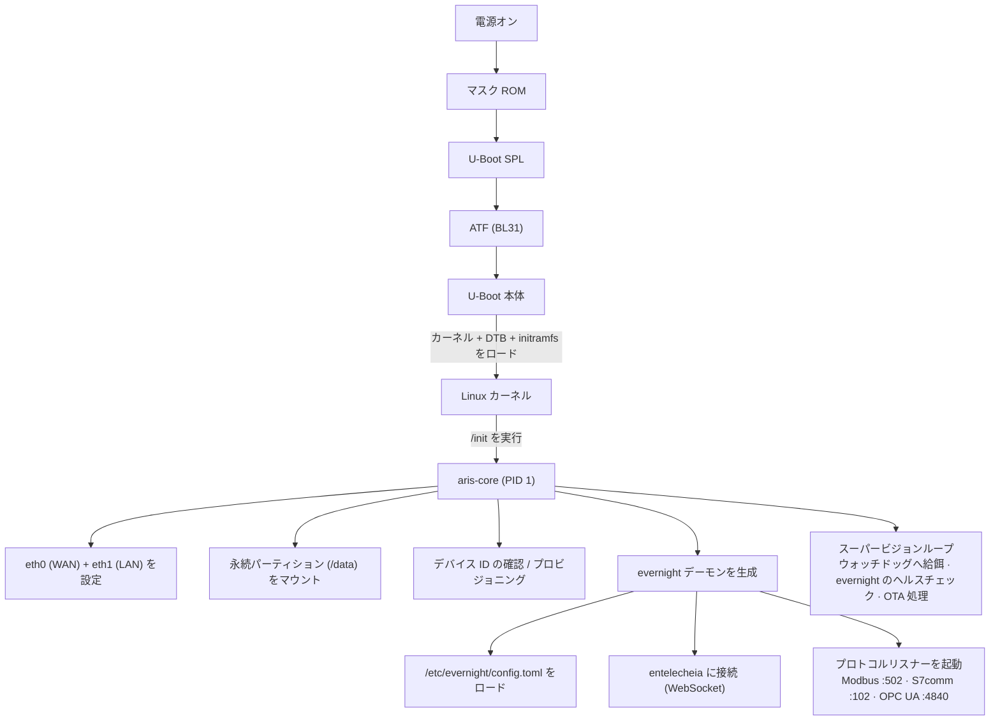
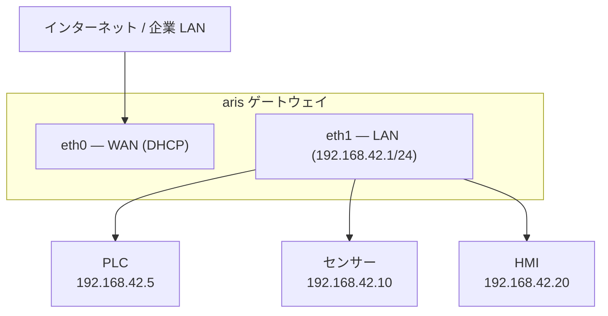

# aris システムアーキテクチャ

## 概要

aris は Entelecheia エコシステムを実行する、産業用 IoT ゲートウェイ向けの
モジュラー組み込み OS です。最小限で安全なカーネル層を通じて、evernight
プロトコルブローカーを物理ハードウェアへ橋渡しします。

## アーキテクチャ層

## ブートフロー

## パーティションレイアウト（A/B 更新）

| オフセット | サイズ | パーティション | 内容 |
|--------|------|-----------|----------|
| 0 | 32 KiB | (ギャップ) | idbloader.img |
| 32 KiB | 8 MiB | (ギャップ) | u-boot.itb |
| 8 MiB | 128 MiB | boot-A | Image + DTB + boot.scr |
| 136 MiB | 128 MiB | boot-B | Image + DTB + boot.scr（待機） |
| 264 MiB | 512 MiB | rootfs-A | squashfs（読み取り専用） |
| 776 MiB | 512 MiB | rootfs-B | squashfs（読み取り専用、待機） |
| 1288 MiB | - | persistent | ext4（読み書き、/data） |

## ネットワークトポロジー

## Asterinas ARM64 戦略（第 2 段階）

ARM64 向け Asterinas の主なアップストリームソース：

- **Fork**：https://github.com/wanywhn/asterinas（ブランチ：`arm64-support`）
- **PR**：asterinas/asterinas#3270
- **状態**：マージ準備ほぼ完了。aarch64 向けの GICv3、ARM GIC、
  基本的なデバイスツリー、MMU セットアップ、UART コンソールを含む

Asterinas 本線へマージされ次第、aris は公式リポジトリを追跡します。
それまでは `arm64-support` ブランチが開発ベースラインとなります。
