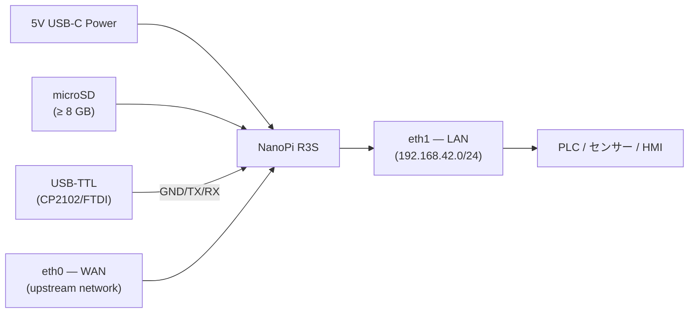
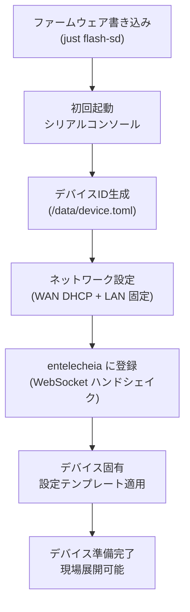
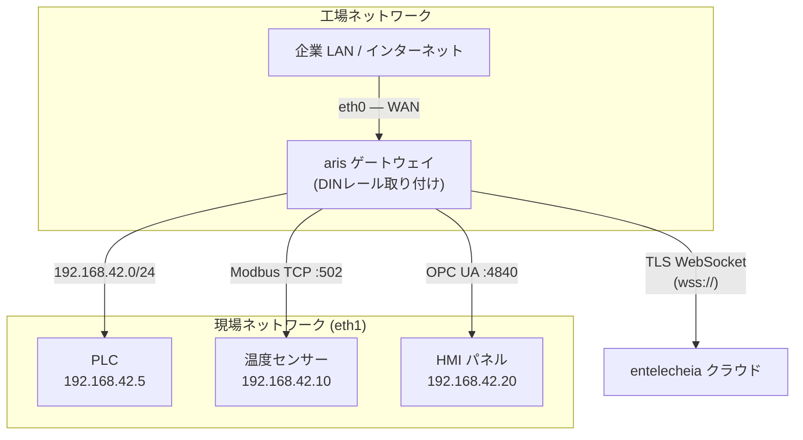
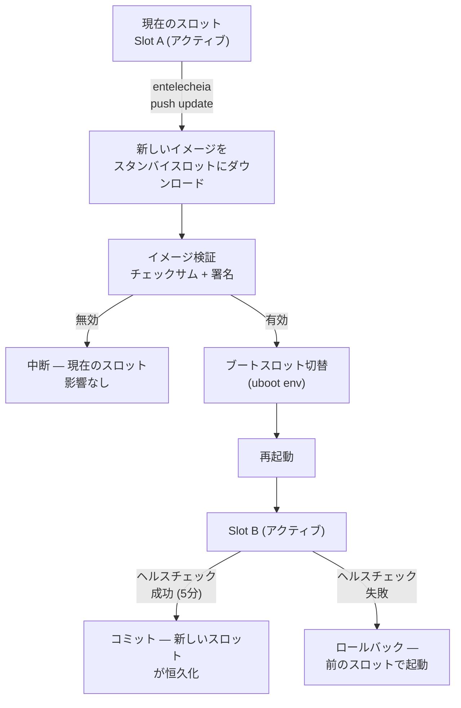

# aris デプロイメントガイド

## 概要

このガイドでは、aris ファームウェアを物理ハードウェアに展開する方法（工場
プロビジョニングから現場設置、継続的なメンテナンスまで）を説明します。

## ハードウェア組み立て

### NanoPi R3S

リファレンスボード（NanoPi R3S）には以下が必要です：

1. **NanoPi R3S ボード**（RK3566、2GB RAM）
2. **microSD カード**（≥ 8 GB、UHS-I 推奨）
3. **USB-C 電源**（5V / 3A）
4. **USB-TTL シリアルアダプタ**（3.3V ロジック、CP2102 または FTDI）
5. **イーサネットケーブル**（WAN + LAN 用 2 本）
6. **筐体**（オプション、DIN レール取り付け推奨）



### 配線リファレンス

| ボードピン | USB-TTL アダプタ | 備考 |
|-------------|-----------------|-------|
| Pin 1 (GND) | GND | 共通グランド |
| Pin 2 (TX) | RX | ボード送信 → アダプタ受信 |
| Pin 3 (RX) | TX | ボード受信 ← アダプタ送信 |

デバッグ UART は **1500000 ボー、8N1** で動作します。ほとんどの端末
エミュレータ（`picocom`、`minicom`、`screen`）がこのボーレートをサポート
しています。

## 工場プロビジョニング

新しいデバイスのプロビジョニングは以下の手順で行います：



### デバイス ID

各 aris デバイスは `/data/device.toml` に保存された一意の ID を持ちます：

```toml
[device]
node_id = "aris-nanopi-r3s-001"
hardware = "nanopi-r3s"
serial = "RK3566-SN-XXXXXXXX"

[entitlecheia]
endpoint = "wss://entelecheia.example.com/ws"
psk = "/data/keys/device.psk"
```

ID は初回起動時に生成され、書き込み可能な永続パーティションに保存されます。
事前共有キー（`device.psk`）は、entelecheia のセッションライフサイクルとの
認証に使用されます。

## ネットワークトポロジー

典型的な現場展開は以下のようになります：



- **eth0 (WAN)**：上流の企業ネットワークまたは直接インターネットに接続します。
  デフォルトは DHCP。固定 IP は `/data/network.toml` で設定可能です。
- **eth1 (LAN)**：ローカルフィールドバスネットワークを `192.168.42.0/24`
  で提供します。PLC、センサー、HMI がここに接続します。

## OTA アップデート

aris は安全でロールバック可能な A/B デュアルスロットアップデートをサポート
しています：



パーティションレイアウトは `boot` と `rootfs` の両方で A/B をサポートします：

| スロット | boot パーティション | rootfs パーティション | 状態 |
|------|---------------|-----------------|--------|
| A | `boot-A` (128 MiB) | `rootfs-A` (512 MiB) | プライマリ |
| B | `boot-B` (128 MiB) | `rootfs-B` (512 MiB) | スタンバイ |

## 現場展開チェックリスト

デバイスを物理サイトに展開する前に、以下を確認してください：

1. **ハードウェア**：全ケーブル接続済み、電源十分、筐体密閉
2. **ストレージ**：SD カード正しく挿入、書き込み保護スイッチ無効
3. **ネットワーク**：eth0 と eth1 両方が正しいネットワークに接続
4. **シリアル**：緊急コンソールアクセス用に USB-TTL が利用可能
5. **起動**：電源投入、シリアルコンソールで起動メッセージを監視
6. **サービス**：`aris-core`（PID 1）および `evernight` デーモンが実行中
7. **登録**：デバイスが entelecheia ダッシュボードに表示される
8. **プロトコル**：Modbus/S7comm/OPC UA リスナーが現場デバイスから到達可能
9. **OTA**：ダミー OTA アップデートでパーティションレイアウトを検証
10. **ウォッチドッグ**：`aris-core` を kill してウォッチドッグをテスト —
    デバイスが再起動すること

```bash
# Verify services on the device (via SSH or serial)
ps aux | grep aris-core
ps aux | grep evernight

# Check network interfaces
ip addr show eth0
ip addr show eth1

# Check partition layout
cat /proc/partitions

# Check boot slot
fw_printenv boot_slot

# Trigger manual health check
aris-core --health-check
```

## 監視

展開後、以下のメトリクスを監視してください：

| メトリクス | ソース | アラート閾値 |
|--------|--------|----------------|
| CPU 温度 | `/sys/class/thermal/thermal_zone0/temp` | > 80°C |
| メモリ使用量 | `/proc/meminfo` | > 90% |
| ストレージ摩耗 | `/data/wear_level.txt` | > 80% rated cycles |
| ネットワークリンク | `ethtool eth0` / `ethtool eth1` | Link down |
| evernight 状態 | `systemctl status evernight` | Not running |
| entelecheia 接続 | `/var/log/evernight.log` | Disconnected > 60s |

すべてのメトリクスは evernight プロトコルブローカーを介して entelecheia に
報告されます。アラートは entelecheia ダッシュボードに表示され、自動応答
（再起動、フェイルオーバー、技術者派遣）をトリガーできます。
