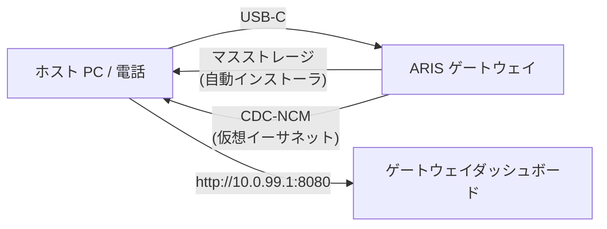

# USB-C ゼロコンフィグプロビジョニング

ARIS が USB-C 経由で任意のホストに接続されると、ゲートウェイは複合 USB
デバイスとして認識され、2 つの機能を提供します：

## マスストレージ

[evernight](https://github.com/celestia-island/evernight) クライアント用の
OS 別自動インストーラを含む仮想 USB ドライブ：

- **Windows** — AutoRun 対応 `.bat` インストーラ
- **Linux** — `.sh` シェルスクリプト
- **macOS** — `.command` ファイル
- **Android** — 画面表示の手順

ホストは USB ドライブを認識し、対応する OS のインストーラを開くと、
evernight クライアントが手動設定なしでインストールされます。

## CDC-NCM（仮想イーサネット）

ホストにゲートウェイダッシュボード（`http://10.0.99.1:8080`）への直接 IP
リンクを提供する仮想イーサネットアダプタ。

## フロー

**USB-C を接続 → ホストが USB ドライブを認識 → インストーラを開く → 完了。**
ネットワーク設定、ドライバのダウンロード、手動ペアリングは一切不要です。
