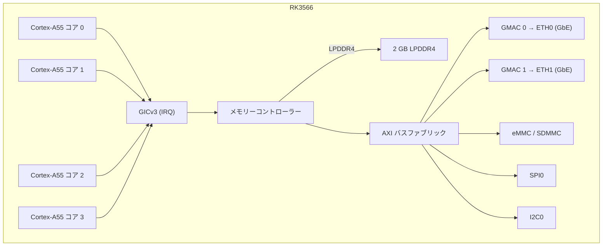

# NanoPi R3S — ハードウェアリファレンス

## 仕様

| コンポーネント | 詳細 |
|-----------|--------|
| SoC | Rockchip RK3566 |
| CPU | クアッドコア Cortex-A55 @ 1.8 GHz |
| NPU | 1 TOPS (INT8) |
| RAM | 2 GB LPDDR4/LPDDR4X |
| ストレージ | MicroSD（最大 128 GB）+ eMMC モジュール |
| イーサネット | 2x 10/100/1000 Mbps（RTL8211F PHY） |
| USB | 1x USB 3.0 Type-A |
| デバッグ UART | 3 ピン 2.54mm ヘッダー（3.3V TTL） |
| GPIO | 40 ピン Raspberry Pi 互換ヘッダー |
| 電源 | 5V/3A、USB-C 経由 |
| 寸法 | 65 × 52 mm |

## ピン配置

### 40 ピン GPIO ヘッダー

| ピン | 信号 | ピン | 信号 |
|-----|--------|-----|--------|
| 1 | 3.3V | 2 | 5V |
| 3 | GPIO2 | 4 | 5V |
| 5 | GPIO3 | 6 | GND |
| 7 | GPIO4 | 8 | GPIO14 (UART2 TX) |
| 9 | GND | 10 | GPIO15 (UART2 RX) |
| ... | ... | ... | ... |

### デバッグ UART

| ピン | ラベル | 機能 |
|-----|-------|----------|
| 1 | GND | グランド |
| 2 | TX  | UART2 TX (3.3V) |
| 3 | RX  | UART2 RX (3.3V) |

ボーレート：1500000、データビット 8、パリティなし、ストップビット 1。

## ブロック図（aris ファームウェア）

