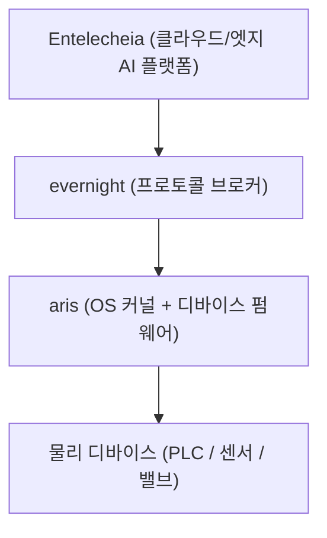

<p align="center"></p>

<h1 align="center">ARIS</h1>

<p align="center"><strong>evernight와 shittim-chest에 맞춘 데스크톱을 갖춘 Linux 표준 배포판 — 산업용 HMI 및 호스트 스테이션(상위기)을 위해 구축</strong></p>

<div align="center">

[](../../LICENSE)
[](https://github.com/celestia-island/aris/actions/workflows/ci.yml)

</div>

<div align="center">

[English](../en/README.md) ·
[简体中文](../zhs/README.md) ·
[繁體中文](../zht/README.md) ·
[日本語](../ja/README.md) ·
**한국어** ·
[Français](../fr/README.md) ·
[Español](../es/README.md) ·
[Русский](../ru/README.md) ·
[العربية](../ar/README.md)

</div>

## 소개

ARIS는 Linux 표준 베이스(LSB)에 충실한 Linux 배포판으로, evernight와 shittim-chest에 맞춰 목적 구축된 데스크톱 환경을 제공합니다. 그 벤치마크는 산업용 HMI 패널과 상위기(감독 호스트) — 즉 엣지 게이트웨이가 아닌, 운용자가 마주하는 기기입니다. Celestia 스택 전체가 물리 디바이스까지 내려가는 반면, ARIS는 운용자가 실제로 앞에 앉는 OS입니다. 친숙하고 LSB 호환 Linux로 부팅되어, evernight 브로커와 shittim-chest 세션을 모니터링하고 제어하도록 특별히 연결된 데스크톱으로 들어섭니다.



## USB-C 제로 설정 프로비저닝

USB-C로 임의의 호스트에 연결되면, 게이트웨이는 자신을 컴포짓 USB 디바이스로
제시합니다:

- **대용량 저장장치** — OS별 evernight 클라이언트 자동 설치 프로그램을 포함한
  가상 USB 드라이브 (Windows `.bat` + 자동 실행, Linux `.sh`, macOS `.command`,
  Android 안내)
- **CDC-NCM** — 호스트에 게이트웨이 대시보드로의 직접 IP 링크를 제공하는
  가상 이더넷 어댑터 `http://10.0.99.1:8080`

**USB-C를 꽂는다 → 호스트가 USB 드라이브로 인식 → 설치 프로그램 열기 → 완료.**
네트워크 설정, 드라이버 다운로드, 수동 페어링이 필요 없습니다.

## 지원 아키텍처

| 아키텍처 | 상태 | 타겟 보드 |
|-------------|--------|---------------|
| ARMv8+ (aarch64) | 활발 | NanoPi R3S (RK3566) |
| ARMv7+ (armv7) | 계획 중 | Raspberry Pi 3/4 |
| RISC-V 64 (riscv64) | 계획 중 | VisionFive 2 |
| x86_64 | 계획 중 | 산업용 PC |

## 빠른 시작

```bash
just setup-cross   # Install cross-compilation toolchains
just build         # Build firmware image for default board
just build-board nanopi-r3s
just flash-sd      # Write image to SD card
```

## 아키텍처

aris는 2단계 전략을 따릅니다:

- **1단계** (현재): Linux 커널 + Buildroot 스타일의 슬림 루트 파일 시스템,
  evernight를 데몬으로 실행. 실용적이며 즉시 제공 가능.
- **2단계** (미래): [Asterinas](https://github.com/asterinas/asterinas)
  프레임커널 (Rust OS)이 Linux 커널을 대체. 실리콘부터 최상위까지의
  완전한 세이프 스택 구현.

아키텍처 세부 정보, 하드웨어 참조, 빌드 가이드는
[문서](./)를 참조하세요.

## 라이선스

Business Source License 1.1 (BUSL-1.1). Commercial use requires an
authorization license. Non-commercial use follows the SySL-1.0 protocol.
Converts to SySL-1.0 or Apache-2.0 on 2030-01-01. See [LICENSE](../../LICENSE).
