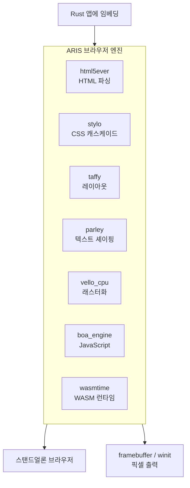

<p align="center"></p>

<h1 align="center">ARIS</h1>

<p align="center"><strong>servo에서 파생된 순수 Rust 브라우저 엔진.</strong></p>

<div align="center">

[](../../LICENSE)
[](https://github.com/celestia-island/aris/actions/workflows/ci.yml)

</div>

<div align="center">

[English](../en/README.md) ·
[简体中文](../zhs/README.md) ·
[繁體中文](../zht/README.md) ·
[日本語](../ja/README.md) ·
**한국어** ·
[Français](../fr/README.md) ·
[Español](../es/README.md) ·
[Русский](../ru/README.md) ·
[العربية](../ar/README.md)

</div>

## 소개

ARIS는 **servo에서 파생된 브라우저 엔진**입니다. 라이브러리로 Rust 앱에 임베딩하거나 스탠드얼론 데스크톱 브라우저로 실행할 수 있습니다. 렌더링 파이프라인은 순수 Rust 크레이트(html5ever, stylo, taffy, parley, vello)로 구성되며, servo의 SpiderMonkey/WebRender/SWGL 의존성은 Boa(JS), Vello CPU(래스터화), Wasmtime(WASM)으로 대체되었습니다.



## Servo를 포크하지 않는 이유

Servo는 SpiderMonkey(C++), WebRender(C++/SWGL), 방대한 컴포넌트 의존성 그래프를 묶고 있습니다. ARIS는 servo의 가장 뛰어난 부분인 순수 Rust HTML/CSS 프론트엔드(html5ever, stylo, cssparser, selectors)를 취하고, JavaScript, 래스터화, WASM 계층을 순수 Rust 대안으로 재구축합니다.

| Servo 컴포넌트 | ARIS 대안 | 이유 |
|---------------|----------|------|
| SpiderMonkey (C++) | boa_engine | 순수 Rust, C++ 빌드 불필요 |
| WebRender + SWGL (C++) | vello_cpu | 순수 Rust CPU 래스터화 |
| components/script | Boa 브릿지 | SpiderMonkey 결합 없음 |
| — | wasmtime | WASM Component Model, WASI |

## 빠른 시작

```bash
# 스탠드얼론 브라우저 빌드
cargo build -p aris-render --release

# 웹 페이지를 프레임버퍼에 렌더링
cargo run -p aris-render --bin render_lagrange -- example.html

# 데스크톱 창에서 실행 (winit 백엔드)
cargo run -p aris-render --bin render_window --features winit-backend
```

자세한 내용은 [빌드 가이드](./build/quickstart.md)를 참조하세요.

## 아키텍처

```
┌──────────────────────────────────────────────────────┐
│  tairitsu (VDOM) / hikari (UI 컴포넌트)              │
│  WASM Component Model → WIT 인터페이스                │
├──────────────────────────────────────────────────────┤
│  ARIS 렌더링 파이프라인                                 │
│  html5ever → stylo → taffy → parley → vello_cpu → RGBA│
│  Boa JS 엔진 (페이지 스크립트)                          │
│  Wasmtime (WASM 컴포넌트, WASI)                       │
├──────────────────────────────────────────────────────┤
│  디스플레이 백엔드: /dev/fb0 · winit+softbuffer        │
├──────────────────────────────────────────────────────┤
│  kei 커널 (syscall ABI) 또는 Linux                    │
└──────────────────────────────────────────────────────┘
```

자세한 내용은 [아키텍처 개요](./architecture/overview.md)를 참조하세요.

## 라이선스

Business Source License 1.1 (BUSL-1.1). 2030-01-01에 SySL-1.0 또는 Apache-2.0으로 전환. [LICENSE](../../LICENSE) 참조.
