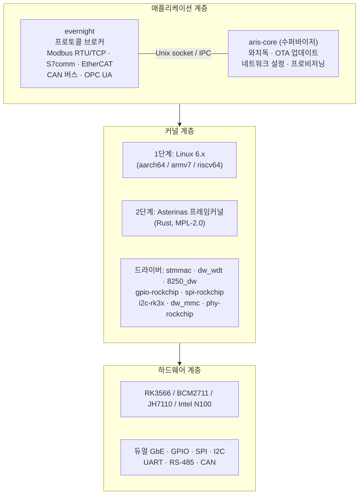
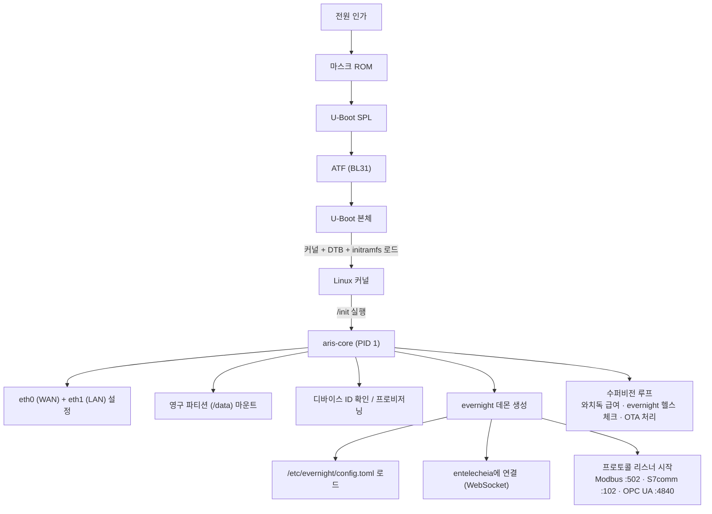
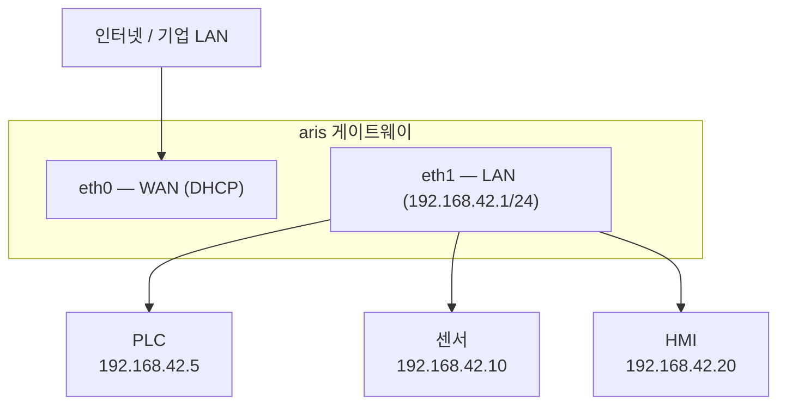

# aris 시스템 아키텍처

## 개요

aris는 Entelecheia 생태계를 실행하는 산업용 IoT 게이트웨이용 모듈형 임베디드 OS입니다.
최소화되고 안전한 커널 계층을 통해 evernight 프로토콜 브로커를 물리 하드웨어로
브리지합니다.

## 아키텍처 계층

## 부트 플로우

## 파티션 레이아웃 (A/B 업데이트)

| 오프셋 | 크기 | 파티션 | 내용 |
|--------|------|-----------|----------|
| 0 | 32 KiB | (갭) | idbloader.img |
| 32 KiB | 8 MiB | (갭) | u-boot.itb |
| 8 MiB | 128 MiB | boot-A | Image + DTB + boot.scr |
| 136 MiB | 128 MiB | boot-B | Image + DTB + boot.scr (대기) |
| 264 MiB | 512 MiB | rootfs-A | squashfs (읽기 전용) |
| 776 MiB | 512 MiB | rootfs-B | squashfs (읽기 전용, 대기) |
| 1288 MiB | - | persistent | ext4 (읽기/쓰기, /data) |

## 네트워크 토폴로지

## Asterinas ARM64 전략 (2단계)

ARM64용 Asterinas의 주요 업스트림 소스:

- **Fork**: https://github.com/wanywhn/asterinas (브랜치: `arm64-support`)
- **PR**: asterinas/asterinas#3270
- **상태**: 병합 준비 거의 완료. aarch64용 GICv3, ARM GIC,
  기본 디바이스 트리, MMU 설정, UART 콘솔을 포함

Asterinas 메인라인에 병합되는 즉시 aris는 공식 리포지토리를 추적합니다.
그 전까지는 `arm64-support` 브랜치가 개발 베이스라인으로 사용됩니다.
