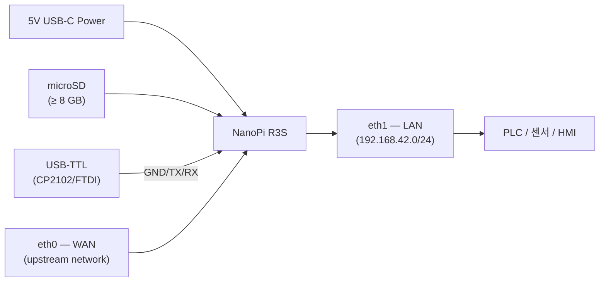
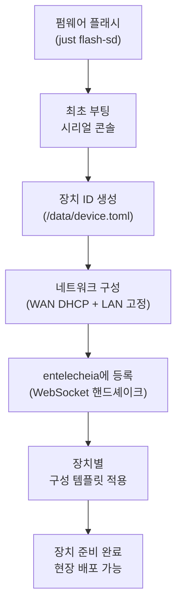
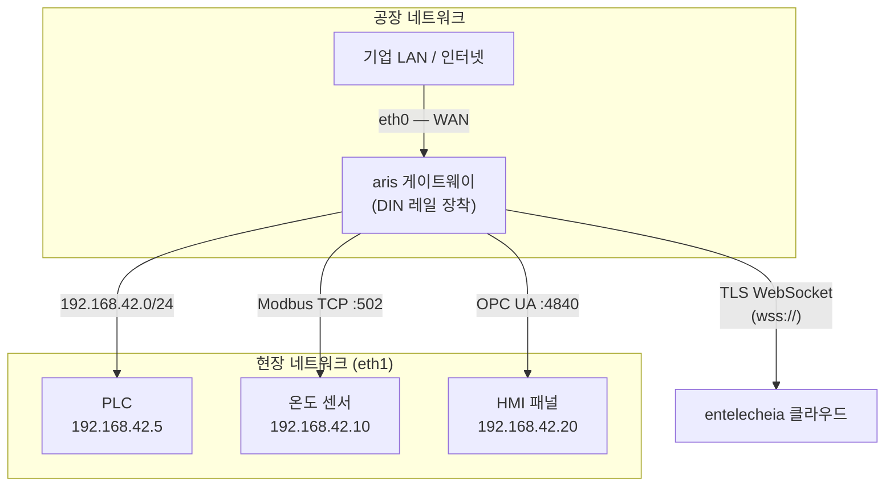
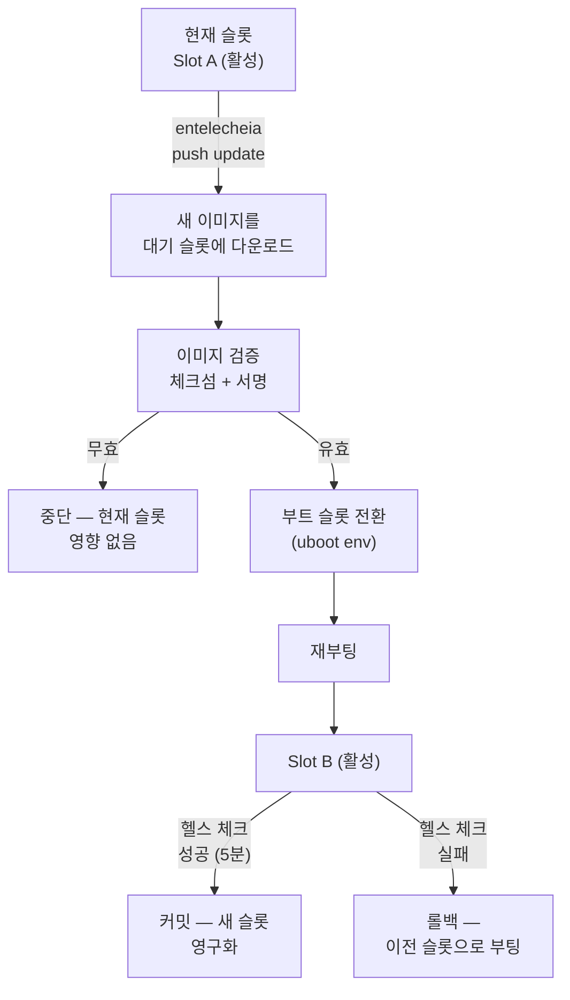

# aris 배포 가이드

## 개요

이 가이드는 aris 펌웨어를 물리적 하드웨어에 배포하는 방법을 다룹니다 —
공장 프로비저닝부터 현장 설치 및 지속적인 유지보수까지.

## 하드웨어 조립

### NanoPi R3S

레퍼런스 보드(NanoPi R3S)에는 다음이 필요합니다:

1. **NanoPi R3S 보드** (RK3566, 2GB RAM)
2. **microSD 카드** (≥ 8 GB, UHS-I 권장)
3. **USB-C 전원 공급 장치** (5V / 3A)
4. **USB-TTL 시리얼 어댑터** (3.3V 로직, CP2102 또는 FTDI)
5. **이더넷 케이블** (WAN + LAN용 2개)
6. **인클로저** (선택 사항, DIN 레일 장착 권장)



### 배선 참조

| 보드 핀 | USB-TTL 어댑터 | 참고 |
|-------------|-----------------|-------|
| Pin 1 (GND) | GND | 공통 접지 |
| Pin 2 (TX) | RX | 보드 송신 → 어댑터 수신 |
| Pin 3 (RX) | TX | 보드 수신 ← 어댑터 송신 |

디버그 UART는 **1500000 보드, 8N1**로 작동합니다. 대부분의 터미널 에뮬레이터
(`picocom`, `minicom`, `screen`)가 이 보레이트를 지원합니다.

## 공장 프로비저닝

새 장치 프로비저닝은 다음 단계를 따릅니다:



### 장치 ID

각 aris 장치는 `/data/device.toml`에 저장된 고유 ID를 가집니다:

```toml
[device]
node_id = "aris-nanopi-r3s-001"
hardware = "nanopi-r3s"
serial = "RK3566-SN-XXXXXXXX"

[entitlecheia]
endpoint = "wss://entelecheia.example.com/ws"
psk = "/data/keys/device.psk"
```

ID는 최초 부팅 시 생성되며 쓰기 가능한 영구 파티션에 저장됩니다. 사전 공유
키(`device.psk`)는 entelecheia의 세션 라이프사이클 인증에 사용됩니다.

## 네트워크 토폴로지

일반적인 현장 배포는 다음과 같습니다:



- **eth0 (WAN)**: 상위 기업 네트워크 또는 인터넷에 직접 연결됩니다. 기본값은
  DHCP. 고정 IP는 `/data/network.toml`을 통해 구성 가능합니다.
- **eth1 (LAN)**: 로컬 필드버스 네트워크를 `192.168.42.0/24`로 제공합니다.
  PLC, 센서, HMI가 여기에 연결됩니다.

## OTA 업데이트

aris는 안전하고 롤백 가능한 A/B 듀얼 슬롯 업데이트를 지원합니다:



파티션 레이아웃은 `boot` 및 `rootfs` 모두에 대해 A/B를 지원합니다:

| 슬롯 | boot 파티션 | rootfs 파티션 | 상태 |
|------|---------------|-----------------|--------|
| A | `boot-A` (128 MiB) | `rootfs-A` (512 MiB) | 주 |
| B | `boot-B` (128 MiB) | `rootfs-B` (512 MiB) | 대기 |

## 현장 배포 체크리스트

물리적 현장에 장치를 배포하기 전에 다음을 확인하세요:

1. **하드웨어**: 모든 케이블 연결, 전원 공급 충분, 인클로저 밀봉
2. **저장소**: SD 카드 올바르게 삽입, 쓰기 방지 스위치 비활성화
3. **네트워크**: eth0 및 eth1 모두 올바른 네트워크에 연결
4. **시리얼**: 비상 콘솔 접근용 USB-TTL 사용 가능
5. **부팅**: 전원 켜기, 시리얼 콘솔에서 부팅 메시지 모니터링
6. **서비스**: `aris-core` (PID 1) 및 `evernight` 데몬 실행 중
7. **등록**: 장치가 entelecheia 대시보드에 표시됨
8. **프로토콜**: Modbus/S7comm/OPC UA 리스너가 현장 장치에서 도달 가능
9. **OTA**: 더미 OTA 업데이트로 파티션 레이아웃 검증
10. **워치독**: `aris-core`를 종료하여 워치독 테스트 — 장치가 재부팅되어야 함

```bash
# Verify services on the device (via SSH or serial)
ps aux | grep aris-core
ps aux | grep evernight

# Check network interfaces
ip addr show eth0
ip addr show eth1

# Check partition layout
cat /proc/partitions

# Check boot slot
fw_printenv boot_slot

# Trigger manual health check
aris-core --health-check
```

## 모니터링

배포 후 다음 메트릭을 모니터링하세요:

| 메트릭 | 소스 | 알림 임계값 |
|--------|--------|----------------|
| CPU 온도 | `/sys/class/thermal/thermal_zone0/temp` | > 80°C |
| 메모리 사용량 | `/proc/meminfo` | > 90% |
| 저장소 마모 | `/data/wear_level.txt` | > 80% rated cycles |
| 네트워크 링크 | `ethtool eth0` / `ethtool eth1` | Link down |
| evernight 상태 | `systemctl status evernight` | Not running |
| entelecheia 연결 | `/var/log/evernight.log` | Disconnected > 60s |

모든 메트릭은 evernight 프로토콜 브로커를 통해 entelecheia에 보고됩니다.
알림은 entelecheia 대시보드에 표시되며 자동 응답(재시작, 장애 조치, 기술자
파견)을 트리거할 수 있습니다.
