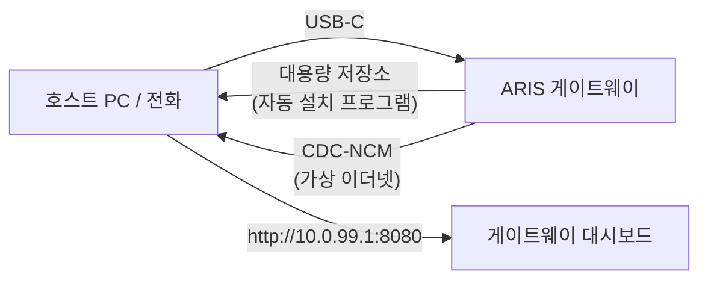

# USB-C 제로 구성 프로비저닝

ARIS가 USB-C를 통해 호스트에 연결되면 게이트웨이가 두 가지 기능을 가진
복합 USB 장치로 인식됩니다:

## 대용량 저장소

[evernight](https://github.com/celestia-island/evernight) 클라이언트용
OS별 자동 설치 프로그램이 포함된 가상 USB 드라이브:

- **Windows** — AutoRun 지원 `.bat` 설치 프로그램
- **Linux** — `.sh` 셸 스크립트
- **macOS** — `.command` 파일
- **Android** — 화면 안내

호스트가 USB 드라이브를 인식하고 해당 OS용 설치 프로그램을 열면 evernight
클라이언트가 수동 구성 없이 설치됩니다.

## CDC-NCM (가상 이더넷)

호스트에 `http://10.0.99.1:8080`의 게이트웨이 대시보드에 대한 직접 IP
링크를 제공하는 가상 이더넷 어댑터입니다.

## 흐름

**USB-C 연결 → 호스트가 USB 드라이브 인식 → 설치 프로그램 실행 → 완료.**
네트워크 구성, 드라이버 다운로드, 수동 페어링이 필요하지 않습니다.
