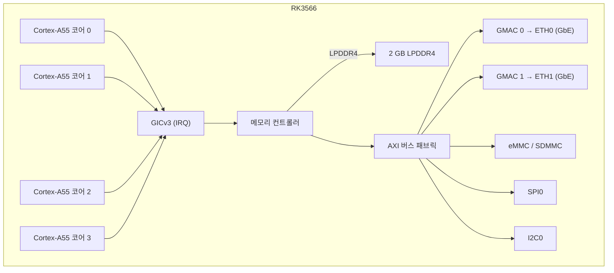

# NanoPi R3S — 하드웨어 참조

## 사양

| 구성 요소 | 상세 |
|-----------|--------|
| SoC | Rockchip RK3566 |
| CPU | 쿼드코어 Cortex-A55 @ 1.8 GHz |
| NPU | 1 TOPS (INT8) |
| RAM | 2 GB LPDDR4/LPDDR4X |
| 저장장치 | MicroSD (최대 128 GB) + eMMC 모듈 |
| 이더넷 | 2x 10/100/1000 Mbps (RTL8211F PHY) |
| USB | 1x USB 3.0 Type-A |
| 디버그 UART | 3핀 2.54mm 헤더 (3.3V TTL) |
| GPIO | 40핀 Raspberry Pi 호환 헤더 |
| 전원 | 5V/3A, USB-C 통해 |
| 크기 | 65 × 52 mm |

## 핀아웃

### 40핀 GPIO 헤더

| 핀 | 신호 | 핀 | 신호 |
|-----|--------|-----|--------|
| 1 | 3.3V | 2 | 5V |
| 3 | GPIO2 | 4 | 5V |
| 5 | GPIO3 | 6 | GND |
| 7 | GPIO4 | 8 | GPIO14 (UART2 TX) |
| 9 | GND | 10 | GPIO15 (UART2 RX) |
| ... | ... | ... | ... |

### 디버그 UART

| 핀 | 라벨 | 기능 |
|-----|-------|----------|
| 1 | GND | 그라운드 |
| 2 | TX  | UART2 TX (3.3V) |
| 3 | RX  | UART2 RX (3.3V) |

보 레이트: 1500000, 데이터 비트 8, 패리티 없음, 스톱 비트 1.

## 블록 다이어그램 (aris 펌웨어)

