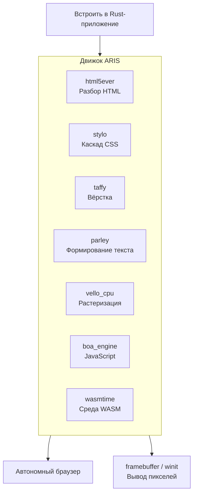

<p align="center"></p>

<h1 align="center">ARIS</h1>

<p align="center"><strong>Браузерный движок на базе servo — встраиваемый или автономный. Официальная инфраструктура servo частично заменена на 100% Rust альтернативы.</strong></p>

<div align="center">

[](../../LICENSE)
[](https://github.com/celestia-island/aris/actions/workflows/ci.yml)

</div>

<div align="center">

[English](../en/README.md) ·
[简体中文](../zhs/README.md) ·
[繁體中文](../zht/README.md) ·
[日本語](../ja/README.md) ·
[한국어](../ko/README.md) ·
[Français](../fr/README.md) ·
[Español](../es/README.md) ·
**Русский** ·
[العربية](../ar/README.md)

</div>

## Введение

ARIS — это **браузерный движок, основанный на servo**. Его можно встроить как библиотеку в любое Rust-приложение или запустить как автономный браузер. Конвейер рендеринга собран из 100% Rust крейтов — html5ever, stylo, taffy, parley, vello — а зависимости servo от SpiderMonkey / WebRender / SWGL заменены на Boa (JS), Vello CPU (растеризация) и Wasmtime (WASM).



## Почему не форк Servo напрямую?

Servo включает SpiderMonkey (C++), WebRender (C++/SWGL) и обширный граф зависимостей. ARIS берёт лучшие части servo — фронтенд HTML/CSS на чистом Rust (html5ever, stylo, cssparser, selectors) — и перестраивает слои JavaScript, растеризации и WASM на 100% Rust альтернативах.

| Компонент Servo | Альтернатива ARIS | Причина |
|-----------------|-------------------|---------|
| SpiderMonkey (C++) | boa_engine | 100% Rust, без сборки C++ |
| WebRender + SWGL (C++) | vello_cpu | Растеризация CPU на 100% Rust |
| components/script | Мост Boa | Без привязки к SpiderMonkey |
| — | wasmtime | WASM Component Model, WASI |

## Быстрый старт

```bash
# Сборка автономного браузера
cargo build -p aris-render --release

# Рендеринг веб-страницы в фреймбуфер
cargo run -p aris-render --bin render_lagrange -- example.html

# Запуск в окне (бэкенд winit)
cargo run -p aris-render --bin render_window --features winit-backend
```

Подробнее в [руководстве по сборке](./build/quickstart.md).

## Архитектура

```
┌──────────────────────────────────────────────────────┐
│  tairitsu (VDOM) / hikari (UI компоненты)            │
│  WASM Component Model → интерфейс WIT                │
├──────────────────────────────────────────────────────┤
│  Конвейер рендеринга ARIS                              │
│  html5ever → stylo → taffy → parley → vello_cpu → RGBA│
│  Движок Boa JS (скрипты страниц)                      │
│  Wasmtime (WASM компоненты, WASI)                     │
├──────────────────────────────────────────────────────┤
│  Бэкенды отображения: /dev/fb0 · winit+softbuffer     │
├──────────────────────────────────────────────────────┤
│  Ядро kei (syscall ABI) или Linux                     │
└──────────────────────────────────────────────────────┘
```

Подробнее в [обзоре архитектуры](./architecture/overview.md).

## Экосистема

- **[kei](https://github.com/celestia-island/kei)** — Ядро ОС на Rust
- **[tairitsu](https://github.com/celestia-island/tairitsu)** — UI фреймворк на WASM
- **[hikari](https://github.com/celestia-island/hikari)** — Библиотека UI компонентов
- **[shirabe](https://github.com/celestia-island/shirabe)** — Автоматизация браузера, контракт FFI рендеринга
- **[evernight](https://github.com/celestia-island/evernight)** — Промышленный протокольный брокер
- **[entelecheia](https://github.com/celestia-island/entelecheia)** — Платформа AI-агентов

## Лицензия

Business Source License 1.1 (BUSL-1.1). Преобразуется в SySL-1.0 или Apache-2.0 2030-01-01. См. [LICENSE](../../LICENSE).
