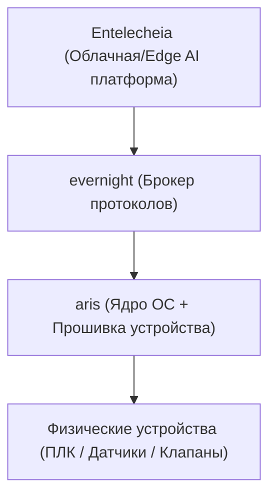

<p align="center"></p>

<h1 align="center">ARIS</h1>

<p align="center"><strong>Встраиваемая ОС для промышленных IoT-шлюзов — запускает evernight на edge-устройствах ARM/RISC-V</strong></p>

<div align="center">

[](../../LICENSE)
[](https://github.com/celestia-island/aris/actions/workflows/ci.yml)

</div>

<div align="center">

[English](../en/README.md) ·
[简体中文](../zhs/README.md) ·
[繁體中文](../zht/README.md) ·
[日本語](../ja/README.md) ·
[한국어](../ko/README.md) ·
[Français](../fr/README.md) ·
[Español](../es/README.md) ·
**[Русский](../ru/README.md)** ·
[العربية](../ar/README.md)

</div>

## Введение

ARIS — это встраиваемая ОС/прошивка для промышленного IoT-шлюза Entelecheia.
Она запускает [evernight](https://github.com/celestia-island/evernight) на
edge-устройствах ARM/RISC-V, связывая брокер протоколов с физическим оборудованием
через минимальный защищённый слой ядра.



## Автонастройка USB-C без конфигурации

При подключении к любому хосту через USB-C шлюз представляется как составное
USB-устройство:

- **Накопитель** — виртуальный USB-диск с автоустановщиками клиента evernight
  для каждой ОС (Windows `.bat` + AutoRun, Linux `.sh`, macOS `.command`,
  инструкции для Android)
- **CDC-NCM** — виртуальный Ethernet-адаптер, предоставляющий хосту прямой
  IP-канал к панели шлюза по адресу `http://10.0.99.1:8080`

**Подключите USB-C → хост видит USB-диск → откройте установщик → готово.**
Никакой настройки сети, загрузки драйверов или ручного сопряжения.

## Поддерживаемые архитектуры

| Архитектура | Статус | Целевые платы |
|-------------|--------|---------------|
| ARMv8+ (aarch64) | Активная | NanoPi R3S (RK3566) |
| ARMv7+ (armv7) | Запланирована | Raspberry Pi 3/4 |
| RISC-V 64 (riscv64) | Запланирована | VisionFive 2 |
| x86_64 | Запланирована | Промышленный ПК |

## Быстрый старт

```bash
just setup-cross   # Install cross-compilation toolchains
just build         # Build firmware image for default board
just build-board nanopi-r3s
just flash-sd      # Write image to SD card
```

## Архитектура

ARIS следует двухфазной стратегии:

- **Фаза 1** (текущая): ядро Linux + облегчённый rootfs в стиле Buildroot,
  запускает evernight как демон. Прагматично, доступно сейчас.
- **Фаза 2** (будущая): [Asterinas](https://github.com/asterinas/asterinas)
  фрейм-ядро (ОС на Rust) заменяет ядро Linux. Полностью безопасный стек от
  кремния до приложения.

См. [документацию](../en/) для деталей архитектуры, спецификаций оборудования и
руководств по сборке.

## Лицензия

Business Source License 1.1 (BUSL-1.1). Commercial use requires an
authorization license. Non-commercial use follows the SySL-1.0 protocol.
Converts to SySL-1.0 or Apache-2.0 on 2030-01-01. See [LICENSE](../../LICENSE).
