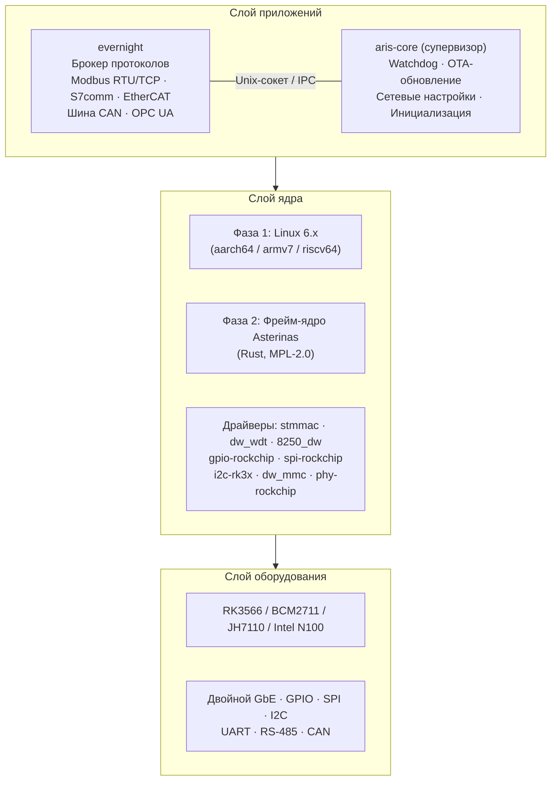
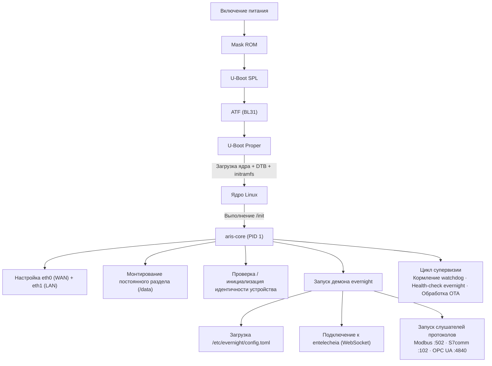

# Архитектура системы aris

## Обзор

aris — это модульная встраиваемая ОС для промышленных IoT-шлюзов, работающая в
экосистеме Entelecheia. Она связывает брокер протоколов evernight с физическим
оборудованием через минимальный защищённый слой ядра.

## Слои архитектуры



## Процесс загрузки



## Схема разделов (Обновление A/B)

| Смещение | Размер | Раздел | Содержимое |
|----------|--------|--------|------------|
| 0 | 32 КиБ | (промежуток) | idbloader.img |
| 32 КиБ | 8 МиБ | (промежуток) | u-boot.itb |
| 8 МиБ | 128 МиБ | boot-A | Image + DTB + boot.scr |
| 136 МиБ | 128 МиБ | boot-B | Image + DTB + boot.scr (резерв) |
| 264 МиБ | 512 МиБ | rootfs-A | squashfs (ro) |
| 776 МиБ | 512 МиБ | rootfs-B | squashfs (ro, резерв) |
| 1288 МиБ | - | постоянный | ext4 (rw, /data) |

## Сетевая топология

```mermaid
flowchart TB
    NET["Интернет / Корпоративная LAN"] --> ETH0
    subbox GW["Шлюз aris"]
        ETH0["eth0 — WAN (DHCP)"]
        ETH1["eth1 — LAN (192.168.42.1/24)"]
    end
    ETH1 --> PLC["ПЛК\n192.168.42.5"]
    ETH1 --> SEN["Датчик\n192.168.42.10"]
    ETH1 --> HMI["HMI\n192.168.42.20"]
```

## Стратегия Asterinas ARM64 (Фаза 2)

Основной upstream-источник для Asterinas ARM64:

- **Форк**: https://github.com/wanywhn/asterinas (ветка: `arm64-support`)
- **PR**: asterinas/asterinas#3270
- **Статус**: Почти готов к слиянию; включает GICv3, ARM GIC, базовое дерево
  устройств, настройку MMU и UART-консоль для aarch64

После слияния в mainline Asterinas aris будет отслеживать официальный репозиторий.
До тех пор ветка `arm64-support` служит базой разработки.
