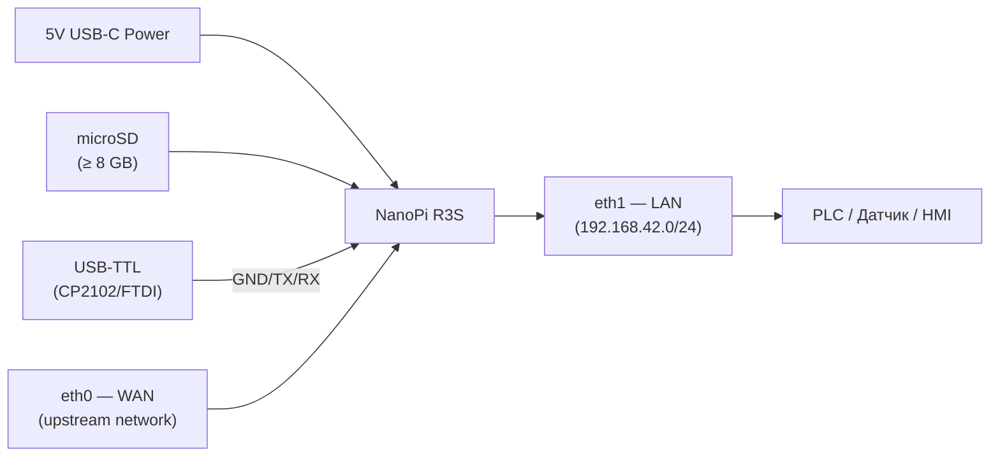
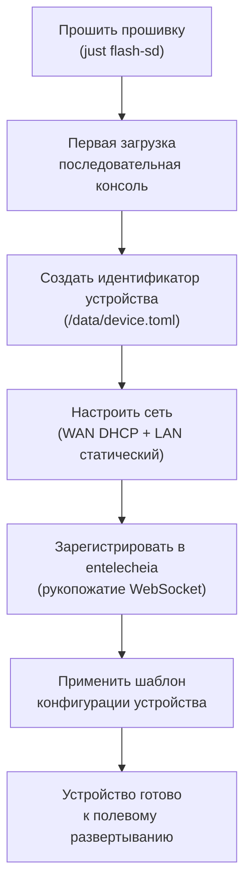
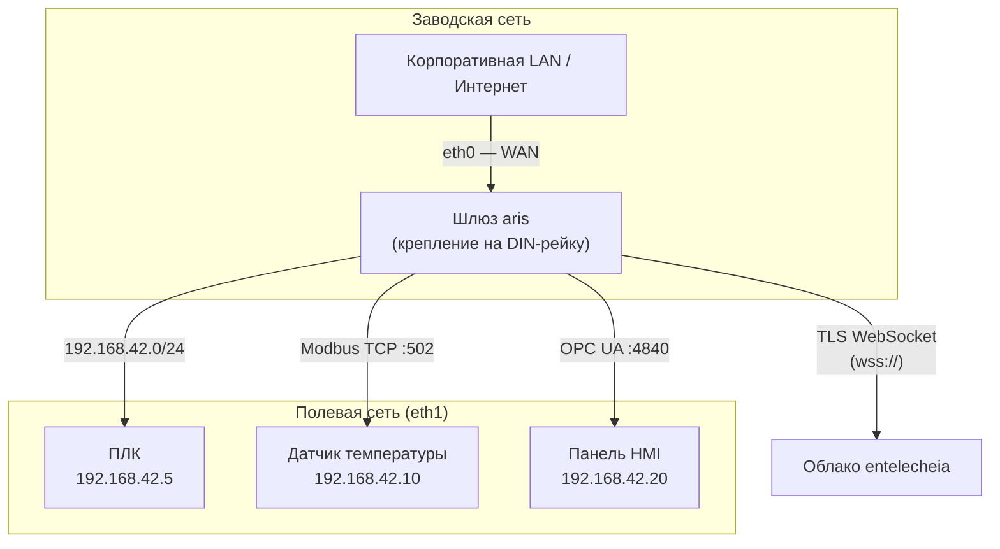
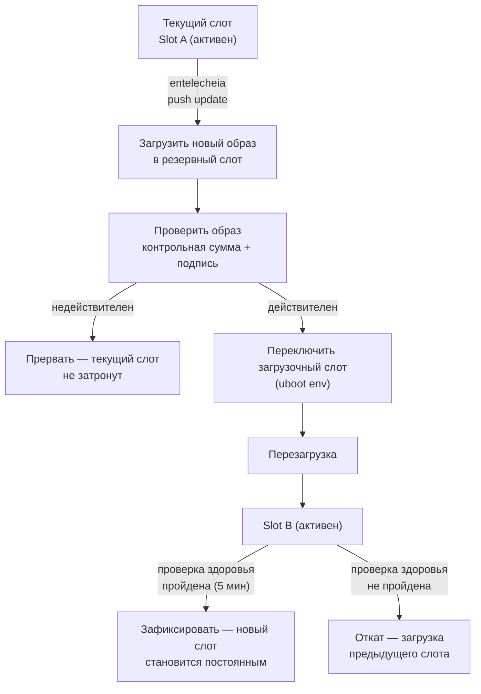

# Руководство по развертыванию aris

## Обзор

Это руководство охватывает развертывание прошивки aris на физическом
оборудовании — от заводской подготовки до полевой установки и текущего
обслуживания.

## Сборка оборудования

### NanoPi R3S

Для эталонной платы (NanoPi R3S) вам понадобится:

1. **Плата NanoPi R3S** (RK3566, 2 ГБ ОЗУ)
2. **Карта microSD** (≥ 8 ГБ, рекомендуется UHS-I)
3. **Блок питания USB-C** (5 В / 3 А)
4. **Последовательный адаптер USB-TTL** (логика 3,3 В, CP2102 или FTDI)
5. **Кабели Ethernet** (2 шт. для WAN + LAN)
6. **Корпус** (опционально, рекомендуется крепление на DIN-рейку)



### Схема подключения

| Вывод платы | Адаптер USB-TTL | Примечания |
|-------------|-----------------|-------|
| Pin 1 (GND) | GND | Общая земля |
| Pin 2 (TX) | RX | Плата передает → адаптер принимает |
| Pin 3 (RX) | TX | Плата принимает ← адаптер передает |

Отладочный UART работает на скорости **1500000 бод, 8N1**. Большинство
терминальных эмуляторов (`picocom`, `minicom`, `screen`) поддерживают эту
скорость.

## Заводская подготовка

Подготовка нового устройства выполняется по следующим шагам:



### Идентификатор устройства

Каждое устройство aris имеет уникальный идентификатор, хранящийся в
`/data/device.toml`:

```toml
[device]
node_id = "aris-nanopi-r3s-001"
hardware = "nanopi-r3s"
serial = "RK3566-SN-XXXXXXXX"

[entitlecheia]
endpoint = "wss://entelecheia.example.com/ws"
psk = "/data/keys/device.psk"
```

Идентификатор генерируется при первой загрузке и сохраняется на доступном для
записи постоянном разделе. Предварительный ключ (`device.psk`) используется
для аутентификации в жизненном цикле сессии entelecheia.

## Топология сети

Типичное полевое развертывание выглядит так:



- **eth0 (WAN)**: Подключается к вышестоящей корпоративной сети или напрямую
  к интернету. По умолчанию DHCP; статический IP настраивается через
  `/data/network.toml`.
- **eth1 (LAN)**: Обслуживает локальную полевую шину на `192.168.42.0/24`.
  Сюда подключаются ПЛК, датчики и HMI.

## OTA-обновления

aris поддерживает обновления с двумя слотами A/B для безопасных обновлений
прошивки с возможностью отката:



Схема разделов поддерживает A/B как для `boot`, так и для `rootfs`:

| Слот | Раздел boot | Раздел rootfs | Статус |
|------|---------------|-----------------|--------|
| A | `boot-A` (128 МиБ) | `rootfs-A` (512 МиБ) | Основной |
| B | `boot-B` (128 МиБ) | `rootfs-B` (512 МиБ) | Резервный |

## Чек-лист полевого развертывания

Перед развертыванием устройства на физическом объекте проверьте:

1. **Оборудование**: Все кабели подключены, питание достаточное, корпус
   герметичен
2. **Хранилище**: SD-карта правильно вставлена, защита от записи отключена
3. **Сеть**: Оба интерфейса eth0 и eth1 подключены к правильным сетям
4. **Последовательный порт**: USB-TTL доступен для экстренного доступа к
   консоли
5. **Загрузка**: Включите питание, следите за сообщениями загрузки в
   последовательной консоли
6. **Сервисы**: `aris-core` (PID 1) и демон `evernight` запущены
7. **Регистрация**: Устройство отображается в панели управления entelecheia
8. **Протокол**: Слушатели Modbus/S7comm/OPC UA доступны с полевых устройств
9. **OTA**: Протестируйте фиктивное OTA-обновление для проверки схемы разделов
10. **Сторожевой таймер**: Протестируйте watchdog, завершив `aris-core` —
    устройство должно перезагрузиться

```bash
# Verify services on the device (via SSH or serial)
ps aux | grep aris-core
ps aux | grep evernight

# Check network interfaces
ip addr show eth0
ip addr show eth1

# Check partition layout
cat /proc/partitions

# Check boot slot
fw_printenv boot_slot

# Trigger manual health check
aris-core --health-check
```

## Мониторинг

После развертывания отслеживайте следующие метрики:

| Метрика | Источник | Порог предупреждения |
|--------|--------|----------------|
| Температура CPU | `/sys/class/thermal/thermal_zone0/temp` | > 80°C |
| Использование памяти | `/proc/meminfo` | > 90% |
| Износ накопителя | `/data/wear_level.txt` | > 80% rated cycles |
| Сетевое соединение | `ethtool eth0` / `ethtool eth1` | Link down |
| Статус evernight | `systemctl status evernight` | Not running |
| Подключение entelecheia | `/var/log/evernight.log` | Disconnected > 60s |

Все метрики передаются в entelecheia через протокольный брокер evernight.
Оповещения отображаются в панели управления entelecheia и могут запускать
автоматические ответы (перезапуск, переключение на резерв, вызов техника).
