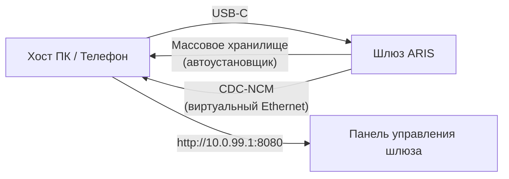

# Нулевая настройка через USB-C

Когда ARIS подключается к любому хосту через USB-C, шлюз представляется как
составное USB-устройство с двумя функциями:

## Массовое хранилище

Виртуальный USB-накопитель, содержащий автоматические установщики для каждой
ОС для клиента [evernight](https://github.com/celestia-island/evernight):

- **Windows** — установщик `.bat` с AutoRun
- **Linux** — скрипт оболочки `.sh`
- **macOS** — файл `.command`
- **Android** — инструкции на экране

Хост видит USB-накопитель, открывает установщик для своей ОС, и клиент
evernight устанавливается без ручной настройки.

## CDC-NCM (Виртуальный Ethernet)

Виртуальный Ethernet-адаптер, предоставляющий хосту прямой IP-канал к панели
управления шлюза по адресу `http://10.0.99.1:8080`.

## Схема работы

**Подключите USB-C → хост видит USB-накопитель → откройте установщик → готово.**
Никакой настройки сети, загрузки драйверов или ручного сопряжения.
