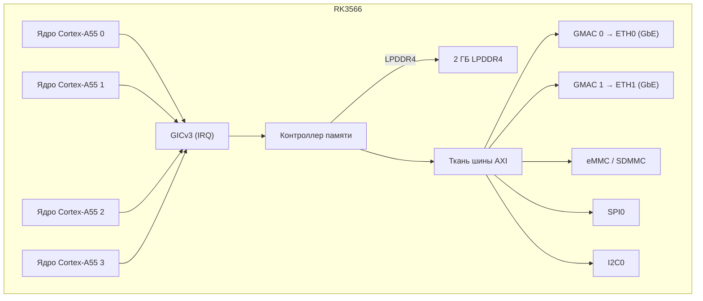

# NanoPi R3S — Спецификация оборудования

## Характеристики

| Компонент | Деталь |
|-----------|--------|
| SoC | Rockchip RK3566 |
| CPU | Четырёхъядерный Cortex-A55 @ 1,8 ГГц |
| NPU | 1 TOPS (INT8) |
| RAM | 2 ГБ LPDDR4/LPDDR4X |
| Накопитель | MicroSD (до 128 ГБ) + модуль eMMC |
| Ethernet | 2x 10/100/1000 Мбит/с (PHY RTL8211F) |
| USB | 1x USB 3.0 Type-A |
| Отладочный UART | 3-контактный разъём 2,54 мм (TTL 3,3 В) |
| GPIO | 40-контактный разъём, совместимый с Raspberry Pi |
| Питание | 5В/3А через USB-C |
| Размеры | 65 × 52 мм |

## Распиновка

### 40-контактный разъём GPIO

| Контакт | Сигнал | Контакт | Сигнал |
|---------|--------|---------|--------|
| 1 | 3,3В | 2 | 5В |
| 3 | GPIO2 | 4 | 5В |
| 5 | GPIO3 | 6 | GND |
| 7 | GPIO4 | 8 | GPIO14 (UART2 TX) |
| 9 | GND | 10 | GPIO15 (UART2 RX) |
| ... | ... | ... | ... |

### Отладочный UART

| Контакт | Метка | Функция |
|---------|-------|---------|
| 1 | GND | Земля |
| 2 | TX  | UART2 TX (3,3 В) |
| 3 | RX  | UART2 RX (3,3 В) |

Скорость: 1500000, 8 бит данных, без чётности, 1 стоп-бит.

## Блок-схема (прошивка aris)

