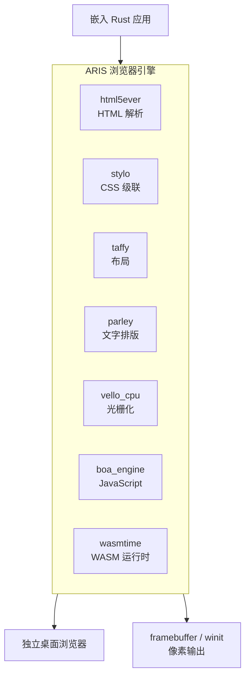

<p align="center"></p>

<h1 align="center">ARIS</h1>

<p align="center"><strong>派生自 servo 的纯 Rust 浏览器引擎。</strong></p>

<div align="center">

[](https://sysl.celestia.world)
[](https://github.com/celestia-island/aris/actions/workflows/ci.yml)

</div>

<div align="center">

[English](../en/README.md) ·
**简体中文** ·
[繁體中文](../zht/README.md) ·
[日本語](../ja/README.md) ·
[한국어](../ko/README.md) ·
[Français](../fr/README.md) ·
[Español](../es/README.md) ·
[Русский](../ru/README.md) ·
[العربية](../ar/README.md)

</div>

## 简介

ARIS 是一个**源自 servo 的浏览器引擎**。既可以作为库嵌入任何 Rust 应用，也可以作为独立桌面浏览器运行。渲染管线由纯 Rust crate 组装——html5ever、stylo、taffy、parley、vello——servo 原有的 SpiderMonkey / WebRender / SWGL 依赖已被 Boa（JS 引擎）、Vello CPU（光栅化）和 Wasmtime（WASM 运行时）替代。



## 为何不直接 fork Servo？

Servo 捆绑了 SpiderMonkey（C++）、WebRender（C++/SWGL）以及庞大的组件依赖图。ARIS 取 servo 最精华的部分——纯 Rust 实现的 HTML/CSS 前端（html5ever、stylo、cssparser、selectors）——并用纯 Rust 方案重建 JavaScript、光栅化和 WASM 层。最终产物是一个更小、更简洁、完全自包含的 Rust 代码库。

| Servo 组件 | ARIS 替代方案 | 理由 |
|-----------|-------------|------|
| SpiderMonkey (C++) | boa_engine | 纯 Rust，无需 C++ 构建 |
| WebRender + SWGL (C++) | vello_cpu | 纯 Rust CPU 光栅化 |
| components/script | Boa 桥接层 | 无 SpiderMonkey 耦合 |
| — | wasmtime | WASM Component Model, WASI |

## 快速开始

```bash
# 构建独立浏览器
cargo build -p aris-render --release

# 将网页渲染到帧缓冲
cargo run -p aris-render --bin render_lagrange -- example.html

# 在桌面窗口中运行（winit 后端）
cargo run -p aris-render --bin render_window --features winit-backend
```

详见[构建指南](./build/quickstart.md)。

## 架构

```
┌──────────────────────────────────────────────────────┐
│  tairitsu (VDOM) / hikari (UI 组件)                  │
│  WASM Component Model → WIT 接口                     │
├──────────────────────────────────────────────────────┤
│  ARIS 渲染管线                                        │
│  html5ever → stylo → taffy → parley → vello_cpu → RGBA│
│  Boa JS 引擎（页面脚本）                               │
│  Wasmtime（WASM 组件, WASI）                          │
├──────────────────────────────────────────────────────┤
│  显示后端: /dev/fb0 · winit+softbuffer                │
├──────────────────────────────────────────────────────┤
│  kei 内核（syscall ABI）或 Linux                       │
└──────────────────────────────────────────────────────┘
```

详见[架构概览](./architecture/overview.md)。

## 许可证

SySL-1.0（Synthetic Source License）。详见 [LICENSE](../../LICENSE) 或 [SySL 网站](https://sysl.celestia.world)。
