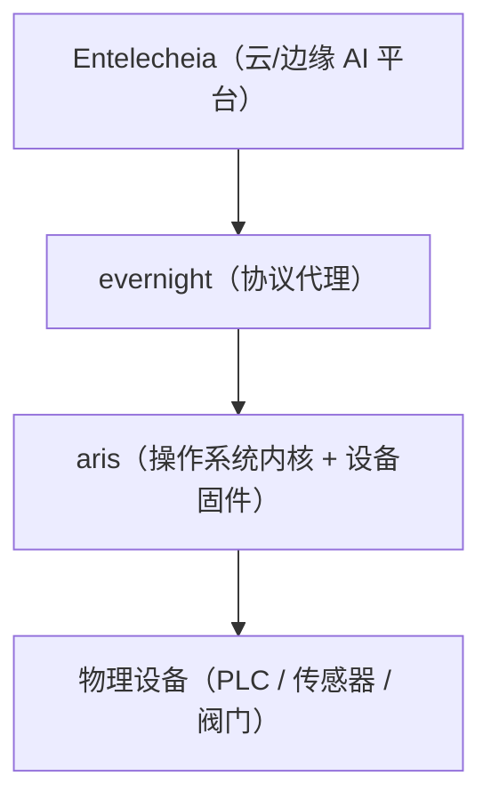

<p align="center"></p>

<h1 align="center">ARIS</h1>

<p align="center"><strong>面向工业物联网网关的嵌入式操作系统 — 在 ARM/RISC-V 边缘设备上运行 evernight</strong></p>

<div align="center">

[](../../LICENSE)
[](https://github.com/celestia-island/aris/actions/workflows/ci.yml)

</div>

<div align="center">

[English](../en/README.md) ·
**简体中文** ·
[繁體中文](../zht/README.md) ·
[日本語](../ja/README.md) ·
[한국어](../ko/README.md) ·
[Français](../fr/README.md) ·
[Español](../es/README.md) ·
[Русский](../ru/README.md) ·
[العربية](../ar/README.md)

</div>

## 简介

ARIS 是 Entelecheia 工业物联网网关的嵌入式操作系统/固件。它在 ARM/RISC-V 边缘设备上运行
[evernight](https://github.com/celestia-island/evernight)，通过一个最小化、安全的内核层
将协议代理桥接到物理硬件。



## USB-C 零配置配网

当通过 USB-C 连接到任意主机时，网关将自身呈现为一个复合 USB 设备：

- **大容量存储** — 一个虚拟 USB 驱动器，包含针对各操作系统的 evernight 客户端自动安装程序
  （Windows `.bat` + 自动运行、Linux `.sh`、macOS `.command`、Android 说明）
- **CDC-NCM** — 一个虚拟以太网适配器，使主机获得直连到网关控制面板的 IP 链路
  `http://10.0.99.1:8080`

**插入 USB-C → 主机识别为 USB 驱动器 → 打开安装程序 → 完成。** 无需网络配置，
无需下载驱动，无需手动配对。

## 支持的架构

| 架构 | 状态 | 目标开发板 |
|-------------|--------|---------------|
| ARMv8+ (aarch64) | 活跃 | NanoPi R3S (RK3566) |
| ARMv7+ (armv7) | 计划中 | Raspberry Pi 3/4 |
| RISC-V 64 (riscv64) | 计划中 | VisionFive 2 |
| x86_64 | 计划中 | 工业电脑 |

## 快速开始

```bash
just setup-cross   # Install cross-compilation toolchains
just build         # Build firmware image for default board
just build-board nanopi-r3s
just flash-sd      # Write image to SD card
```

## 架构

ARIS 遵循两阶段策略：

- **第一阶段**（当前）：Linux 内核 + Buildroot 风格的精简根文件系统，
  以守护进程方式运行 evernight。务实可行，即刻交付。
- **第二阶段**（未来）：[Asterinas](https://github.com/asterinas/asterinas)
  框架内核（Rust 操作系统）替换 Linux 内核。实现从芯片到顶层的完整安全栈。

请参阅[文档](./)以获取架构详情、硬件参考和构建指南。

## 许可证

Business Source License 1.1 (BUSL-1.1). Commercial use requires an
authorization license. Non-commercial use follows the SySL-1.0 protocol.
Converts to SySL-1.0 or Apache-2.0 on 2030-01-01. See [LICENSE](../../LICENSE).
