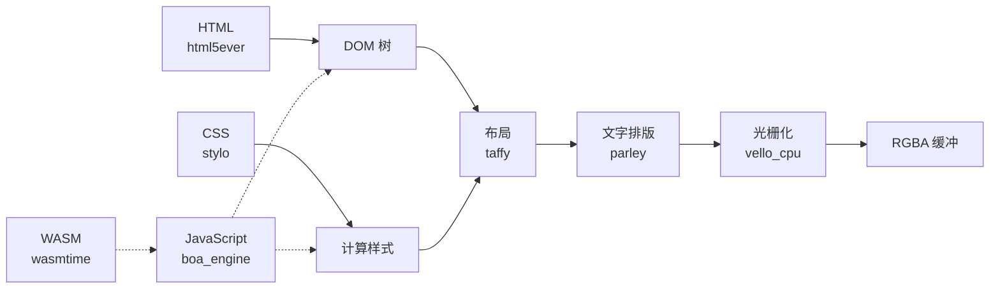

# ARIS 架构

## 概览

ARIS 是源自 servo 的浏览器引擎。可作为库嵌入任何 Rust 应用，或作为独立桌面浏览器运行。渲染管线由纯 Rust crate 组装——html5ever、stylo、taffy、parley、vello——servo 原有的 SpiderMonkey（C++）、WebRender（C++/SWGL）、components/script 已被 Boa、Vello CPU、Wasmtime 分别替代。

## 渲染管线

## 关键替换

| Servo 组件 | ARIS 替代方案 | 理由 |
|-----------|-------------|------|
| SpiderMonkey (C++) | boa_engine | 纯 Rust，无需 C++ 构建 |
| WebRender + SWGL (C++) | vello_cpu | 纯 Rust CPU 光栅化 |
| components/script | Boa 桥接（aris-js） | 无 SpiderMonkey 耦合 |
| — | wasmtime | WASM Component Model + WASI |

## 显示后端

| 后端 | 用途 |
|------|------|
| /dev/fb0 mmap | 嵌入式设备、kei 内核 |
| winit + softbuffer | 桌面（Linux/macOS/Windows） |
| WASM canvas | 浏览器内嵌（WASM） |

## 两种运行模式

1. **嵌入模式**（库）：`render_html()` 函数直接产出像素缓冲
2. **独立模式**（桌面浏览器）：`render_window` 二进制打开完整桌面窗口

## 相关项目

- **[kei](https://github.com/celestia-island/kei)** — Rust OS 内核，提供 syscall ABI 和帧缓冲
- **[tairitsu](https://github.com/celestia-island/tairitsu)** — WASM UI 框架
- **[hikari](https://github.com/celestia-island/hikari)** — UI 组件库
- **[shirabe](https://github.com/celestia-island/shirabe)** — 浏览器自动化，定义渲染 FFI 合约
