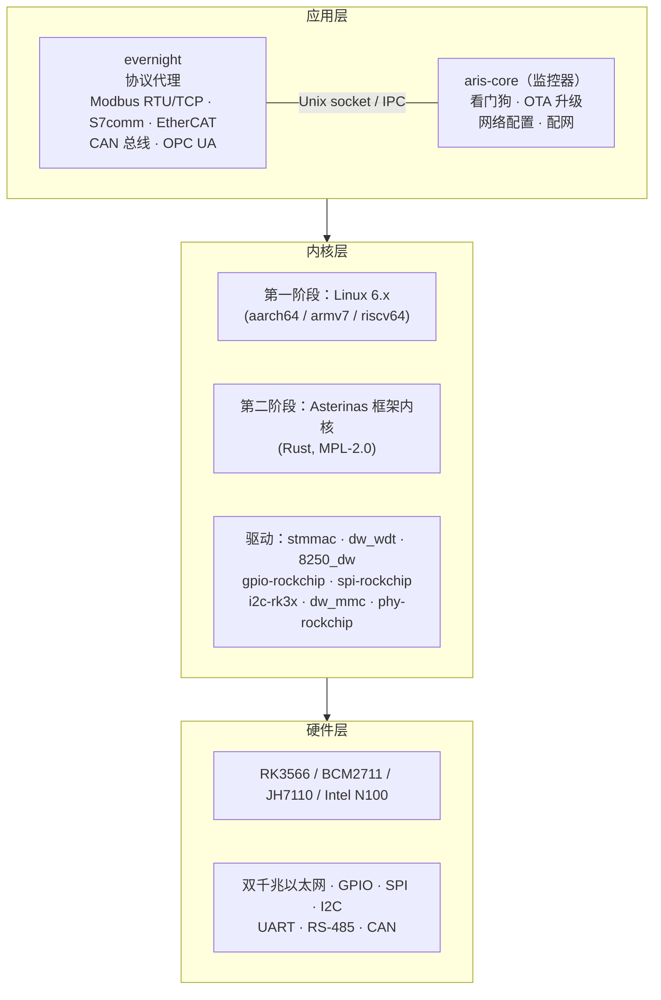
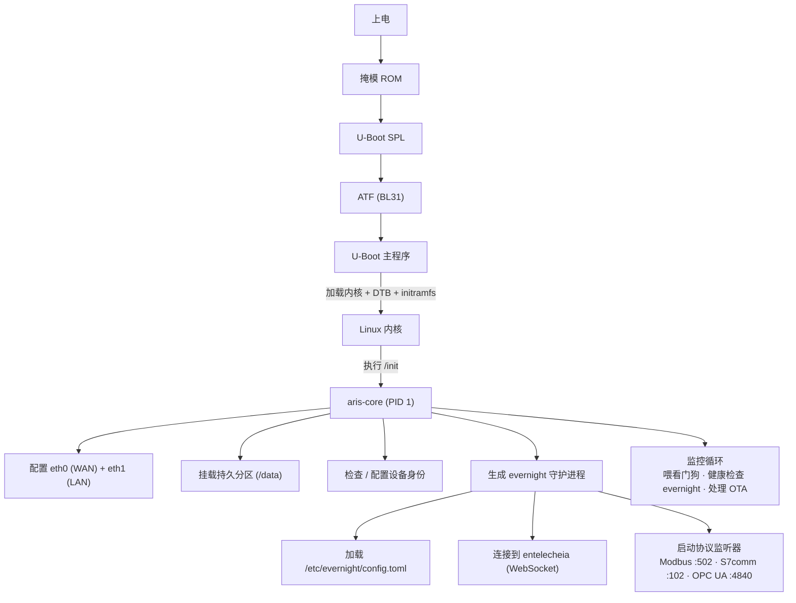
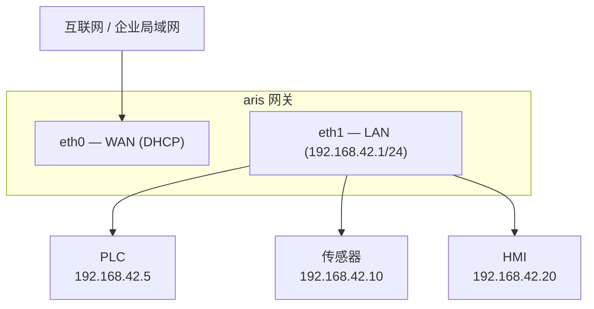

# aris 系统架构

## 概览

aris 是面向工业物联网网关的模块化嵌入式操作系统，运行 Entelecheia 生态系统。
它通过一个最小化、安全的内核层，将 evernight 协议代理桥接到物理硬件。

## 架构分层

## 启动流程

## 分区布局（A/B 更新）

| 偏移量 | 大小 | 分区 | 内容 |
|--------|------|-----------|----------|
| 0 | 32 KiB | (间隙) | idbloader.img |
| 32 KiB | 8 MiB | (间隙) | u-boot.itb |
| 8 MiB | 128 MiB | boot-A | Image + DTB + boot.scr |
| 136 MiB | 128 MiB | boot-B | Image + DTB + boot.scr（备用） |
| 264 MiB | 512 MiB | rootfs-A | squashfs（只读） |
| 776 MiB | 512 MiB | rootfs-B | squashfs（只读，备用） |
| 1288 MiB | - | persistent | ext4（读写，/data） |

## 网络拓扑

## Asterinas ARM64 策略（第二阶段）

ARM64 Asterinas 的主要上游来源：

- **Fork**：https://github.com/wanywhn/asterinas（分支：`arm64-support`）
- **PR**：asterinas/asterinas#3270
- **状态**：几乎已准备好合并；包含面向 aarch64 的 GICv3、ARM GIC、
  基本设备树、MMU 设置和 UART 控制台

一旦合并到 Asterinas 主线，aris 将跟踪官方仓库。在此之前，
`arm64-support` 分支作为开发基线。
