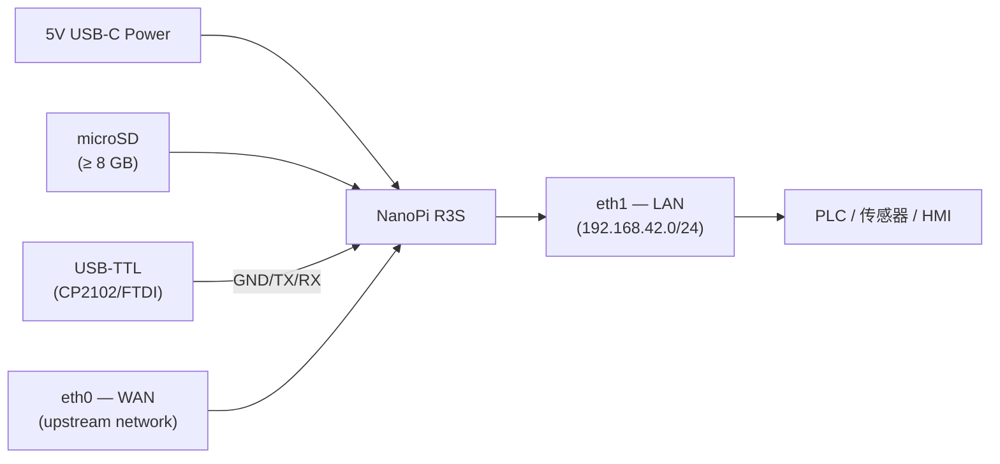
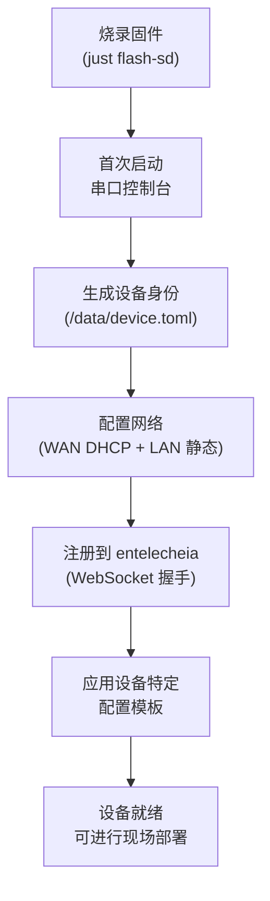
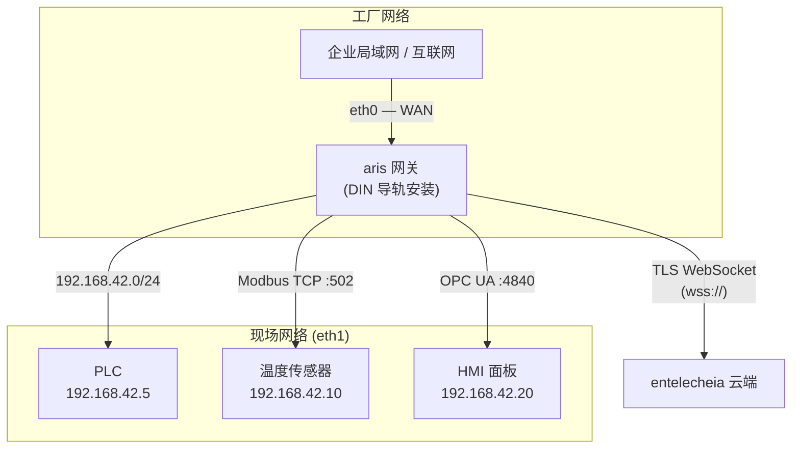
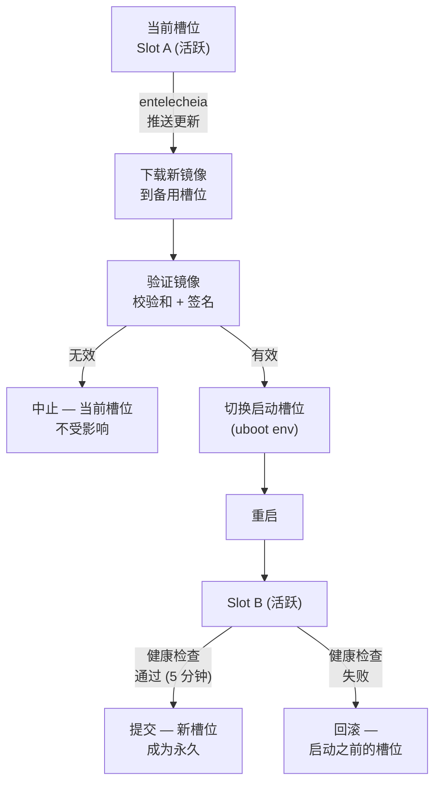

# aris 部署指南

## 概述

本指南涵盖将 aris 固件部署到物理硬件的全过程——从工厂预置到现场安装和持续
维护。

## 硬件组装

### NanoPi R3S

对于参考开发板（NanoPi R3S），您需要：

1. **NanoPi R3S 开发板**（RK3566，2GB RAM）
2. **microSD 卡**（≥ 8 GB，推荐 UHS-I）
3. **USB-C 电源适配器**（5V / 3A）
4. **USB-TTL 串口适配器**（3.3V 逻辑电平，CP2102 或 FTDI）
5. **以太网线**（WAN + LAN 各一根）
6. **外壳**（可选，推荐 DIN 导轨安装）



### 接线参考

| 开发板引脚 | USB-TTL 适配器 | 备注 |
|-------------|-----------------|-------|
| Pin 1 (GND) | GND | 共地 |
| Pin 2 (TX) | RX | 开发板发送 → 适配器接收 |
| Pin 3 (RX) | TX | 开发板接收 ← 适配器发送 |

调试串口波特率为 **1500000 baud，8N1**。大多数终端模拟器（`picocom`、
`minicom`、`screen`）支持此波特率。

## 工厂预置

新设备预置遵循以下步骤：



### 设备身份

每台 aris 设备都有存储在 `/data/device.toml` 中的唯一身份：

```toml
[device]
node_id = "aris-nanopi-r3s-001"
hardware = "nanopi-r3s"
serial = "RK3566-SN-XXXXXXXX"

[entitlecheia]
endpoint = "wss://entelecheia.example.com/ws"
psk = "/data/keys/device.psk"
```

身份在首次启动时生成并持久化到可写持久分区。预共享密钥（`device.psk`）
用于与 entelecheia 的会话生命周期进行身份验证。

## 网络拓扑

典型的现场部署如下：



- **eth0 (WAN)**：连接到上游企业网络或直接连接互联网。默认使用 DHCP；
  可通过 `/data/network.toml` 配置静态 IP。
- **eth1 (LAN)**：为本地现场总线网络提供服务，地址为 `192.168.42.0/24`。
  PLC、传感器和 HMI 在此连接。

## OTA 更新

aris 支持 A/B 双槽位更新，实现安全、可回滚的固件升级：



分区布局支持 `boot` 和 `rootfs` 的 A/B 双份：

| 槽位 | boot 分区 | rootfs 分区 | 状态 |
|------|---------------|-----------------|--------|
| A | `boot-A` (128 MiB) | `rootfs-A` (512 MiB) | 主 |
| B | `boot-B` (128 MiB) | `rootfs-B` (512 MiB) | 备用 |

## 现场部署检查清单

将设备部署到物理现场之前，请验证：

1. **硬件**：所有线缆已插好，电源充足，外壳已密封
2. **存储**：SD 卡已正确插入，未启用写保护开关
3. **网络**：eth0 和 eth1 均已连接到正确的网络
4. **串口**：USB-TTL 可用以进行紧急控制台访问
5. **启动**：上电，通过串口控制台监控启动消息
6. **服务**：`aris-core`（PID 1）和 `evernight` 守护进程正在运行
7. **注册**：设备出现在 entelecheia 仪表板中
8. **协议**：Modbus/S7comm/OPC UA 监听器可从现场设备访问
9. **OTA**：测试一个虚拟 OTA 更新以验证分区布局
10. **看门狗**：通过终止 `aris-core` 测试看门狗 — 设备应重新启动

```bash
# Verify services on the device (via SSH or serial)
ps aux | grep aris-core
ps aux | grep evernight

# Check network interfaces
ip addr show eth0
ip addr show eth1

# Check partition layout
cat /proc/partitions

# Check boot slot
fw_printenv boot_slot

# Trigger manual health check
aris-core --health-check
```

## 监控

部署后，请监控以下指标：

| 指标 | 数据源 | 告警阈值 |
|--------|--------|----------------|
| CPU 温度 | `/sys/class/thermal/thermal_zone0/temp` | > 80°C |
| 内存使用率 | `/proc/meminfo` | > 90% |
| 存储磨损 | `/data/wear_level.txt` | > 80% rated cycles |
| 网络链路 | `ethtool eth0` / `ethtool eth1` | Link down |
| evernight 状态 | `systemctl status evernight` | Not running |
| entelecheia 连接 | `/var/log/evernight.log` | Disconnected > 60s |

所有指标通过 evernight 协议代理上报到 entelecheia。告警显示在 entelecheia
仪表板中，并可触发自动响应（重启、故障切换、派遣技术人员）。
